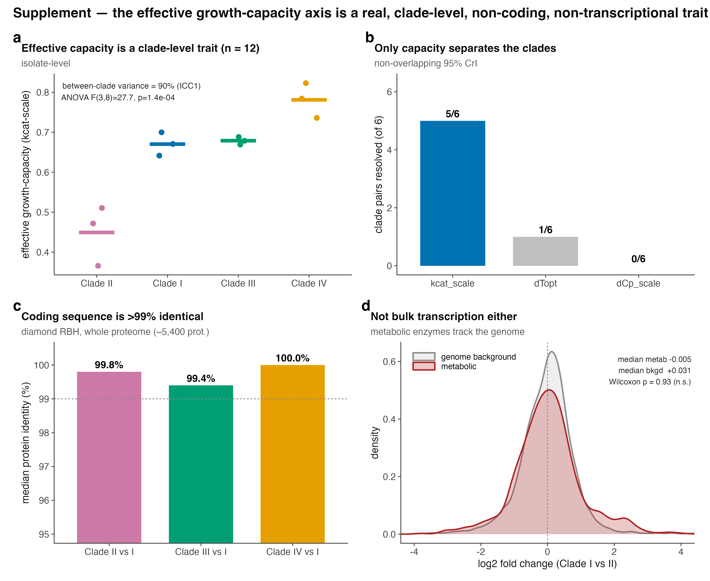

# Supplementary figures
{width=100%}

**Supplementary Figure 1. The effective growth-capacity axis is a real,
clade-level, non-coding, non-transcriptional trait.** (**a**) Capacity
across the twelve isolates by clade (bars, clade means); 90% of the
variance lies between clades (ICC~1~ = 0.90). (**b**) Number of clade
pairs resolved (non-overlapping 95% CrI) by each calibration parameter;
only the effective growth-capacity parameter (kcat-scale) separates the
clades. (**c**) Median whole-proteome amino-acid identity of each clade
to Clade I (diamond reciprocal best-hit); coding sequence is \>99%
identical. (**d**) Distribution of Clade I-versus-II log~2~ fold-change
for the model\'s 928 metabolic-enzyme genes (red) against the genome
background (grey), from GEO GSE165762; the metabolic set is not
coordinately shifted (Wilcoxon P = 0.93).

{width=100%}

**Supplementary Figure 2. etc-GEM model diagnostics: fit,
identifiability and method robustness.** (**a**) Predicted versus
observed growth rate for each clade under its own calibration; points on
the 1:1 line are perfect (R^2^ = 0.96, 0.94, 0.97 and 0.96 for Clades
I-IV; overall RMSE 0.038 h^-1^). (**b**) Residuals against temperature.
They are unbiased between 24 and 40 °C; at the 22 and 44 °C limits all
four clades deviate together (mean residual -0.035 and +0.071 h^-1^
respectively), so the fit degrades at the edges of the assayed range.
Dashed lines and shading mark the 37-40 °C febrile window.
(**c**) RMSE as each calibration knob is swept around its optimum with
the remaining knobs held at the fit (dot). Each knob has a well-defined
optimum, but these are one-dimensional profiles and are not a joint
identifiability test: in the posterior, dCp-scale and kcat-scale are
correlated (r = 0.43 to 0.70 depending on clade). (**d**) Effective
growth-capacity per clade from the two calibration methods, Bayesian
median with 95% CrI (dot and bar) and differential evolution (x). The
two agree to within 0.02 in every clade and give the same ordering.

{width=100%}

**Supplementary Figure 3. Self-consistency check.** Effective
growth-capacity (the fitted curve-height parameter) versus measured peak
growth across the twelve isolates (r = 0.96). Because capacity scales
curve height by construction, this relationship is expected and is shown
as a consistency check, not as independent evidence; the out-of-sample
tests are in Fig. 4d-e.
