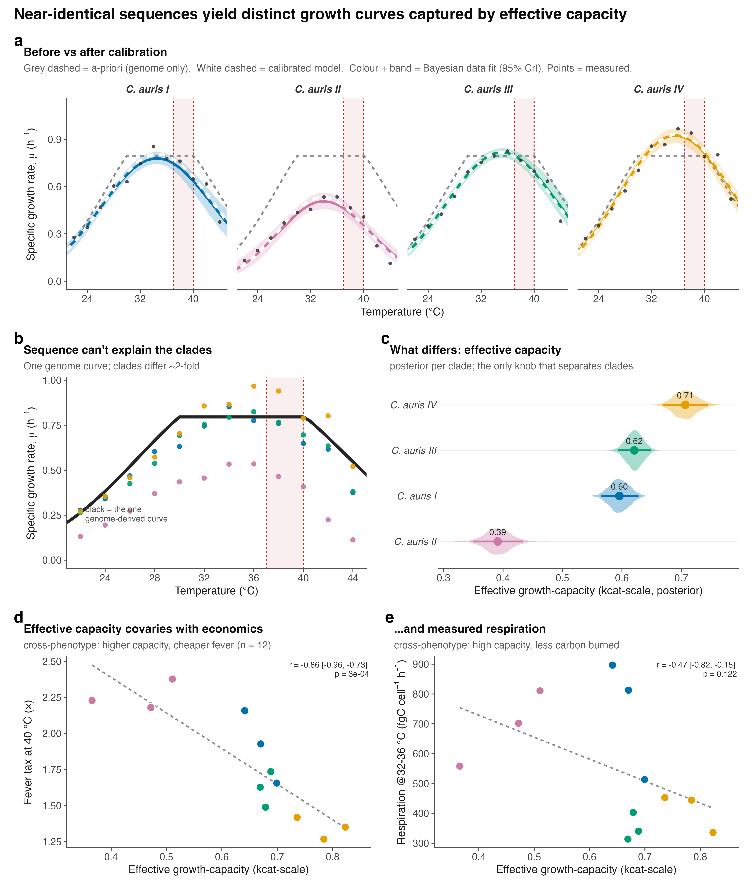

## Results

Dissolved-oxygen respirometry was used to fit thermal performance curves
for four Candida *auris* clades (I-IV; three isolates each) and C.
*parapsilosis* (three isolates), across 22-44 °C (12 temperatures).
Growth was modelled with a Sharpe-Schoolfield function and per-cell
respiration with a Boltzmann-Arrhenius function, both fitted
hierarchically (isolates nested within clades) in a Bayesian framework.
Unless stated, values are posterior medians with 95% credible intervals
(CrI).

## Methods (summary)
O~2~ concentration was recorded continuously with PreSens SensorDish
readers across the temperature series (22-44 °C, 12 temperatures; three
isolates × five replicates per temperature). Specific growth rate and
per-cell respiration rate were recovered simultaneously from each O~2~
time series using the mechanistic oxygen-dynamics model of Cakin et al. [@cakin2026], which couples exponential population growth with
biomass-proportional oxygen consumption, O~2~(t) = O~2,0~ + (K/r)(1 −
e^rt^), where r is the specific growth rate and K the volumetric O~2~
consumption rate at the window start. Per-cell respiration, carbon-use
efficiency and derived quantities were computed as in that study.

**Units.** The oxygen-dynamics model recovers the specific growth rate r
(h^−1^) from the exponential term. A per-cell carbon assimilation flux
was then formed as G = r q, where q is the per-cell carbon quota (a
temperature-independent constant per taxon); the per-cell respiratory
carbon flux R was obtained from the volumetric O~2~ consumption rate
divided by the biomass integral, converted to carbon. G and R are
therefore both per-cell carbon fluxes (fg C cell^−1^ h^−1^), and
carbon-use efficiency CUE = G/(G + R) is the dimensionless ratio of
these two matched quantities. Because q is independent of temperature,
the growth activation energy E~G~ equals the activation energy of r (q
shifts the intercept, not the Boltzmann slope) and is directly
comparable to the respiration activation energy E~R~. Growth thermal
performance curves (Fig. 1a) and E~G~ thus derive from a rate constant;
the r-to-carbon conversion enters only where CUE and downstream ratios
are formed.

# Growth and respiration decouple, placing the carbon-economy optimum below body temperature
Growth rate rose with temperature to a clade-level optimum near 33-36 °C
and then declined, following the expected unimodal thermal performance
curve (Fig. 1a). Per-cell respiration showed no such turnover: it
increased monotonically across the entire measured range, and
leave-one-out cross-validation favoured the monotonic Arrhenius model
over a unimodal Sharpe-Schoolfield alternative (Fig. 1b). Growth and
respiration are therefore governed by different thermal sensitivities.

This difference is quantified by the activation energies (Fig. 1c). In
every taxon, the activation energy of growth exceeded that of
respiration: E~G~ ranged 0.83-1.14 eV and E~R~ 0.30-0.52 eV, with the
growth-respiration difference credibly greater than zero in all five
taxa (0.39-0.73 eV; 95% CrI excluding zero throughout). Growth is thus
roughly twice as temperature-sensitive as respiration.

Because respiration continues to rise while growth saturates and falls,
carbon-use efficiency (CUE = G/(G+R)) is itself a unimodal function of
temperature that peaks early and then collapses (Fig. 1d). The
temperature of this economic optimum, T~opt~(CUE) lay below human body
temperature in every taxon: 31.3-34.1 °C, with posterior probability
P(T~opt~(CUE) \< 37 °C) ≥ 0.999 for all five (Fig. 1e). The economic
optimum sat 1.6-3.9 °C below the growth optimum and 2.9-5.7 °C below 37
°C. The mammalian host temperature therefore lies beyond the point at
which warming still improves the carbon economy of any species tested.

{width=100%}

**Figure 1. Growth and respiration decouple with temperature, placing
every carbon-economy optimum below body temperature.** (**a**) Specific
growth rate *r* (h^−1^) and (**b**) per-cell respiration carbon flux (fg C
cell^−1^ h^−1^) versus temperature (points, isolate-level observations; thin
lines, per-isolate fits; bold lines, clade-level posterior medians;
bands, 95% CrI). Growth turns over; respiration does not (Arrhenius
favoured over Sharpe-Schoolfield by leave-one-out cross-validation).
(**c**) Activation energies of growth (circles) and respiration
(triangles); dashed line, the 0.65 eV metabolic-theory value. Growth is
credibly more temperature-sensitive than respiration in all five taxa.
(**d**) Carbon-use efficiency, CUE = G/(G+R), collapses with warming and
peaks early; filled points mark each curve's peak. (**e**) Thermal
optimum of CUE (filled points, 95% CrI; open points, growth optimum;
small points, isolates), with the posterior probability that it lies
below 37 °C. Shaded band, 37 to 40 °C (body to fever).

**A febrile host imposes a quantifiable, taxon-specific carbon tax**

Because the economic optimum lies below 37 °C, every taxon operates at a
carbon penalty in the host. We express this as the relative respiratory
cost, i.e. respiration per unit growth relative to each taxon's own
cheapest temperature (Fig. 2a). At 40 °C (fever), this cost reached
1.34× for C. *auris* Clade IV but 3.13× for C. *parapsilosis*.

The three-degree step from body temperature (37 °C) to fever (40 °C)
captures the clinical penalty most directly (Fig. 2c). Over this
interval C. *parapsilosis* retained only 58% of its 37 °C growth rate
(0.58, 95% CrI 0.50-0.67) while its respiratory cost per unit growth
rose 1.96× (1.71-2.31). The C. *auris* clades were far less affected:
Clade IV retained 89% of growth (0.89, 0.85-0.93) at a cost increase of
only 1.25× (1.19-1.31), with Clades I-III intermediate (growth retained
0.67-0.84; cost 1.37×-1.73×). Fever thus suppresses growth without
suppressing respiration, and it does so most severely in C.
*parapsilosis*.

**A warmer environmental optimum predicts a lower cost of fever.**
Across the five taxa, the environmental growth optimum was strongly and
negatively associated with the metabolic cost of fever: the more
thermotolerant a taxon, the less a fever cost it (Fig. 2b). Computed as
a posterior distribution over Spearman's ρ (propagating parameter
uncertainty rather than treating the five taxon medians as fixed), the
correlation was ρ = −0.90 (95% CrI −1.00 to −0.30; P(ρ \< 0) = 0.996).
C. *parapsilosis* occupied the cool-optimum, expensive-fever extreme and
C. *auris* Clade IV the warm-optimum, cheap-fever extreme. This links
adaptation to a warm environment with tolerance of the febrile host as
facets of a single thermal trait, consistent with the hypothesis that
environmental thermal selection underlies fungal thermotolerance to the
mammalian host. We note that T~opt~ and fever cost are partly
geometrically coupled through the growth curve; however, respiration
(E~R~) is an independent parameter that could have broken the
relationship and did not. The correlation rests on only five taxa; it is
therefore reported as suggestive and will be tested directly with
additional species.

**Clade-level differences within** C. *auris***.** Pairwise comparison
of the fever cost resolved 8 of 10 taxon contrasts (95% CrI excluding a
ratio of 1; Fig. 2d). All four C. *auris* clades credibly paid less at
fever than C. *parapsilosis* (cost ratios 0.43-0.72), and Clade IV was
credibly the cheapest of all clades. Only two contrasts, Clade I versus
Clade II (0.85, 0.68-1.04) and Clade I versus Clade III (1.18,
0.98-1.42), could not be separated at three isolates per clade.

{width=100%}

{width=100%}

**Figure 4. The sequence-grounded etc-GEM pipeline.** Fixed,
genome-derived inputs (the iRV973 metabolic network; per-reaction
turnover kcat from EC/DLKcat; enzyme molecular weights and per-clade
sequences; per-enzyme thermal parameters Topt, Tm and ΔCp; and
proteome-sector fractions) feed an enzyme- and temperature-constrained
genome-scale model that, at each temperature, maximises growth subject
to a shared enzyme budget. Three parameters (ΔTopt, ΔCp-scale, and
effective-capacity kcat-scale) are then calibrated by differential
evolution and MCMC to each clade\'s measured growth curve. Because the
genome is \>99% identical across clades, only the effective
growth-capacity axis differs, giving the per-clade values in Figure 3.

The four clades are near-identical at the enzyme level: median
whole-proteome amino-acid identity was 99.4-100% across clades I-IV
(reciprocal best-hit alignment of the four reference proteomes).
Consequently the genome-derived model predicts a single, essentially
identical thermal curve for all four clades, whereas the measured clades
differ roughly two-fold in peak growth (Fig. 3b). Sequence variation
therefore cannot account for the clade differences.

The difference resides instead in an effective growth-capacity axis
(kcat-scale), an effective flux-generating capacity per unit modelled
metabolic proteome that lumps enzyme abundance, active fraction,
substrate saturation, maintenance and respiratory coupling (Fig. 3c). It
is a single proteome-wide capacity scaling, not a change in the
individual database-derived kcat values, which are shared across the
near-identical clades. Its posterior ordered with thermotolerance (Clade
II lowest at 0.39, Clades I and III intermediate at 0.60 and 0.62, Clade
IV highest at 0.71), and of the three calibration parameters it was the
only one that separated the clades (5 of 6 pairwise contrasts with
non-overlapping 95% CrI, versus 1 of 6 for the optimum shift and 0 of 6
for curvature; Supplementary Fig. 1b).

**The effective capacity axis covaries with measured respiratory
economics.** The growth-fitted effective-capacity scalar covaried across
the twelve isolates with independently measured, respiration-containing
outcomes. It was negatively associated with the cost of a fever (r =
-0.86, 95% CI -0.96 to -0.76): the higher a clade\'s capacity, the
cheaper its fever (Fig. 3d). It was likewise negatively associated with
per-cell respiration at the growth optimum (r = -0.64), so that
higher-capacity clades sustain growth while respiring less carbon (Fig.
3e). These cross-phenotype associations indicate that the scalar
captures a reproducible physiological axis extending beyond peak-growth
amplitude, but they do not constitute independent mechanistic validation
of enzyme abundance. The fever tax is itself derived from measured
growth and respiration through carbon-use efficiency, so it is not a
fully independent target; and a flux-variability analysis showed that
oxygen consumption at fixed optimal growth is not uniquely determined by
the growth-calibrated model, so the model\'s respiration is an
objective-selected flux solution rather than a unique prediction.
Growth-only fits of alternative capacity, maintenance and uptake
constraints each reproduced the clade growth ranking but none recovered
the observed ranking in respiratory cost, and Clade II combined the
lowest growth with the highest respiratory cost. We therefore read the
fitted parameter as an effective growth-capacity axis that does not by
itself distinguish reduced enzyme deployment from a coupling or
maintenance component. Capacity behaved as a clade-level trait, with 90%
of its variance between clades (ICC~1~ = 0.90; ANOVA F~3~,~8~ = 27.7, P =
1.4×10^−4^; Supplementary Fig. 1a). The capacity-versus-peak-growth
relationship, by contrast, is a self-consistency check rather than
independent evidence, because capacity is itself the fitted height term
(Supplementary Fig. 2).

Because the clades are near-identical in coding sequence, the capacity
differences cannot be encoded there. A direct transcriptional test did
not, however, localise them to bulk mRNA: in the only public
clade-resolved RNA-seq at a controlled condition (Clade I versus Clade
II, 37 °C; GEO GSE165762), the model\'s 928 central-metabolic enzyme
genes were not coordinately lower in the low-capacity clade (median log~2~
fold-change -0.005 versus +0.031 for the genome background; Wilcoxon P =
0.93; Supplementary Fig. 1d). Because that analysis is compositional
(standard library-size-normalised RNA-seq, a single Clade II isolate,
one 37 °C snapshot), it rules out a relative down-allocation of
metabolic transcripts, not lower absolute output. The causal layer is
therefore non-coding, regulatory, post-transcriptional,
post-translational, or bioenergetic, and remains undetermined among
these; distinguishing them will require a model-identifiability analysis
(profiling capacity against maintenance, uptake and respiratory
coupling) together with absolute, spike-in-calibrated proteomics, which
partitions but does not fully close these branches.

{width=100%}

**Figure 3. Clade thermotolerance is a growth-tunable trait, not
sequence.** (**a**) Per-clade calibration of the sequence-grounded
etc-GEM: grey dashed, genome-only (a-priori) prediction; white dashed,
calibrated model; colour and band, Bayesian data fit (95% CrI); points,
measured. (**b**) The genome yields one curve for all clades (black),
yet the measured clades differ \~2-fold. (**c**) Posterior of the
effective growth-capacity parameter (kcat-scale) per clade; the only
calibration parameter that separates the clades. (**d**) Effective
growth-capacity versus the measured fever tax at 40 °C and (**e**)
versus per-cell respiration at 32-36 °C (points, twelve isolates
coloured by clade). The scalar was fitted to growth only; d-e are
cross-phenotype associations, not independent mechanistic validation,
because the fever tax derives from measured growth and respiration and
the model\'s respiration at fixed growth is not uniquely determined (see
text). They replace the earlier capacity-versus-growth panel, which was
a self-consistency check (Supplementary Fig. 2).



# Supplementary figures
{width=100%}

**Supplementary Figure 1. The effective growth-capacity axis is a real,
clade-level, non-coding, non-transcriptional trait.** (**a**) Capacity
across the twelve isolates by clade (bars, clade means); 90% of the
variance lies between clades (ICC~1~ = 0.90). (**b**) Number of clade
pairs resolved (non-overlapping 95% CrI) by each calibration parameter;
only the effective growth-capacity parameter (kcat-scale) separates the
clades. (**c**) Median whole-proteome amino-acid identity of each clade
to Clade I (diamond reciprocal best-hit); coding sequence is \>99%
identical. (**d**) Distribution of Clade I-versus-II log~2~ fold-change
for the model\'s 928 metabolic-enzyme genes (red) against the genome
background (grey), from GEO GSE165762; the metabolic set is not
coordinately shifted (Wilcoxon P = 0.93).

{width=100%}

**Supplementary Figure 2. Self-consistency check.** Effective
growth-capacity (the fitted curve-height parameter) versus measured peak
growth across the twelve isolates (r = 0.96). Because capacity scales
curve height by construction, this relationship is expected and is shown
as a consistency check, not as independent evidence; the out-of-sample
tests are in Fig. 3d-e.



# References

::: {#refs}
:::
