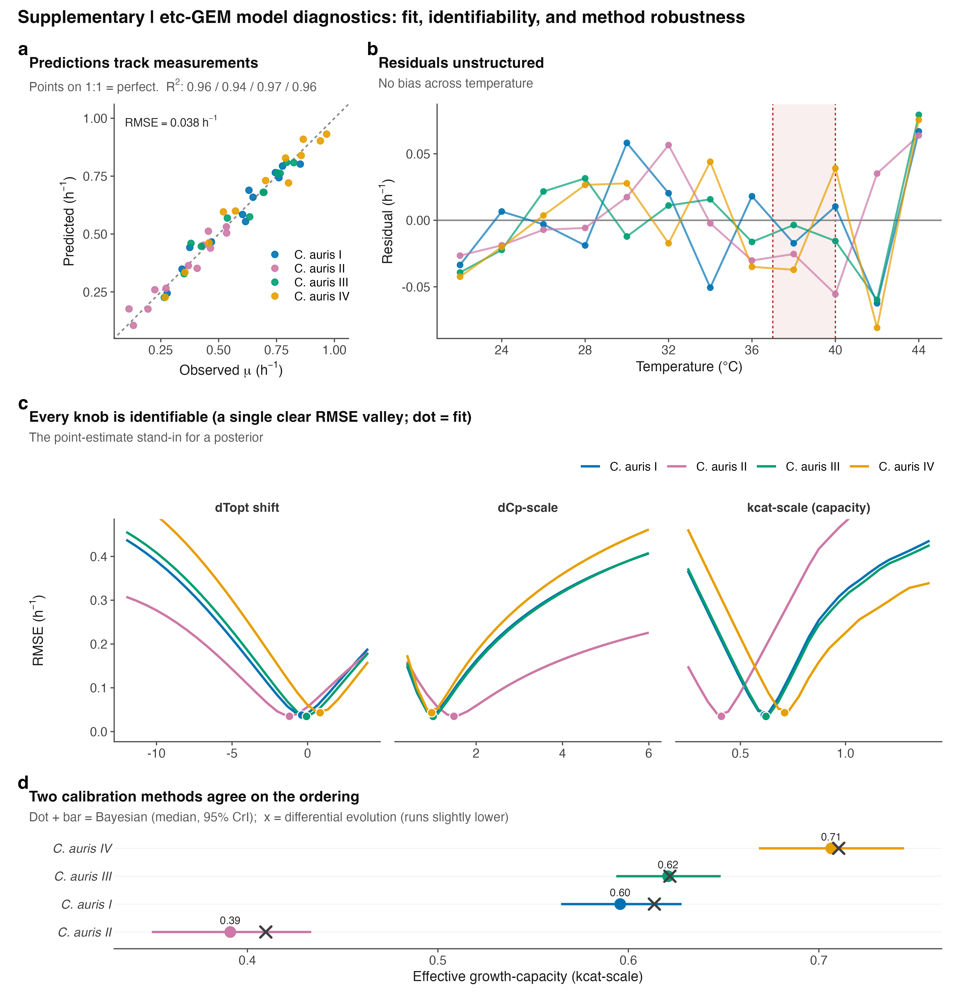

# Supplementary figures
{width=100%}

**Supplementary Figure 1. The effective growth-capacity axis is a real,
clade-level, non-coding, non-transcriptional trait.** (**a**) Capacity
across the twelve isolates by clade (bars, clade means); 90% of the
variance lies between clades (ICC~1~ = 0.90). (**b**) Number of clade
pairs resolved (non-overlapping 95% CrI) by each calibration parameter;
only the effective growth-capacity parameter (kcat-scale) separates the
clades. (**c**) Median whole-proteome amino-acid identity of each clade
to Clade I (diamond reciprocal best-hit); coding sequence is \>99%
identical. (**d**) Distribution of Clade I-versus-II log~2~ fold-change
for the model\'s 928 metabolic-enzyme genes (red) against the genome
background (grey), from GEO GSE165762; the metabolic set is not
coordinately shifted (Wilcoxon P = 0.93).

{width=100%}

**Supplementary Figure 2. Self-consistency check.** Effective
growth-capacity (the fitted curve-height parameter) versus measured peak
growth across the twelve isolates (r = 0.96). Because capacity scales
curve height by construction, this relationship is expected and is shown
as a consistency check, not as independent evidence; the out-of-sample
tests are in Fig. 3d-e.
