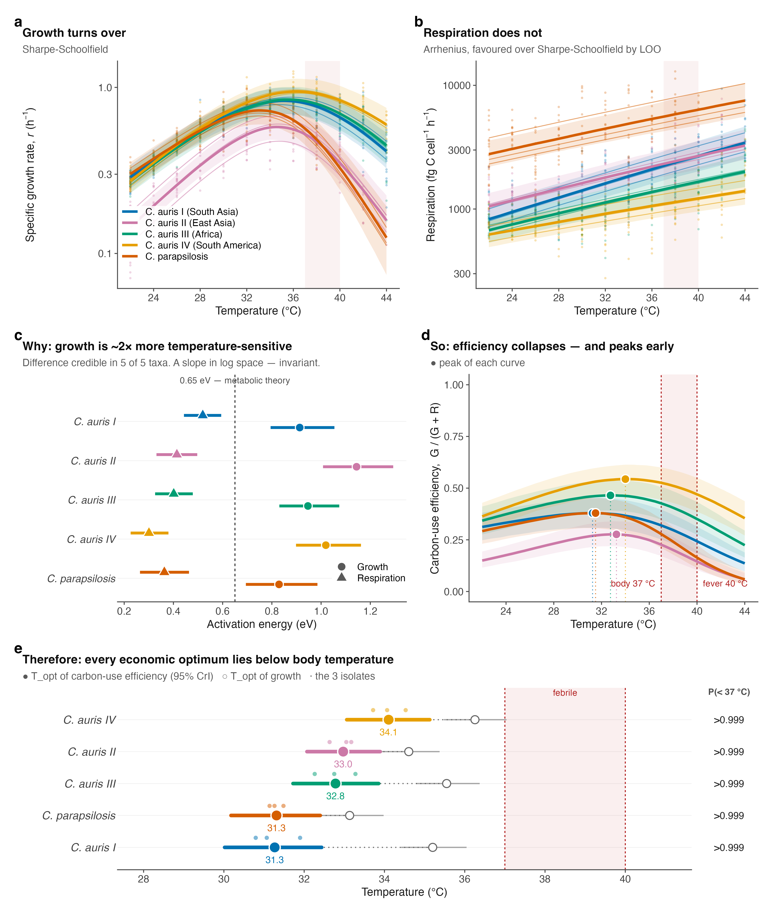
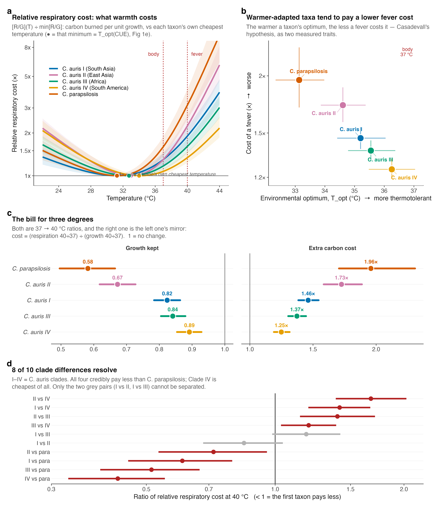
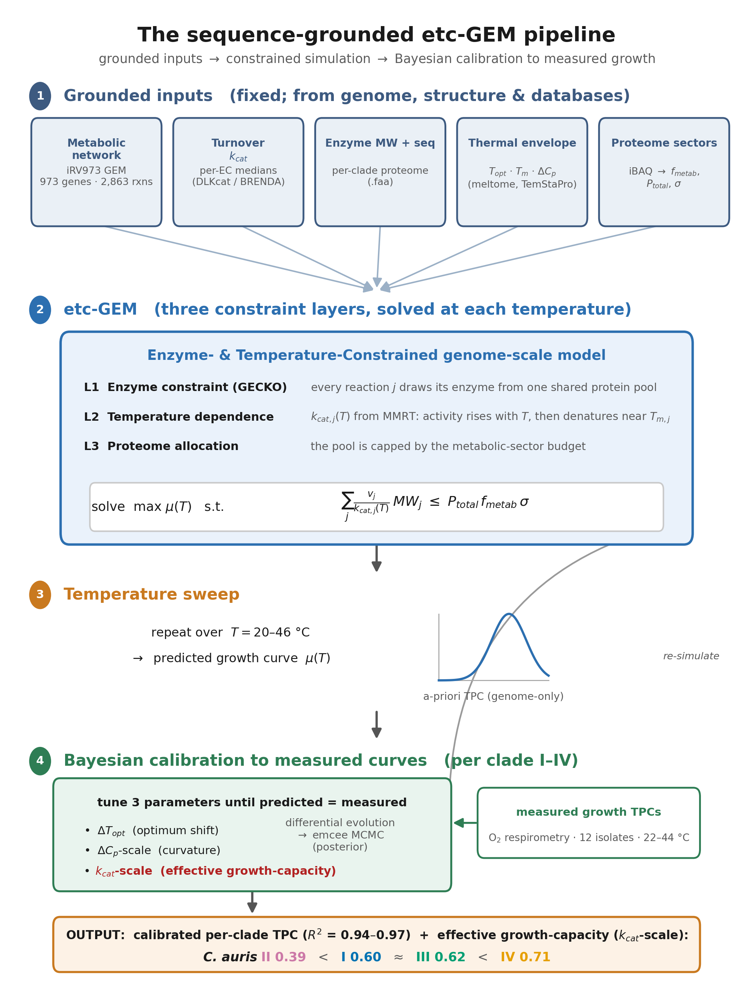
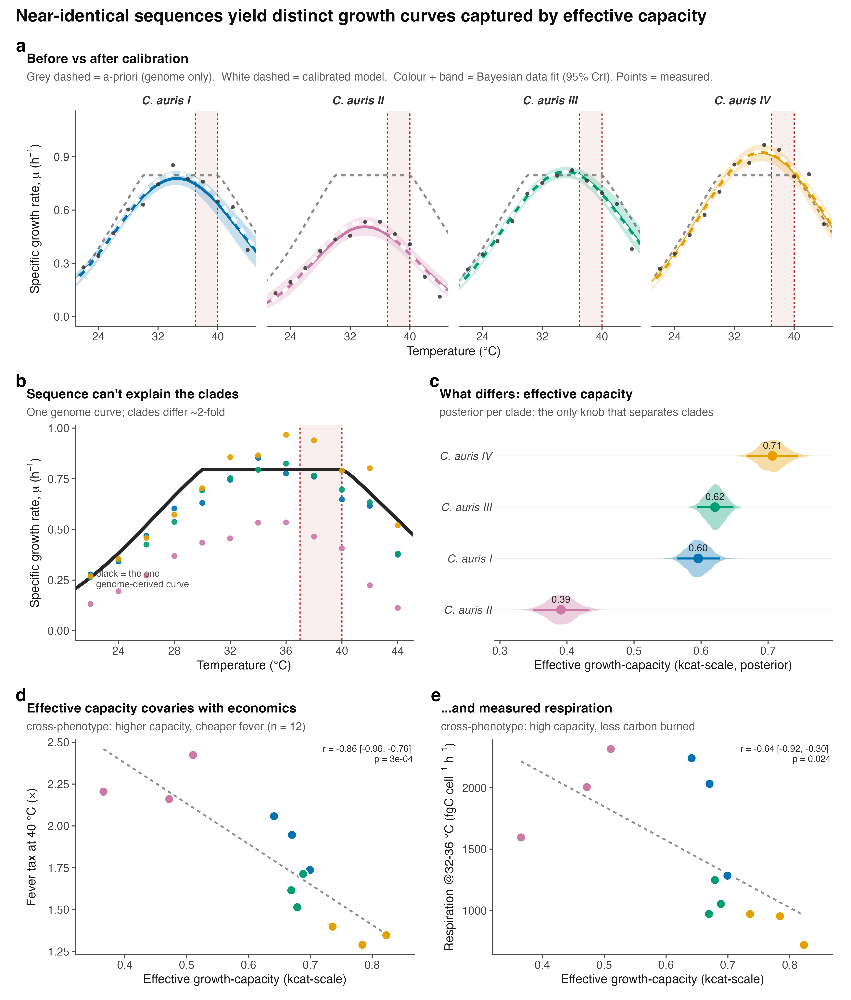
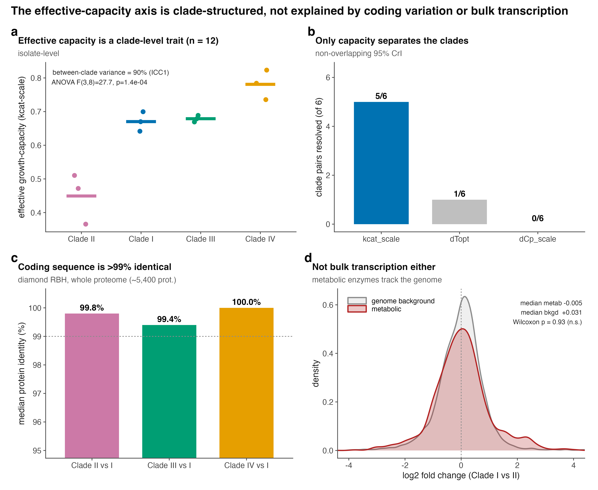
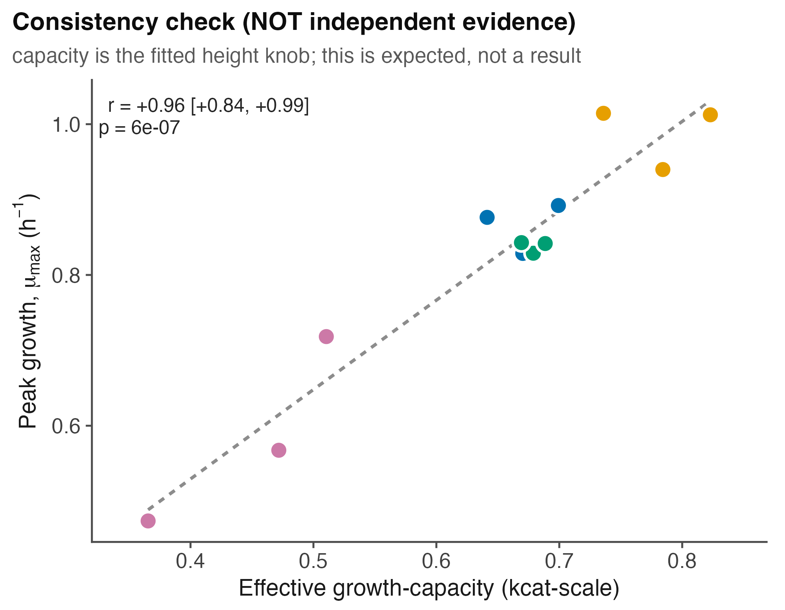
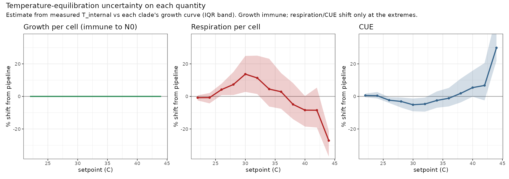
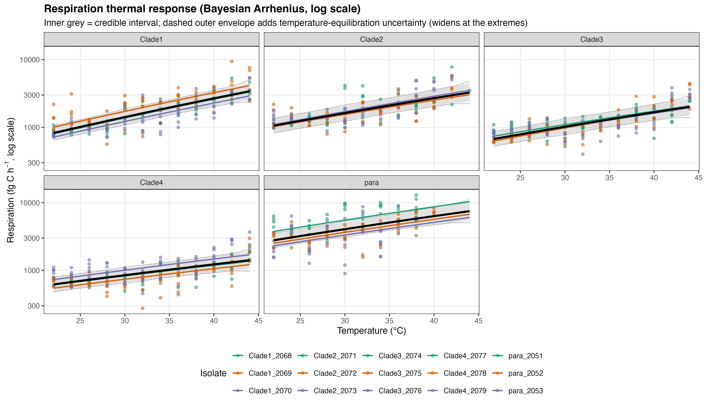
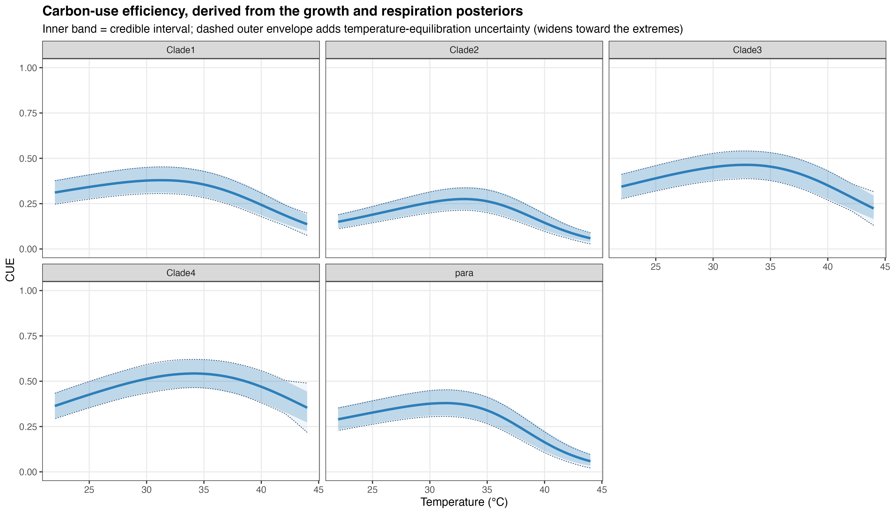

*Results*

We tested whether warming imposes a metabolic cost on pathogenic *Candida* by raising respiration relative to growth. Across all taxa, growth peaked below fever temperature while respiration continued to rise, so carbon-use efficiency declined at host temperatures, and the penalty was substantially smaller in the most thermotolerant *C. auris* clades.

Dissolved-oxygen respirometry was used to fit thermal performance curves for four Candida *auris* clades (I-IV; three isolates each) and C. *parapsilosis* (three isolates), across 22-44 °C (12 temperatures). Growth was modelled with a Sharpe-Schoolfield function and per-cell respiration with a Boltzmann-Arrhenius function, both fitted hierarchically (isolates nested within clades) in a Bayesian framework. Unless stated, values are posterior medians with 95% credible intervals (CrI).

## **Methods (summary)**

O~2~ concentration was recorded continuously with PreSens SensorDish readers across the temperature series (22-44 °C, 12 temperatures; three isolates × five replicates per temperature). Specific growth rate and per-cell respiration rate were recovered simultaneously from each O~2~ time series using the mechanistic oxygen-dynamics model of Cakin *et al.* (2026), which couples exponential population growth with biomass-proportional oxygen consumption, O~2~(t) = O~2,0~ + (K/r)(1 − e^rt^), where r is the specific growth rate and K the volumetric O~2~ consumption rate at the window start. Per-cell respiration, carbon-use efficiency and derived quantities were computed as in that study.

Growth and respiratory carbon flux were expressed on a matched per-cell basis, so carbon-use efficiency could be computed as CUE = G/(G + R). Because the assumed per-cell carbon quota is temperature-independent, the activation energy of growth is directly comparable with that of respiration.

# **Growth and respiration decouple, placing the carbon-economy optimum below body temperature**

Growth rate rose with temperature to a clade-level optimum near 33-36 °C and then declined, following the expected unimodal thermal performance curve (Fig. 1a). Per-cell respiration showed no such turnover: it increased monotonically across the entire measured range, and leave-one-out cross-validation favoured the monotonic Arrhenius model over a unimodal Sharpe-Schoolfield alternative (Fig. 1b). Growth and respiration are therefore governed by different thermal sensitivities.

This difference is quantified by the activation energies (Fig. 1c). In every taxon, the activation energy of growth exceeded that of respiration: E~G~ ranged 0.83-1.14 eV and E~R~ 0.30-0.52 eV, with the growth-respiration difference credibly greater than zero in all five taxa (0.39-0.73 eV; 95% CrI excluding zero throughout). Growth is thus roughly twice as temperature-sensitive as respiration. The respiration activation energies additionally carry a small, temperature-structured uncertainty from the inoculum back-projection (Robustness, below); it does not alter the growth-minus-respiration ordering in any taxon.

Because respiration continues to rise while growth saturates and falls, carbon-use efficiency (CUE = G/(G+R)) is itself a unimodal function of temperature that peaks early and then collapses (Fig. 1d). The temperature of this economic optimum, T~opt~(CUE) lay below human body temperature in every taxon: 31.3-34.1 °C, with posterior probability P(T~opt~(CUE) \< 37 °C) ≥ 0.999 for all five (Fig. 1e). The economic optimum sat 1.6-3.9 °C below the growth optimum and 2.9-5.7 °C below 37 °C. The mammalian host temperature therefore lies beyond the point at which warming still improves the carbon economy of any species tested.

{width="6.395833333333333in" height="7.514586614173228in"}

**Figure 1. Growth and respiration decouple with temperature, placing every carbon-economy optimum below body temperature.** (**a**) Specific growth rate *r* (h⁻¹) and (**b**) per-cell respiration carbon flux (fg C cell⁻¹ h⁻¹) versus temperature (points, isolate-level observations; thin lines, per-isolate fits; bold lines, clade-level posterior medians; bands, 95% CrI). Growth turns over; respiration does not (Arrhenius favoured over Sharpe-Schoolfield by leave-one-out cross-validation). (**c**) Activation energies of growth (circles) and respiration (triangles); dashed line, the 0.65 eV metabolic-theory value. Growth is credibly more temperature-sensitive than respiration in all five taxa. (**d**) Carbon-use efficiency, CUE = G/(G+R), collapses with warming and peaks early; filled points mark each curve's peak. (**e**) Thermal optimum of CUE (filled points, 95% CrI; open points, growth optimum; small points, isolates), with the posterior probability that it lies below 37 °C. Shaded band, 37 to 40 °C (body to fever).

**A febrile host imposes a quantifiable, taxon-specific carbon tax**

Because the economic optimum lies below 37 °C, every taxon operates at a carbon penalty in the host. We express this as the relative respiratory cost, i.e. respiration per unit growth relative to each taxon's own cheapest temperature (Fig. 2a). At 40 °C (fever), this cost reached 1.34× for C. *auris* Clade IV but 3.13× for C. *parapsilosis*.

The three-degree step from body temperature (37 °C) to fever (40 °C) captures the clinical penalty most directly (Fig. 2c). Over this interval C. *parapsilosis* retained only 58% of its 37 °C growth rate (0.58, 95% CrI 0.50-0.67) while its respiratory cost per unit growth rose 1.96× (1.71-2.31). The C. *auris* clades were far less affected: Clade IV retained 89% of growth (0.89, 0.85-0.93) at a cost increase of only 1.25× (1.19-1.31), with Clades I-III intermediate (growth retained 0.67-0.84; cost 1.37×-1.73×). Fever thus suppresses growth without suppressing respiration, and it does so most severely in C. *parapsilosis*. Absolute per-cell costs at 40 °C carry the temperature-equilibration uncertainty quantified below; the direction and the among-taxon ranking are unaffected.

**Clade-level differences within** C. *auris***.** Pairwise comparison of the fever cost resolved 8 of 10 taxon contrasts (95% CrI excluding a ratio of 1; Fig. 2d). All four C. *auris* clades credibly paid less at fever than C. *parapsilosis* (cost ratios 0.43-0.72), and Clade IV was credibly the cheapest of all clades. Only two contrasts, Clade I versus Clade II (0.85, 0.68-1.04) and Clade I versus Clade III (1.18, 0.98-1.42), could not be separated at three isolates per clade.

{width="6.395833333333333in" height="7.339966097987752in"}

**Figure 2.** A febrile host imposes a quantifiable, taxon-specific carbon cost. (a) Relative respiratory cost (respiration per unit growth, each taxon normalised to its own cheapest temperature) versus temperature; the minimum marks the CUE optimum, Topt(CUE). (b) Environmental growth optimum versus the cost of a fever across the five taxa; warmer-adapted taxa pay less. (c) The 37 to 40 °C step: growth retained (left) and the rise in respiratory cost per unit growth (right). (d) Pairwise contrasts of the 40 °C fever cost among clades and against *C. parapsilosis* (ratio \< 1 means the first taxon pays less). Points and bars are posterior medians with 95% credible intervals.

As an exploratory observation resting on only five taxa, and one partly geometrically coupled to the growth curve, the environmental growth optimum was negatively associated with the cost of a fever: the more thermotolerant a taxon, the less a fever cost it (Fig. 2b). Computed as a posterior over Spearman's ρ (propagating parameter uncertainty rather than treating the five taxon medians as fixed), the correlation was ρ = −0.90 (95% CrI −1.00 to −0.30; P(ρ \< 0) = 0.996), with *C. parapsilosis* at the cool-optimum, expensive-fever extreme and *C. auris* Clade IV at the warm-optimum, cheap-fever extreme. The respiration activation energy is an independent parameter that could have broken the relationship and did not; with only five points, however, we report the association as suggestive, to be tested directly with additional species. It is consistent with environmental thermal selection contributing to tolerance of the mammalian host.

Temperature-equilibration uncertainty in the inoculum back-projection affected the absolute per-cell values most at the temperature extremes (≥40 °C) but changed neither the direction, the significance, nor the taxon ranking of these results (Robustness and limitations).

**Clade differences are captured by an effective growth-capacity axis despite near-identical sequences**

Having established reproducible differences in fever cost among the *C. auris* clades, we asked whether their near-identical enzyme sequences could account for them. We compared the measured growth curves with a sequence-grounded, enzyme- and temperature-constrained genome-scale metabolic model (etc-GEM), in which fixed genome-derived inputs feed a model that maximises growth at each temperature under a shared enzyme budget, and three parameters are calibrated to each clade's growth curve (Fig. 3).

{width="5.5993000874890635in" height="7.452285651793526in"}

**Figure 3.** The sequence-grounded etc-GEM pipeline. Fixed, genome-derived inputs (the iRV973 metabolic network; per-reaction turnover kcat from EC/DLKcat; enzyme molecular weights and per-clade sequences; per-enzyme thermal parameters Topt, Tm and ΔCp; and proteome-sector fractions) feed an enzyme- and temperature-constrained genome-scale model that, at each temperature, maximises growth subject to a shared enzyme budget. Three parameters (ΔTopt, ΔCp-scale, and effective-capacity kcat-scale) are then calibrated by differential evolution and MCMC to each clade's measured growth curve. Within the calibrated model, the effective growth-capacity axis is the only parameter that clearly separates the clades, despite their \>99% reference-proteome identity; the per-clade values are given in Figure 4.

The four clades are near-identical at the enzyme level: median whole-proteome amino-acid identity was 99.4-100% across clades I-IV (reciprocal best-hit alignment of the four reference proteomes). Consequently the genome-derived model predicts a nearly identical thermal curve for all four clades, whereas their measured peak growth differs roughly two-fold (Fig. 4b). Broad differences in enzyme coding sequence are therefore unlikely to explain the observed clade differences.

The difference is captured instead by an effective growth-capacity axis (kcat-scale), an effective flux-generating capacity per unit modelled metabolic proteome that lumps enzyme abundance, active fraction, substrate saturation, maintenance and respiratory coupling (Fig. 4c). It is a single proteome-wide capacity scaling, not a change in the individual database-derived kcat values, which are shared across the near-identical clades. Its posterior ordered with thermotolerance (Clade II lowest at 0.39, Clades I and III intermediate at 0.60 and 0.62, Clade IV highest at 0.71), and of the three calibration parameters it was the only one that separated the clades (5 of 6 pairwise contrasts with non-overlapping 95% CrI, versus 1 of 6 for the optimum shift and 0 of 6 for curvature; Supplementary Fig. 1b).

The effective-capacity axis covaries with measured respiratory economics. The growth-fitted scalar covaried across the twelve isolates with outcomes not used to fit the model and that incorporate measured respiration: it was negatively associated with the cost of a fever (r = −0.86, 95% CI −0.96 to −0.76), so the higher a clade's capacity the cheaper its fever (Fig. 4d), and with per-cell respiration at the growth optimum (r = −0.64), so that higher-capacity clades sustain growth while respiring less carbon (Fig. 4e). Capacity behaved as a reproducible clade-level trait, with 90% of its variance falling between clades (ICC₁ = 0.90; ANOVA F₃,₈ = 27.7, P = 1.4×10⁻⁴; Supplementary Fig. 1a).

These are cross-phenotype associations, not independent mechanistic validation. First, the fever tax is itself derived from measured growth and respiration through carbon-use efficiency, so it is not a fully independent target. Second, a flux-variability analysis showed that oxygen consumption at fixed optimal growth is not uniquely determined by the growth-calibrated model, so the model's respiration is an objective-selected flux solution rather than a unique prediction. Third, growth-only fits of alternative capacity, maintenance and uptake constraints each reproduced the clade growth ranking but none recovered the observed ranking in respiratory cost, with Clade II combining the lowest growth with the highest respiratory cost. We therefore read the fitted parameter as an effective growth-capacity axis that does not by itself distinguish reduced enzyme deployment from a coupling or maintenance component. The capacity-versus-peak-growth relationship, by contrast, is a self-consistency check rather than independent evidence, because capacity is itself the fitted height term (Supplementary Fig. 2).

The near-identity of the reference proteomes makes broad coding-sequence divergence an unlikely explanation for the capacity differences. A direct transcriptional test likewise did not support a coordinated relative down-allocation of metabolic transcripts: in the only public clade-resolved RNA-seq at a controlled condition (Clade I versus Clade II, 37 °C; GEO GSE165762), the model's 928 central-metabolic enzyme genes were not coordinately lower in the low-capacity clade (median log₂ fold-change -0.005 versus +0.031 for the genome background; Wilcoxon P = 0.93; Supplementary Fig. 1d). Because that analysis is compositional (standard library-size-normalised RNA-seq, a single Clade II isolate, one 37 °C snapshot), it rules out a relative down-allocation of metabolic transcripts, not lower absolute output. The causal layer is therefore non-coding, regulatory, post-transcriptional, post-translational, or bioenergetic, and remains undetermined among these; distinguishing them will require a model-identifiability analysis (profiling capacity against maintenance, uptake and respiratory coupling) together with absolute, spike-in-calibrated proteomics, which partitions but does not fully close these branches.

{width="6.395833333333333in" height="7.514586614173228in"}

**Figure 4.** Clade differences are captured by an effective growth-capacity axis despite near-identical sequence. (a) Per-clade calibration of the sequence-grounded etc-GEM: grey dashed, genome-only (a-priori) prediction; white dashed, calibrated model; colour and band, Bayesian data fit (95% CrI); points, measured. (b) The genome yields one curve for all clades (black), yet the measured clades differ \~2-fold. (c) Posterior of the effective growth-capacity parameter (kcat-scale) per clade; the only calibration parameter that separates the clades. (d) Effective growth-capacity versus the measured fever tax at 40 °C and (e) versus per-cell respiration at 32--36 °C (points, twelve isolates coloured by clade). The scalar was fitted to growth only; d--e are cross-phenotype associations, not independent mechanistic validation, because the fever tax derives from measured growth and respiration and the model's respiration at fixed growth is not uniquely determined (see text). They replace the earlier capacity-versus-growth panel, a self-consistency check (Supplementary Fig. 2).

**Robustness and limitations**

Per-cell respiration and carbon-use efficiency depend on the starting cell number N0, obtained by back-projecting the measured inoculum over the pre-fit interval, N0 = N_inoc·exp(r·Δt). The specific growth rate r and its activation energy are recovered directly from the oxygen dynamics and are independent of N0; only the per-cell respiratory flux, CUE and quantities derived from them inherit its uncertainty, so we assessed the two ways the back-projection can bias them. First, a fit-window selection issue was corrected: for a small number of series (chiefly at 26 °C) the selector had latched onto a short late-run segment and returned implausible growth rates. These windows were reviewed and corrected to span the full respiration phase, restoring the expected unimodal growth curves and leaving every clade optimum in the 34--36 °C range.

Second, and more consequentially, the vials are inoculated near bench temperature and take tens of minutes to reach setpoint, so the growth accrued during the pre-fit interval is not governed by the stable r used in the back-projection. Using the continuously logged internal vial temperature together with each clade's own measured growth--temperature curve, we recomputed the growth actually accrued during equilibration and propagated the difference into N0. Growth per cell is unaffected by construction. Per-cell respiration and CUE shift in a temperature-structured way: negligibly across 22--36 °C, then increasingly toward the extremes, with the sign set by the growth optimum (below it, a cooler onset implies slower early growth and slightly higher per-cell respiration; above it, the reverse). The median shift on respiration reaches about +14% near 30 °C and −27% at 44 °C, mirrored and buffered in CUE, while growth per cell is immune throughout (Supplementary Fig. 3). Shown on the thermal curves themselves, widening each posterior credible interval by this component leaves an outer envelope that coincides with the credible interval through the mid-range and separates only toward the extremes (Supplementary Figs. 4 and 5).

The uncertainty is roughly an order of magnitude smaller than the trends it could threaten. The CUE optimum still lies below 37 °C in every taxon, growth remains credibly more temperature-sensitive than respiration, respiration's monotonic rise is unchanged, and C. auris Clade IV remains the cheapest at fever. We therefore keep the per-cell point estimates unchanged but treat their absolute values at the temperature extremes (≥40 °C) as approximate. Separately, the absolute carbon scale carries a systematic uncertainty from the assumed respiratory quotient and per-cell carbon content; varying these within literature ranges rescales CUE proportionally but does not change its thermal shape, its sub-37 °C optimum, or any among-taxon ranking. All conclusions in the preceding sections are robust to these sources.

Across the *Candida* taxa tested, host and fever temperatures lie above the optimum for carbon-use efficiency, because respiration continues to rise after growth has peaked. The resulting fever cost is smallest in the warmest-adapted *C. auris* clade. A sequence-grounded model reproduces the clade growth differences through a single effective-capacity parameter that also covaries with respiratory phenotype, but the molecular and bioenergetic basis of that capacity remains unresolved.

# 

# 

# **Supplementary figures**

{width="6.395833333333333in" height="5.243044619422572in"}

**Supplementary Figure 1.** The effective-capacity axis is clade-structured and is not explained by coding variation or by coordinated metabolic-transcript allocation in the available dataset. (a) Capacity across the twelve isolates by clade (bars, clade means); 90% of the variance lies between clades (ICC₁ = 0.90). (b) Number of clade pairs resolved (non-overlapping 95% CrI) by each calibration parameter; only the effective growth-capacity parameter (kcat-scale) separates the clades. (c) Median whole-proteome amino-acid identity of each clade to Clade I (diamond reciprocal best-hit); coding sequence is \>99% identical. (d) Distribution of Clade I-versus-II log₂ fold-change for the model's 928 metabolic-enzyme genes (red) against the genome background (grey), from GEO GSE165762; the metabolic set is not coordinately shifted (Wilcoxon P = 0.93).

{width="6.395833333333333in" height="4.975205599300088in"}

**Supplementary Figure 2.** Self-consistency check. Effective growth-capacity (the fitted curve-height parameter) versus measured peak growth across the twelve isolates (r = 0.96). Because capacity scales curve height by construction, this relationship is expected and is shown as a consistency check, not as independent evidence; the out-of-sample tests are in Fig. 4d--e.

{width="6.6in" height="2.335384951881015in"}

**Supplementary Figure 3.** Sensitivity of each per-cell quantity to temperature equilibration. Median percentage shift from the pipeline value versus setpoint, estimated from the logged internal vial temperature against each clade's growth curve (band, interquartile range across vials). Growth per cell is immune because it does not use N0; per-cell respiration shifts by a few percent through the mid-range and up to about −27% at 44 °C; CUE follows, buffered.

{width="6.6in" height="3.8076924759405073in"}

**Supplementary Figure 4.** Per-cell respiration versus temperature (Bayesian Arrhenius, log scale), per clade, with the temperature-equilibration uncertainty overlaid. Solid band, 95% credible interval; dashed envelope, the same interval widened by the equilibration component. The two coincide through the mid-range and separate only toward the extremes; respiration's monotonic rise is unaffected.

{width="6.6in" height="3.8076924759405073in"}

**Supplementary Figure 5.** Carbon-use efficiency versus temperature, per clade, with the temperature-equilibration uncertainty overlaid. Solid band, 95% credible interval; dashed envelope, widened by the equilibration component. Even with the added uncertainty, CUE peaks below body temperature and declines with further warming in every clade.

# 

# **Reference**

Cakin I, Millington R, Pawar S, Buckling A, Smirnoff N, Padfield D, Duffy J, Yvon-Durocher G. *A novel method to simultaneously estimate bacterial respiration and growth from oxygen dynamics.* ISME Communications 2026;6(1):ycag024. https://doi.org/10.1093/ismeco/ycag024
