# **Supplementary Methods**

**Sensitivity arm: the pre-registered classifier.** Before the likelihood model was written, the state of every series had been derived by a three-criterion classifier applied blind to taxon, isolate and temperature, with its protocol, source and output hashed before any label was restored (protocol versions 1 to 4, archived with their hashes). It scored a vial as confirmed growth when all of blocked cross-validation, a bootstrap floor on r and rt ≥ 0.5 agreed, and as ambiguous when they disagreed. The likelihood model agrees with it on 930 of its 931 confirmed-growth vials. Of its 154 ambiguous vials, 90 failed only the cross-validation criterion because the fixed fit window ran into the plateau, and 89 of those are growth under the likelihood model; of the remaining 64, 13 are growth. Of its 114 respiration-only vials, 31 show growth under the likelihood model (LR 11 to 220, median r 0.09 h⁻¹), curvature the classifier missed because its window extended 15 h into the plateau. Every count in Figs 1 to 3 uses the likelihood model; the classifier's states are retained in the project archive.

**Isolate-level crossings and their concordance with the limit.** The cost-multiplier crossings were recomputed for every isolate from its own curve in the hierarchical fit (group effect plus that isolate's random effects on the growth activation energy, the deactivation midpoint and the respiration activation energy), for every posterior draw as for the group-level analysis. Each isolate's 3× crossing (posterior median) was compared with its observed loss of growth under the likelihood model: the signed distance to the grid interval (zero if inside), the posterior probability that the crossing falls inside the interval, Spearman's rank correlation across the 20 isolates with censored limits tied above 44 °C, and an interval-censored regression of the limit on the crossing. Whether any fitted quantity predicts the limit better than another was tested by using each in turn as the single predictor in the interval-censored model (the 1.5×, 2× and 3× crossings, the growth optimum, the CUE optimum, the deactivation midpoint T~h~ and the temperature at which fitted growth falls to half its peak), compared by maximised log-likelihood and leave-one-isolate-out predictive density; the half-peak temperature and the crossings were indistinguishable and both outperformed T~h~ and the CUE optimum.

**Decomposition of the displacement.** For each of the 12 *C. auris*-clade-versus-relative pairs and 600 posterior draws of the group-level parameters, the 3× crossing was recomputed with every subset of the four curve parameters (E, E~h~, T~h~, E~R~) taken from the *C. auris* clade and the rest from the relative; each parameter's contribution is its Shapley value over those subsets, so the four contributions sum to the displacement in every draw. Shares are medians over draws, averaged over pairs. E~h~ is estimated at group level only and is weakly identified for *C. duobushaemulonii*, whose growth is lost across most of the upper grid, so its contribution in the three *C. duobushaemulonii* pairs is the least certain.

**Respiration across the limit.** The initial oxygen consumption rate K of every vial with detectable respiration (1,199 vials) was regressed on inverse temperature with isolate fixed effects, an indicator for vials at or above the isolate's own growth limit, and, in a second model, an interaction of that indicator with inverse temperature; standard errors were clustered by isolate and temperature. The indicator's coefficient is the log offset of above-limit vials from the isolate's sub-limit Arrhenius line. Censored isolates contribute only sub-limit vials. The bound on how much of the across-limit fall in K is cell number rather than per-cell rate uses the growth accrued before the window: for each isolate with a limit inside the assay, the median e^rt~s~^ over its vials two degrees below the limit (r the likelihood-model rate, t~s~ = 1.5 h), by which the sub-limit K is divided before the ratio of the median K two degrees above the limit to that two degrees below is recomputed (medians 1.16, 0.26 and 0.28 over the nine isolates with a measured temperature two degrees above their limit).

**Kinetics within non-growing vials.** Each vial respiring without detectable growth was refitted with a consumption rate decaying exponentially from its initial value, O~2~(t) = O~2,0~ − (K/δ)(1 − e^−δt^) with the same plateau term, against the constant-rate model, by the AR(1) likelihood ratio used for the growth call; a decline was accepted at LR > 10. Among declining vials the decay rate δ was regressed on inverse temperature with group intercepts and isolate-clustered errors (E~δ~ = −1.2 ± 0.7 eV, p = 0.10).

**Fever profiles.** Daily growth under a temperature profile was computed per isolate and posterior draw as ∫r(T(t))dt over 24 h from the isolate's fitted growth curve, with r in h⁻¹ obtained from the per-cell flux and the group carbon quota as in Fig. 4, assuming an instantaneous thermal response and no mortality; profiles were constant 37, 38.5 and 40 °C, 12 h at 40 °C with 12 h at 37 °C, and 4 h at 40 °C with 20 h at 37 °C.

**Isolate-level trait correlations.** For each isolate and posterior draw the peak growth rate (h⁻¹, from the per-cell flux and the group quota), the growth optimum, the CUE optimum and the 37 to 40 °C change in respiration per unit growth were computed from the isolate's own curve, and the growth limit was taken from the likelihood model with censored limits imputed uniformly on (44, 48]. Spearman's ρ between the limit and each trait was computed in every draw, over all 20 isolates, within *C. auris* and within the relatives; posterior medians and 95% CrI are reported.

**Phylogenetic signal in the limit.** The isolate-level loss temperature was modelled as limit~i~ = μ + u~g(i)~ + e~i~, with u a multivariate normal group effect whose covariance is the shared root-to-ancestor path length between the seven groups on the supermatrix tree (re-rooted at their common ancestor and scaled to unit mean variance), and e an independent isolate residual. The share h² = σ~p~²/(σ~p~² + σ~e~²) was fitted by maximum likelihood on a grid; with isolates attached at their group's tip it is Pagel's λ. Censored isolates (>44 °C) were imputed uniformly on (44, 48] over 200 imputations and the estimates pooled. Significance was assessed by a likelihood-ratio test of σ~p~² = 0 against the boundary χ² mixture and by a permutation null shuffling the limits across isolates (20,000 draws). Setting the censored limits to 44 or 46 °C instead gives h² = 0.68 and 0.58.

**Predictive test.** Whether sub-febrile metabolism forecasts high-temperature failure was tested using only fits restricted to 22–38 °C, validated by leave-one-isolate-out with the complete isolate withheld, and scored by mean absolute error against the observed temperature of growth loss (likelihood-model limits, censored isolates scored as correct when predicted ≥ 44 °C) and by held-out log predictive score for the binary outcomes. The concordance between the cost-multiplier crossings and the observed loss temperature was computed per taxon from a logistic fit of the vial-level growth calls against temperature, over the taxa whose loss lies inside the assay range.

# **Supplementary figures**

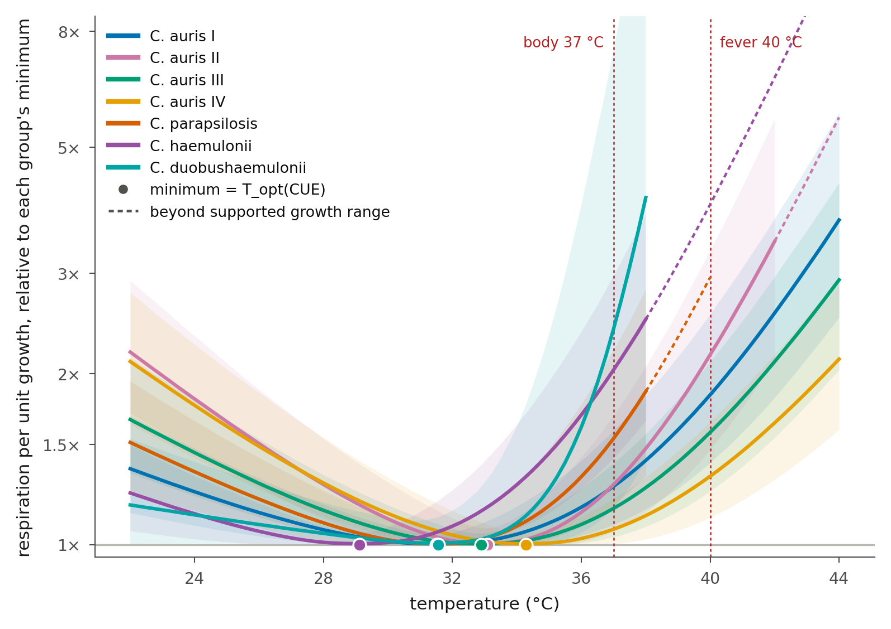{width="6.6in"}

**Supplementary Figure 1.** Temperature dependence of the respiration-to-growth ratio. Respiration per unit growth at each temperature, divided by that group's own minimum, so that 1× marks each group's cheapest temperature and the filled point marks the position of that minimum, T~opt~(CUE) (the quantity plotted in Fig. 5b). Bands are 95% credible intervals; dashed lines mark body (37 °C) and fever (40 °C) temperature. Curves are solid over the range in which at least half of the group's vials grew and dashed beyond it.

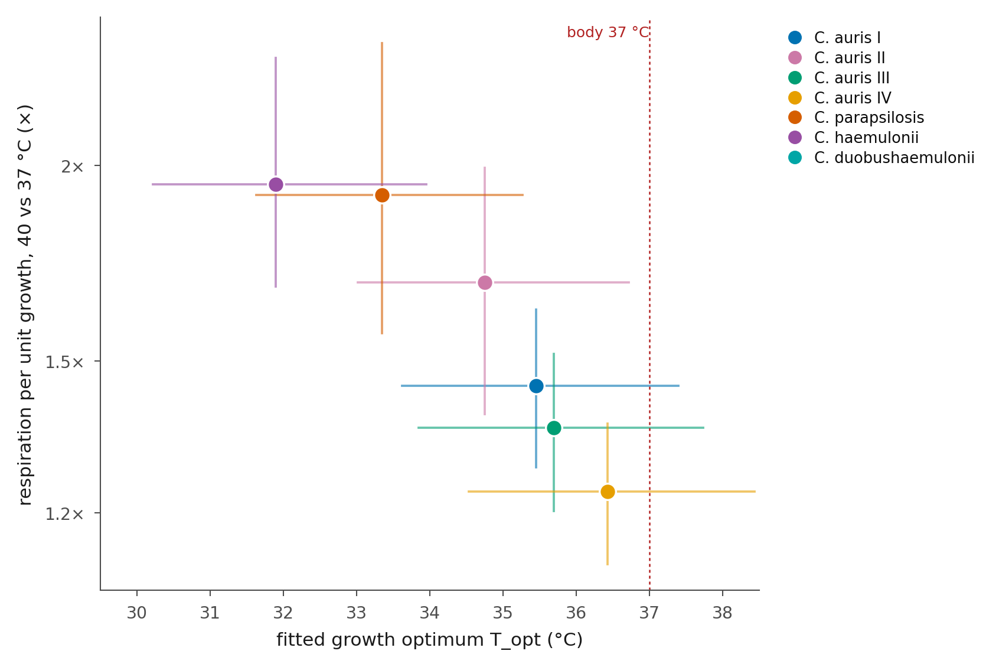{width="5.4in"}

**Supplementary Figure 2.** Growth optimum against the cost of a fever, across the six groups with measurable growth at 40 °C (*C. duobushaemulonii* excluded). Horizontal bars, 95% CrI on the fitted growth optimum; vertical bars, 95% CrI on the 37 to 40 °C change in respiration per unit growth. Both axes are derived from the same fitted curves and four of the seven points are clades of one species, so the association is reported as exploratory. The *C. duobushaemulonii* cost extrapolates the fitted curve beyond 38 °C, where that group has almost no measurable growth, and is not quoted in the text.

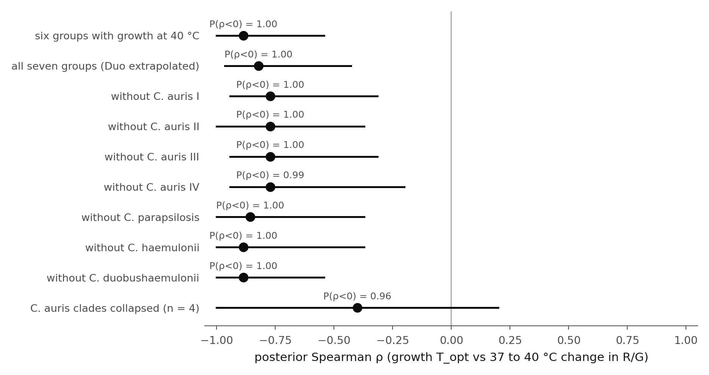{width="5.8in"}

**Supplementary Figure 3.** Leave-one-out robustness of that association. Posterior Spearman ρ between the growth optimum and the 37 to 40 °C change in respiration per unit growth, computed over the six groups with measurable growth at 40 °C, over all seven with *C. duobushaemulonii*'s extrapolated cost included, then dropping each group in turn, and finally with the four *C. auris* clades averaged into a single *C. auris* value in every posterior draw before the correlation is taken, so that the four clades of one species count once rather than four times (four taxa in that row). Points are posterior medians, bars 95% CrI, with the posterior probability that ρ \< 0 annotated.

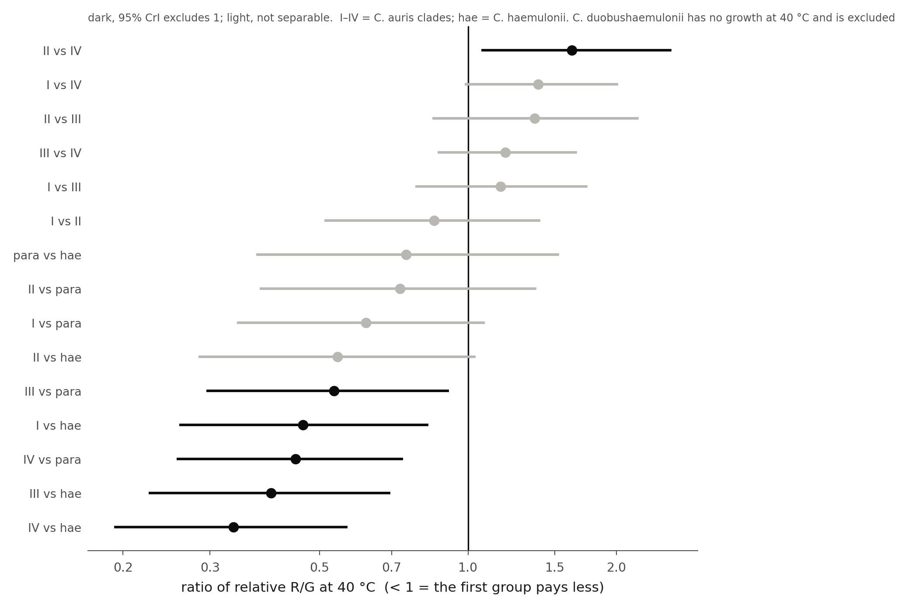{width="6.6in"}

**Supplementary Figure 4.** Posterior pairwise contrasts in the relative respiration-to-growth ratio at 40 °C, for the 15 pairs among the six groups with measurable growth at 40 °C (*C. duobushaemulonii* excluded). Ratios below 1 mean the first group pays less; dark bars mark the six contrasts whose 95% CrI excludes 1, light bars the nine that do not separate.

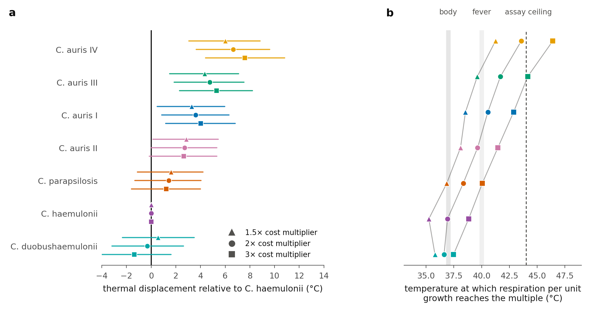{width="6.6in"}

**Supplementary Figure 5.** *C. auris* is displaced along the temperature axis.
Derived from the manual fit windows. (**a**) Displacement relative to
*C. haemulonii* at three cost multipliers (posterior median, 95% CrI). (**b**) Absolute
crossing temperatures; shaded bands, 37 and 40 °C; dashed line, the 44 °C assay ceiling. The
rank order is identical at every multiplier. No multiplier is a biological failure
threshold; 3× lies closest to observed growth loss (mean absolute error 0.73 °C against
2.29 °C for 2×, over the four taxa whose loss lies inside the assay range). The sign of the margin relative to host temperature is
multiplier-dependent and is not used as a criterion. Above 38 °C the *C. haemulonii*
estimate is strongly informed by one isolate, *C. haemulonii* 1724.

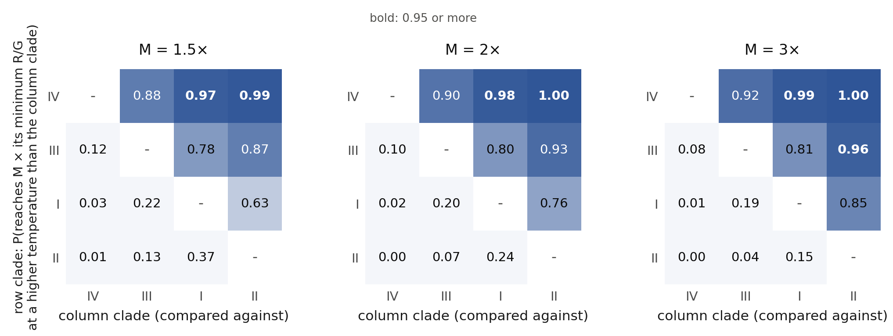{width="6.6in"}

**Supplementary Figure 6.** Pairwise ordering of the *C. auris* clades on the cost-multiplier
axis does not depend on the multiplier. Each cell is the draw-wise posterior probability that
the row clade reaches M times its own minimum respiration per unit growth at a higher
temperature than the column clade, at M = 1.5, 2 and 3. Only the two extremes separate
decisively (Clade IV versus II, P ≥ 0.98 at every M); adjacent clades do not, so the clades
are reported as a gradient rather than a ranking. The crossing temperatures themselves are
shown in Supplementary Fig. 5b.

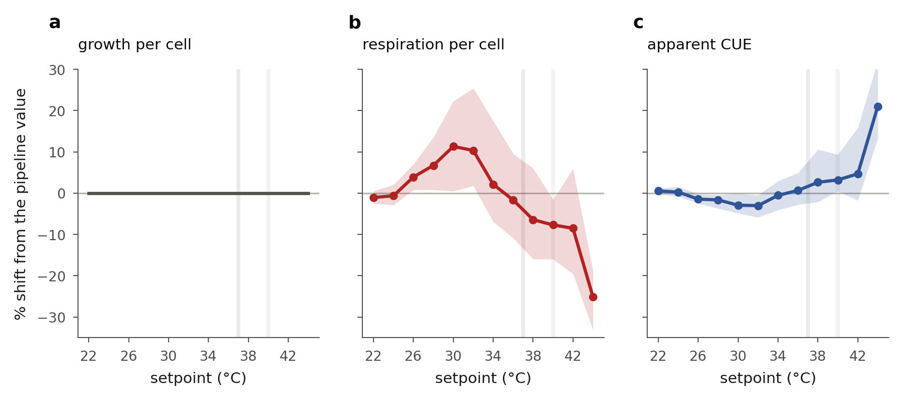{width="6.6in"}

**Supplementary Figure 7.** Sensitivity of each per-cell quantity to temperature equilibration. Median percentage shift from the pipeline value versus setpoint, estimated from the logged internal vial temperature against each group's growth curve (band, interquartile range across vials), for (**a**) growth per cell, (**b**) per-cell respiration and (**c**) the apparent CUE. Growth per cell is immune because it does not use N0; per-cell respiration shifts by up to about +11% through the mid-range and −25% at 44 °C; CUE follows, buffered.

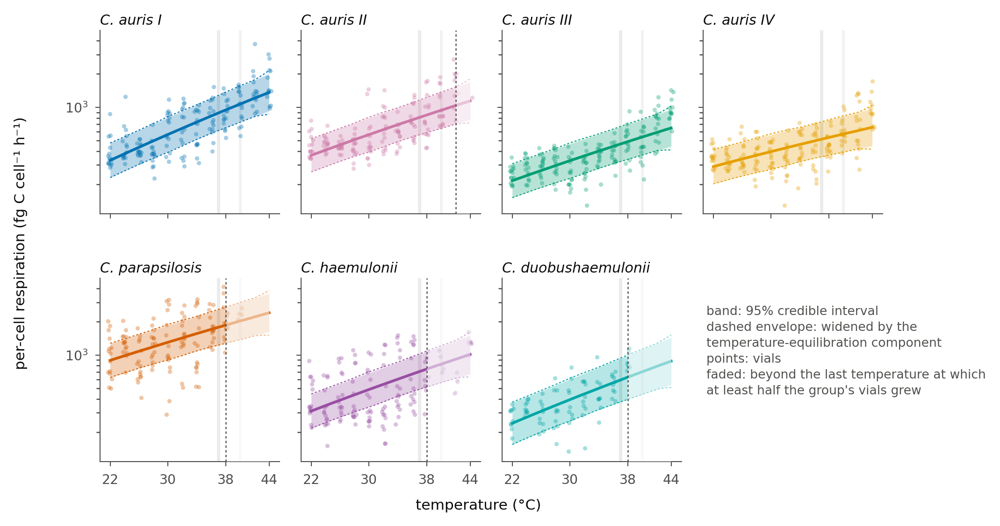{width="6.6in"}

**Supplementary Figure 8.** Per-cell respiration versus temperature (Bayesian Arrhenius, log scale), per group, with the temperature-equilibration uncertainty overlaid. Points, vials; band, 95% credible interval; dashed envelope, the same interval widened by the equilibration component; the faded region beyond the dotted line marks temperatures at which fewer than half the group's vials grew, where the curve is a fitted extension and not an observation. The two intervals coincide through the mid-range and separate only toward the extremes; respiration's monotonic rise over the observed range is unaffected.

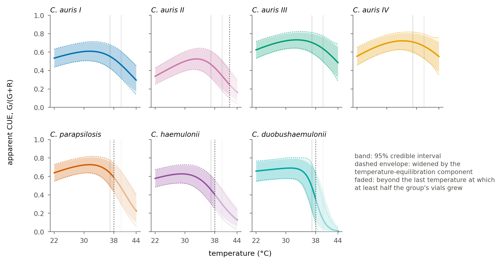{width="6.6in"}

**Supplementary Figure 9.** Apparent carbon-use efficiency versus temperature, per group, with the temperature-equilibration uncertainty overlaid. Solid band, 95% credible interval; dashed envelope, widened by the equilibration component. The two coincide through the mid-range and separate toward the extremes. Under this correction the fitted optimum of the warmest clade approaches body temperature (*C. auris* Clade IV, 36.6 °C, P(\< 37 °C) = 0.78); this is the weakest of the three treatments for that clade and is reported alongside them in the main text.

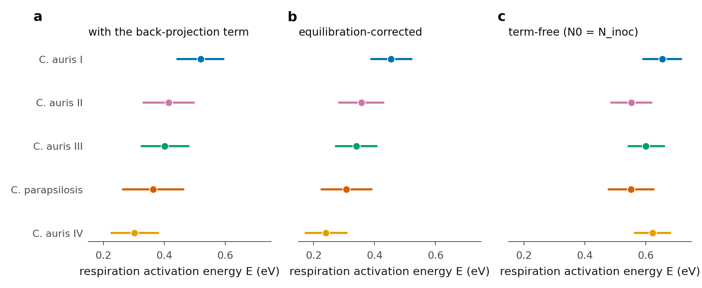{width="6.6in"}

**Supplementary Figure 10.** The between-group respiration activation energy under three treatments of the inoculum back-projection, for the five groups of the original five-group fit. Each panel shows the hierarchical Bayesian Arrhenius activation energy E~R~ per group (posterior median; bars, 95% credible interval), refitting the same model under: (left) the published back-projection, N0 = N_inoc·exp(r·Δt); (centre) the equilibration-corrected N0, recomputed from the logged internal vial temperature over the onset window; and (right) the term removed entirely, N0 = N_inoc. The *C. auris*-versus-*C. parapsilosis* separation is preserved across all three, but the finer ordering within *C. auris* is not: Clade IV holds the lowest activation energy under the published and equilibration-corrected treatments and moves to fourth of five when the term is removed. The term-free case is not the physical null (the inoculum grows before the fit window), so it bounds the correction from the opposite side rather than representing the correct value; it is shown to make the dependence explicit.

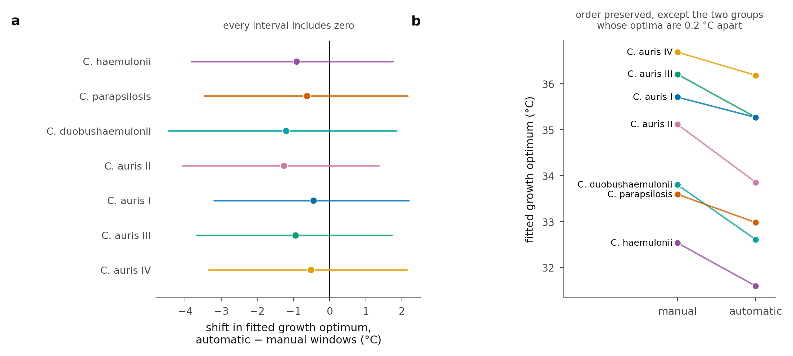{width="6.4in"}

**Supplementary Figure 11.** Manual against automatic choice of fit window. The same hierarchical growth model was refitted on the same traces under both rules, the manual windows of the analysis pipeline and the fixed rule of the pre-registered classifier (window from 90 min to 98% oxygen depletion), so the two arms differ only in how each window was chosen. (**a**) Shift in the fitted growth optimum, automatic minus manual, with 95% CrI; every group shifts down by 0.45 to 1.26 °C and every interval includes zero (posterior probability of a positive shift 0.17 to 0.37). (**b**) The optima themselves. The order is preserved except for *C. parapsilosis* and *C. duobushaemulonii*, whose optima differ by 0.2 °C under the manual rule and 0.4 °C under the automatic one and which exchange places. Activation energies move by at most 0.19 eV and the deactivation midpoint by at most 0.83 °C, except in *C. auris* II (2.82 °C), the group that loses most data under the automatic rule. The manual arm of this refit reproduces the published optima with a systematic offset of +0.24 to +0.64 °C, traced to prior differences between the refit script and the analysis pipeline (a narrower prior on E~h~ and unbounded T~h~); because both arms here use identical priors, that offset cancels in the manual-minus-automatic contrast reported above.

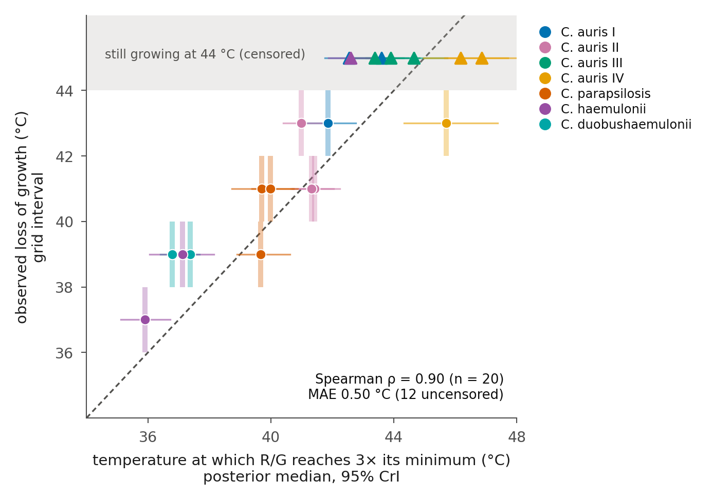{width="3.8in"}

**Supplementary Figure 12.** The 3× crossing of the respiration-to-growth ratio tracks the growth limit isolate by isolate. Each point is one isolate: the temperature at which its respiration per unit growth reaches three times its own minimum (posterior median and 95% CrI from the isolate's own curve in the hierarchical fit) against the temperature at which growth is lost under the per-vial likelihood model (vertical bar, the 2 °C grid interval; triangles, isolates still growing at 44 °C, plotted in the shaded band). Points coloured by group as in the other figures; dashed line, identity. Spearman ρ = 0.90 over 20 isolates; mean absolute error 0.50 °C over the twelve uncensored isolates; at 1.5× every crossing and at 2× 18 of 20 lie below the observed interval (mean error −3.0 and −1.5 °C). An interval-censored regression gives slope 0.87 and rejects the identity line (p = 0.006), the compression coming from the assay ceiling at the warm end.

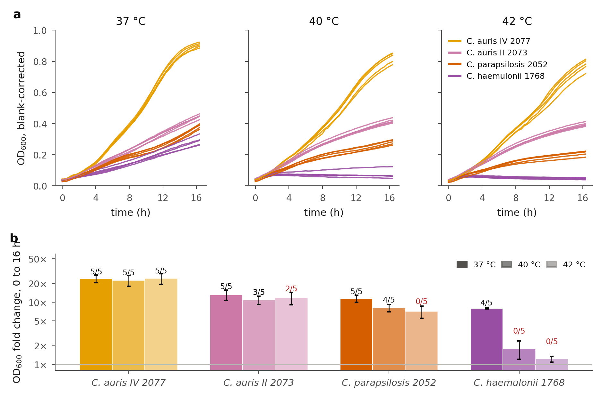{width="6.6in"}

**Supplementary Figure 13.** Independent test of the oxygen-derived growth calls by optical density. Four isolates spanning the states the likelihood model assigns (*C. auris* 2077 of Clade IV, growth at every temperature; *C. auris* 2073 of Clade II, mixed at 40 to 42 °C with non-growing vials respiring at the rate of growing ones; *C. parapsilosis* 2052, growth lost at 42 °C; *C. haemulonii* 1768, growth lost at 40 °C) were grown in 24-well plates (1 mL YMS, five wells each, OD~600~ 0.05 at inoculation) at 37, 40 and 42 °C in a temperature-controlled plate reader, one plate per temperature. The plates are aerobic and shaken before each read, whereas the PreSens vials are sealed and static, and the 37 °C plate is compared with the 38 °C vials because the vials were run on a 2 °C grid; the comparison is therefore of whether growth occurred and of the ordering of isolates, not of absolute rates. (**a**) Blank-corrected OD~600~ read every 20 min for 16 h; every line is one well. (**b**) Fold change in OD over the run (mean ± SD of five wells) at 37, 40 and 42 °C (dark to light), labelled with the number of the same isolate's sealed PreSens vials (of five) in which the likelihood model detected growth at that temperature (38 °C vials for the 37 °C plate); red where fewer than three. Where the model detected growth, OD rose 7- to 24-fold; where it detected none in *C. haemulonii* 1768, OD rose only 1.2- to 1.8-fold over 16 h, a single division in the first 2.5 h followed by no further increase, beside wells of *C. auris* 2077 that rose 20-fold. The fastest (*C. auris* 2077) and slowest (*C. haemulonii* 1768) of the four isolates are the same by both methods at every temperature; *C. parapsilosis* 2052 and *C. auris* 2073 exchange places between the two methods at 37 to 40 °C. At the edge of the vial limit, at 42 °C, the aerobic, shaken plate, inoculated at about 100 times the vial cell density, supported slow growth in every well of *C. parapsilosis* 2052 (7-fold over 16 h; none of five vials grew) and *C. auris* 2073 (12-fold; two of five vials grew), most of it in the first 3 h, so "no detectable growth" in a vial is a conservative call. Absolute rates are not compared because the plate becomes oxygen-transfer limited within hours, which is visible as the bend in every curve.

# **Supplementary notes**

**Supplementary Note 1 | Predictive test.** Predictors were computed from the manual fits restricted to 22 to 38 °C only: the fitted growth rate at 38 °C, the group growth optimum, log(K/r) at 38 °C and its slope over 34 to 38 °C. Three models were compared: growth predictors only (M1), metabolic predictors only (M2) and both (M3). Continuous outcome: the temperature of growth loss under the likelihood model, scored by mean absolute error under leave-one-isolate-out with the complete isolate withheld, over the twelve isolates whose loss lies inside the assay range (M1 0.93 °C, M2 1.42 °C, M3 1.10 °C). Binary outcomes: growth at 40, 42 and 44 °C and respiration without growth at 40 °C, scored by held-out log predictive density (M1 −0.20, −0.26, −0.46, −0.20; M2 −0.47, −0.47, −0.53, −0.47; M3 −0.38, −0.29, −0.46, −0.38) and Brier score (M1 0.056, 0.078, 0.130, 0.056; M2 0.144, 0.153, 0.174, 0.144; M3 0.127, 0.088, 0.141, 0.127). The growth-only model scored best on every outcome.

**Supplementary Note 2 | Concordance between the cost-multiplier crossings and the growth limit.** Of the
three multipliers, 3× lies closest to the temperature at which growth is lost (mean absolute
error 0.73 °C over the four taxa whose loss lies inside the assay range, against 2.29 °C
for 2×; Supplementary Methods). The same holds isolate by isolate: computing each isolate's own crossings
from its curve in the hierarchical fit, the 3× crossing tracks that isolate's observed loss
of growth with a rank correlation of 0.90 across all 20 isolates and a mean absolute error
of 0.50 °C over the twelve whose loss lies inside the assay range (Supplementary Fig. 12).
Because the same fitted growth rate enters both quantities this is a concordance rather than
an independent validation, and the crossing carries no information about the limit beyond
the growth curve itself: the temperature at which each isolate's fitted growth rate falls to
half its peak coincides with its 3× crossing (r = 0.99 across isolates, mean difference
0.2 °C) and predicts the limit at least as well (Supplementary Methods).

**Supplementary Note 3 | Robustness of the derived quantities, in full.** Because several derived respiratory quantities depend on the estimated starting cell number, we tested which conclusions were sensitive to the inoculum back-projection. Per-cell respiration and carbon-use efficiency depend on the starting cell number N0, obtained by back-projecting the inoculum over the pre-fit interval, N0 = N_inoc·exp(r·Δt). The specific growth rate r and its activation energy are recovered directly from the oxygen dynamics and are independent of N0; only the per-cell respiratory flux, CUE and quantities derived from them inherit its uncertainty, so we assessed the two ways the back-projection can bias them. First, a fit-window selection issue was corrected: for a small number of series (chiefly at 26 °C) the selector had latched onto a short late-run segment and returned implausible growth rates. These windows were reviewed and corrected to span the full respiration phase, restoring the expected unimodal growth curves and leaving every *C. auris* clade optimum in the 34.8--36.4 °C range.

Second, and more consequentially, the vials are inoculated near bench temperature and take tens of minutes to reach setpoint, so the growth accrued during the pre-fit interval is not governed by the stable r used in the back-projection. Using the continuously logged internal vial temperature together with each clade's own measured growth--temperature curve, we recomputed the growth actually accrued during equilibration and propagated the difference into N0. Growth per cell is unaffected by construction. Per-cell respiration and CUE shift in a temperature-structured way: negligibly across 22--36 °C, then increasingly toward the extremes, with the sign set by the growth optimum (below it, a cooler onset implies slower early growth and slightly higher per-cell respiration; above it, the reverse). The median shift on respiration reaches about +11% near 30 °C and −25% at 44 °C, mirrored and buffered in CUE, while growth per cell is immune throughout (Supplementary Fig. 7). Shown on the thermal curves themselves, widening each posterior credible interval by this component leaves an outer envelope that coincides with the credible interval through the mid-range and separates only toward the extremes (Supplementary Figs. 8 and 9).

This equilibration correction is roughly an order of magnitude smaller than the trends it could threaten: the CUE optimum still lies below 37 °C in every taxon, growth remains credibly more temperature-sensitive than respiration, and respiration's monotonic rise is unchanged. We therefore keep the per-cell point estimates unchanged but treat their absolute values at the temperature extremes (≥40 °C) as approximate.

A stronger stress test is to remove the back-projection term entirely (N0 = N_inoc), the opposite bound to the equilibration correction. This is not the physical null (the inoculum did grow before the fit window, which is what the back-projection accounts for), so the true values lie between it and the published table rather than at either end; but it isolates every quantity that leans on the term. The primary conclusions are unchanged or strengthened under it: r and its activation energy are independent of N0 by construction, and the sub-37 °C CUE optimum in fact sharpens. Two secondary results are sensitive and we treat them accordingly. First, the fine fever-cost ordering among the *C. auris* clades: its leader moves from first to fourth of five when the term is removed, whereas the *C. auris* versus *C. parapsilosis* contrast survives both bounds; the term-free analysis sharpens this further, collapsing the between-clade spread in respiration activation energy from 0.22 eV (with the term) to 0.10 eV, so we do not report a within-*auris* ranking at all. The between-clade respiration activation energy under all three treatments, with the term (published), equilibration-corrected, and term-free, is compared directly in Supplementary Fig. 10.

A separate question is whether the manual choice of fit window matters at all. We refitted the
same hierarchical growth model on the same traces with windows chosen automatically by the
pre-registered classifier's rule instead, so that the two arms differ only in how the interval was
selected. Every group's fitted optimum moves down, by 0.45 to 1.26 °C, and every interval
includes zero (posterior probability of a positive shift 0.17 to 0.37); activation energies move
by at most 0.19 eV, and the deactivation midpoint by at most 0.83 °C except in *C. auris* II,
the group that loses most data under the automatic rule. The ordering of groups is preserved
except for *C. parapsilosis* and *C. duobushaemulonii*, whose optima lie 0.2 °C apart and which
exchange places (Supplementary Fig. 11). No conclusion in this paper turns on either the
direction or the magnitude of that shift. The comparison is internally consistent because both
arms use identical priors; its manual arm reproduces the published optima with a systematic
offset of +0.24 to +0.64 °C, which we traced to prior differences between the refit script and
the analysis pipeline rather than to the data.

**Supplementary Note 4 | High-oxygen refit.** Measured oxygen at the manual window start was 6.5 to 12.9 mg L⁻¹ (median 9.2) and at the window end a median 0.50 of the start (5th to 95th percentile 0.31 to 0.69), so the primary windows already use the oxygen-rich half of each trace. Truncating every window at 50% of its start value shortened 578 of the 1,055 windows, by a median 7%, and left r and K in those vials within 2% of the primary values (median ratios 1.016 and 0.983). The model-free CUE optimum from the truncated fits is within 0.1 °C of the primary value in six of the seven groups (27.8, 34.0, 31.2, 32.0, 26.5 and 28.5 °C for *C. auris* Clades I to IV, *C. parapsilosis* and *C. duobushaemulonii*). In *C. haemulonii*, whose ratio of respiration to growth is nearly flat over most of the grid and whose optimum is the least constrained of the seven (Results), the minimum moves from 31.3 to 41.7 °C, the upper edge of the primary interval (23.9 to 41.6 °C), and its probability of lying below 37 °C falls to 0.67. The Arrhenius activation energy of K over 22 to 38 °C moves by at most 0.05 eV in every group.
