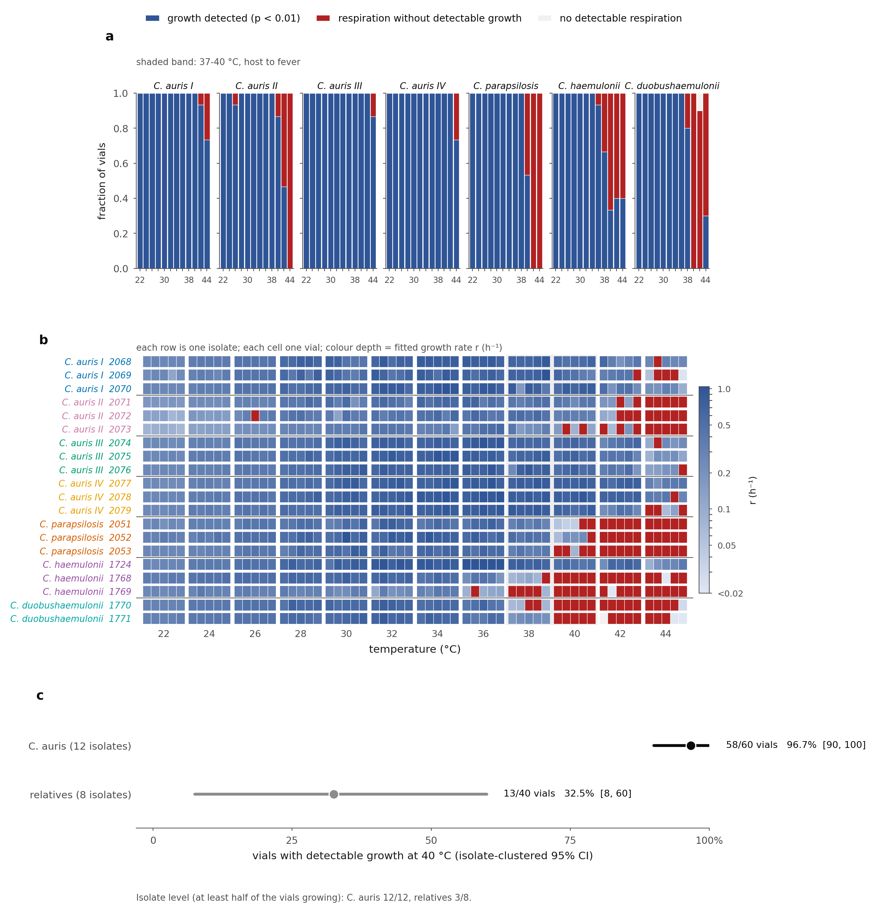
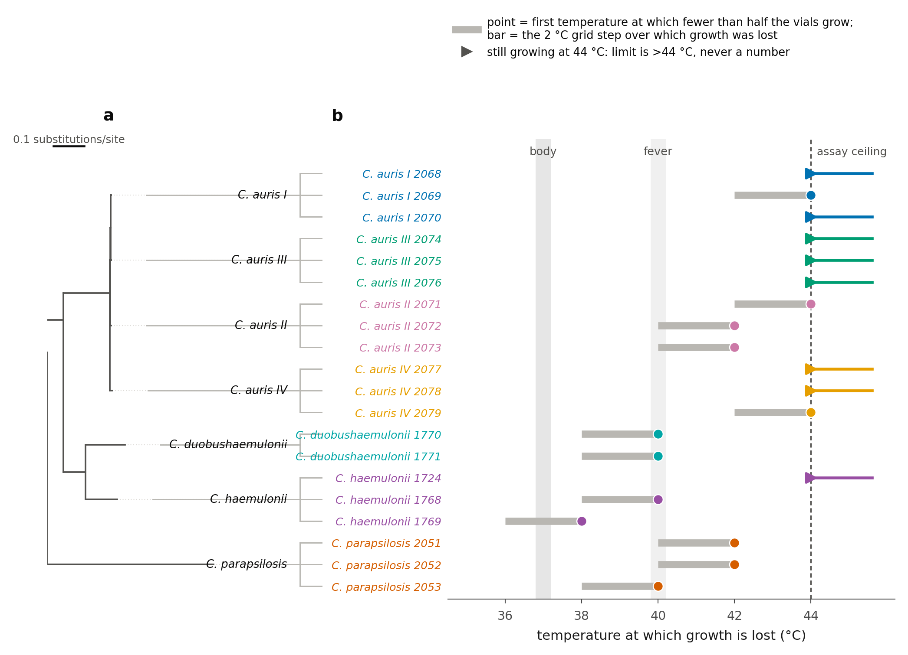
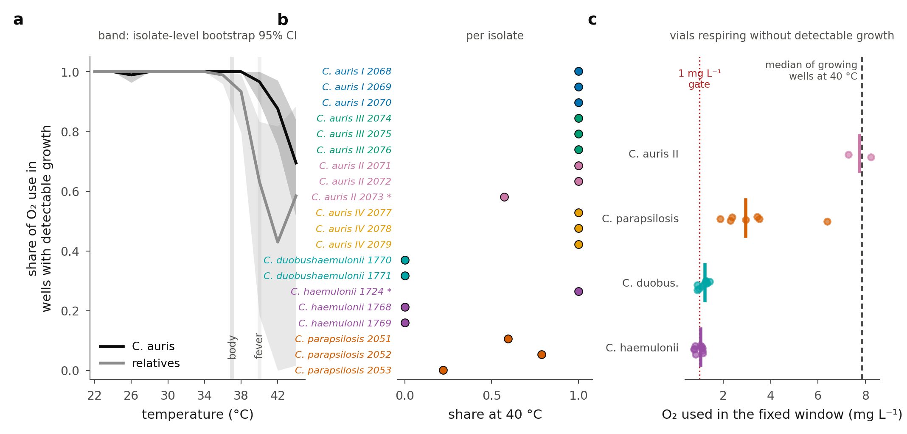
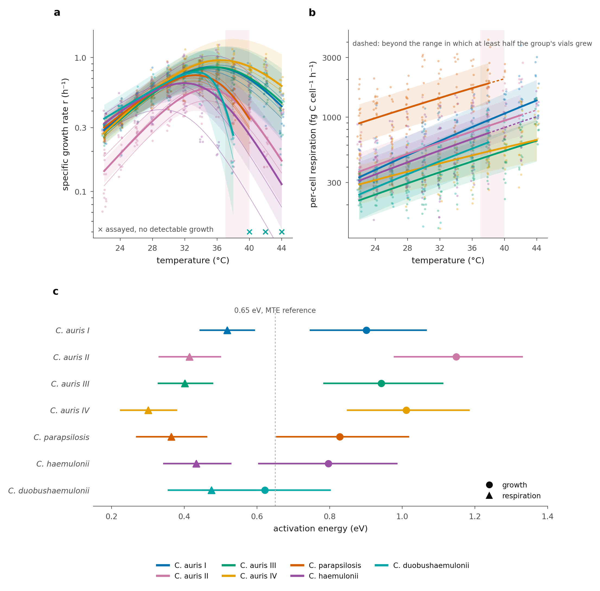
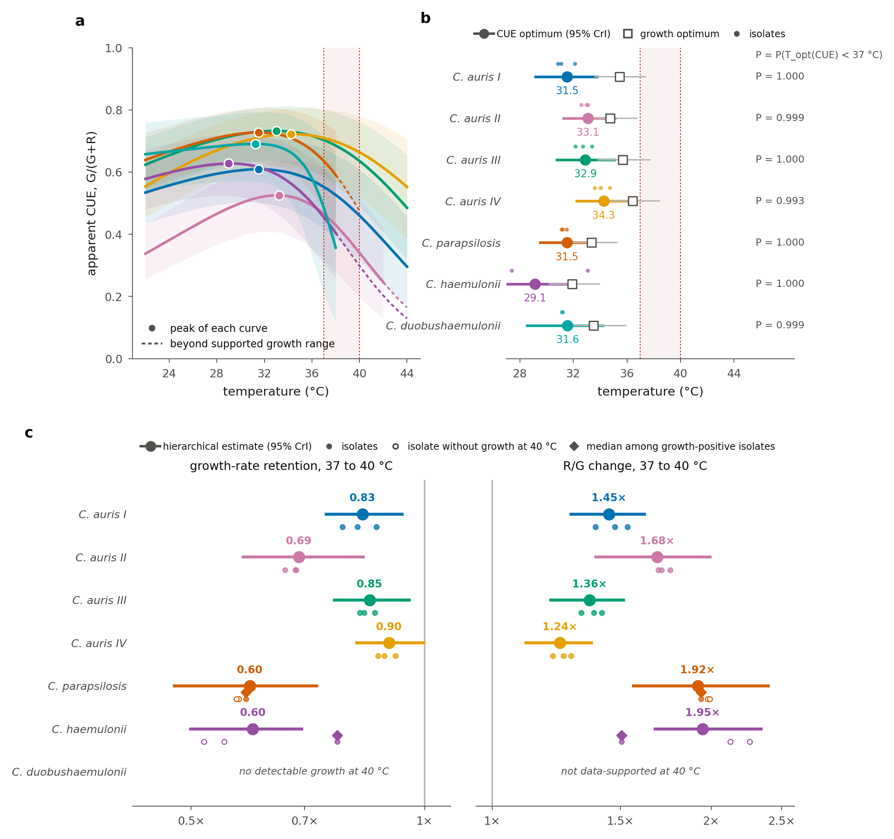

# **Introduction**

Most fungi cannot grow at mammalian body temperature, and the thermal restriction this imposes is one of the main reasons fungal disease is rare in endotherms^1,2^. The pathogens that do infect mammals operate at 37 °C, near the upper limit of their growth range, and fever pushes them further toward it. Fever is usually discussed as a growth constraint: a species either grows at 39 to 41 °C or it does not^3^. But temperature does not act on a single rate. Metabolic rate rises with temperature with a characteristic activation energy^4^, but whether growth and respiration share that sensitivity is an empirical question: across prokaryotes the average sensitivities of growth and of metabolic flux are statistically indistinguishable^5^, whereas growth, unlike respiration, must turn over as the thermal limit is approached. Where respiration keeps rising after growth has begun to fall, the carbon a population respires per unit of biomass it makes must rise with temperature. Growth and yield have been measured against temperature for individual pathogenic yeasts, and in *C. albicans* the yield on glucose falls linearly to zero between the optimum and the maximum growth temperature^6^, but growth and respiration have not been resolved jointly across a febrile thermal series for a pathogen and its relatives, so whether fever imposes a metabolic cost of this kind, and whether that cost differs between a heat-tolerant pathogen and its relatives, is not known.

*Candida auris* is the natural test case. It emerged on three continents almost simultaneously^7^, in four genetically distinct clades that share 98.7% genome-wide nucleotide identity^8^, and it grows at 39 to 41 °C, temperatures that halt or severely inhibit its closest relatives *C. haemulonii* and *C. duobushaemulonii*^3^. Thermal adaptation, possibly to a warming environment, has been proposed as the reason it could cross into the mammalian niche when its relatives did not^9^, and the World Health Organization places it in the critical priority group of fungal pathogens^10^. Comparisons of growth at fixed high temperatures have established that *C. auris* is the more thermotolerant^3^, but none has measured growth and respiration together for enough isolates to separate species, clade and isolate.

Here we do that with dissolved-oxygen respirometry. The dataset is 1,200 oxygen time series (20 isolates × 12 temperatures × 5 replicate vials) for 20 isolates of four *Candida* species at 22 to 44 °C: *C. auris* (12 isolates, three from each of clades I to IV, of the six so far described), its closest relatives *C. haemulonii* (three isolates) and *C. duobushaemulonii* (two), and the more distant comparison species *C. parapsilosis* (three). Every trace was inspected by hand and given a fit window wherever one existed, and every trace was then re-scored by two independent automatic methods. Isolates are analysed throughout as seven groups: the four *C. auris* clades and the three other species. From each trace, a published oxygen-dynamics model developed for bacteria^11^ recovers a specific growth rate and an oxygen consumption rate at once; whether a vial grew at all was decided by a per-vial likelihood model that sees only time and oxygen; thermal performance curves were fitted hierarchically, isolates nested within groups, in a Bayesian framework; and per-cell respiration and the apparent respiratory carbon-use efficiency (CUE = G/(G + R), apparent because carbon leaving as products other than CO~2~ is not measured; Methods) were derived on a matched per-cell basis. Throughout, "growth" in a vial means the accelerating oxygen consumption that an expanding population produces, validated against flow-cytometry counts and optical density for bacteria in the method's original description^11^ and checked, for these yeasts, against optical density in an independent plate-reader test (Supplementary Fig. 13). What the oxygen trace supports directly is the divergence between growth and oxygen use across temperature; the carbon interpretation rests on stated conversion assumptions and is treated as conditional on them. Unless stated, values are posterior medians with 95% credible intervals (CrI).

# **Results**

## **Related taxa frequently leave the growing state near fever**

Whether a vial grew was decided for every one of the 1,200 oxygen series by the same
automatic test, independent of the hand-chosen fit windows. A growing population draws
oxygen down faster and faster; a population that is not growing draws it down at a steady
rate. The test fits both shapes to each trace and calls growth only when the accelerating
curve fits better than it would by chance in 99% of simulated steady-rate traces with the
same noise (Methods). Every vial receives a yes or no call, with no ambiguous category, and
an earlier blind classifier built on different criteria agrees on 930 of its 931 growth
calls (Supplementary Methods).

Of the 1,200 series, 1,063 show growth, 136 show respiration without
detectable growth and one shows no detectable respiration (Fig. 1a). Below 38 °C, 798 of 800 vials grow. At 40 °C it is retained in 58 of 60 *C. auris* vials (96.7%,
isolate-clustered 95% CI 90 to 100) against 13 of 40 in the relatives (32.5%, CI 8 to 60);
*C. duobushaemulonii* and two of the three *C. haemulonii* isolates retain no growing vial
while continuing to consume oxygen (Fig. 1b, c). At the isolate level all 12 *C. auris*
isolates and 3 of 8 relatives keep growth in at least half of their vials at 40 °C (risk
difference +0.63, 95% CI +0.22 to +0.86, Newcombe hybrid-score method; Fisher's exact
p = 0.0036). The fitted growth rate itself falls toward the limit before growth is lost: in the
relatives the rate at 38 °C is 13 to 81% of the same isolate's rate at 34 °C (median 45%),
so the transition is a decline that ends in loss rather than a switch (Fig. 1b).

{width="6.6in"}

**Figure 1 | Related taxa frequently leave the growing state near fever.** All 1,200 series scored by the per-vial likelihood model. (**a**) Proportion of vials in each state against temperature, per taxon; shaded band, 37 to 40 °C. (**b**) Every vial: each row is one isolate, each cell one vial at one temperature, coloured by the fitted growth rate *r* where growth was detected and red where oxygen was consumed without detectable growth. (**c**) Vials with detectable growth at 40 °C, with isolate-clustered 95% intervals. Red and the terminal category, *no detectable respiration*, are statements about the oxygen trace under this sealed assay, not about arrest or viability.

## **High-temperature growth varies sharply among close relatives**

High-temperature growth varied sharply among close relatives and was retained far longer
across the sampled *C. auris* isolates (Fig. 2). Growth was lost at a median of 40 °C in the
relatives, against seven of twelve *C. auris* isolates still growing at the 44 °C assay
ceiling (log-rank statistic with permutation null, p = 0.002; p = 0.0004 excluding
*C. haemulonii* 1724). Treating each isolate's limit as interval-censored on the 2 °C grid and
right-censored at 44 °C, an interval-censored location model places the *C. auris* limit
4.4 °C above the relatives' (95% profile CI 2.3 to 7.0 °C; likelihood-ratio p = 0.0005;
Methods), and the equivalent proportional-hazards fit gives a hazard of growth loss for
*C. auris* 0.15 times that of the relatives (0.03 to 0.43). Within *C. haemulonii* the spread is larger than between many taxa: *C. haemulonii* 1724
retains growth beyond the assay ceiling while *C. haemulonii* 1769 loses it at 38 °C, and within
*C. auris* the only isolates to fail below 44 °C are two of the three Clade II isolates, at 42 °C.

As an exploratory estimate, a phylogenetic mixed model on the 20 isolates (Supplementary Methods) attributes about half of the variance in the limit to phylogeny (h² = 0.53, 0.35 to 0.68 across imputations of the censored limits; permutation p = 0.007), nearly all of it the separation of *C. auris* from the two *haemulonii*-complex species; the other half is variation among isolates within a clade or species. With seven tips and censored limits, this is a partition of this dataset, not a general heritability.

{width="6.9in"}

**Figure 2 | High-temperature growth varied sharply among close relatives and was retained far longer across the sampled *C. auris* isolates.** (**a**) Maximum-likelihood phylogeny drawn to scale from 600 concatenated single-copy orthologs of the public reference genomes (one per clade or species; the assayed isolates were not sequenced), with the branch-length scale shown; tips are connected to the isolate rows of (**b**), whose limits come from the assayed isolates. At this scale the four *C. auris* clades are barely separable: the widest patristic distance inside *C. auris* is 0.012 substitutions per site, against 0.330 to *C. haemulonii* and 1.146 to *C. parapsilosis*. (**b**) Temperature at which growth is lost, per isolate: the first measured temperature at which fewer than half of the five vials show growth under the per-vial likelihood model, with the loss persisting at every higher temperature. The grey bar is the 2 °C grid step over which growth was lost. Arrowheads mark isolates still growing at 44 °C, whose limit is reported as >44 °C and never assigned a value.

## **Oxygen consumption persists after growth loss, at reduced and taxon-dependent rates**

To ask how much oxygen vials use once growth has stopped, the oxygen consumed between
90 and 390 minutes was measured in every vial: the first 1.5 h are skipped while the vials
reach temperature, and the same 5 h window is applied to every vial, so growing and
non-growing vials are compared on equal terms. Vials that ran out of oxygen inside the
window were counted as using at least that much, not as low consumers.

*C. parapsilosis* retained substantial oxygen consumption after growth was lost (2.95 mg L⁻¹
median at 40 °C). *C. haemulonii* (1.05) and *C. duobushaemulonii* (1.22) vials without
growth sat only slightly above the 1.0 mg L⁻¹ detection gate. Across the relatives, vials
respiring without growth at 40 °C consumed 35 to 45% of what the same isolate's growing
vials consumed at 38 °C (one *C. parapsilosis* isolate, 81%). Because growing vials reach
the oxygen floor inside the window far more often than non-growing vials (70% against 0%),
their consumption is understated here and the true ratio is lower rather than higher.

The pooled oxygen-weighted share of consumption occurring in growing vials at 40 °C was 0.97
(isolate-level bootstrap 95% CI 0.90 to 1.00) in *C. auris* against 0.63 (0.18 to 0.83) in
the relatives, and 0.45 excluding *C. haemulonii* 1724 (Fig. 3). Two isolates cross the species lines:
*C. haemulonii* 1724 behaves like a *C. auris* isolate, and *C. auris* 2073 (Clade II) is the one *C. auris* isolate
with vials that consume oxygen at the full rate of a growing vial, 7.8 mg L⁻¹ on the window,
with no detectable curvature. That isolate is the clearest instance in the dataset of
respiration continuing at growth-rate intensity after growth has stopped, and it shows that
the contrast is a tendency across sampled isolates rather than a species-level rule.

The rise of respiration with temperature reported below for growing cultures (Fig. 4b) is a
property of growing cultures, and it does not continue through the limit. Placing the initial oxygen consumption rate K of every
respiring vial on an Arrhenius axis within its own isolate, vials at or above that isolate's
growth limit fall to 0.32× the isolate's sub-limit line (95% CI 0.24 to 0.42; relatives
0.26×, *C. auris* 0.68×), and above the limit K also falls more steeply with temperature within each of the two groups (Supplementary Methods). Two degrees
above the limit the median vial consumes oxygen at 0.26 times the rate it did two degrees
below it. K is a volumetric rate, so part of this fall could be fewer cells rather than less respiration per cell: the growth accrued before the fit window multiplies cell number by e^rt~s~^, which for the vials two degrees below each isolate's limit is 1.06 to 1.68 (median 1.16), so dividing it out moves the median across-limit ratio only from 0.26 to 0.28. Most of the fall is therefore a fall in respiration itself: growth and respiration
decouple across the growing range, and respiration collapses within a grid step once growth
is lost. Within a non-growing vial that collapse is not a rapid death: over the 15 h window
the consumption rate was constant in 72 of the 136 such vials and declined in the other 64,
with a median half-life of 8.5 h, and the rate of decline did not depend on temperature
(Supplementary Methods). Cultures that have stopped growing at fever temperature keep respiring, at a
reduced rate, for the duration of the assay.

{width="6.9in"}

**Figure 3 | Oxygen consumption persists after growth is lost, at reduced and taxon-dependent rates.** (**a**) Oxygen-weighted share of the consumption observed on the fixed 90 to 390 min window that occurs in vials with detectable growth, against temperature, pooled for *C. auris* and for the three relatives; band, isolate-level bootstrap 95% CI. Growing vials reach the oxygen floor inside the window far more often than non-growing vials (70% against 0% at 40 °C), so their consumption is understated and the share is a lower bound. (**b**) The same quantity at 40 °C, per isolate. Asterisks mark the two isolates that cross the species lines, *C. haemulonii* 1724 and *C. auris* 2073. (**c**) Oxygen consumed on the fixed 90 to 390 min window by vials respiring without detectable growth at 40 °C; points are vials, the bar the group median, the dotted line the 1 mg L⁻¹ gate used for the no-respiration call, which applies to the total drawdown of the whole trace rather than to this window, so fixed-window values below it are possible; the dashed line is the median of growing vials at the same temperature. *C. auris* clades I, III and IV had no such vials at 40 °C and are absent from (**c**).

## **Growth and respiration decouple, placing the apparent CUE optimum below body temperature**

The next two sections derive a carbon cost from the same oxygen traces, in a deliberate hierarchy of assumptions. The position of the CUE optimum, the growth-respiration decoupling and the fold-change in their balance across temperature are identifiable from the fitted growth rate r, the volumetric consumption rate K and the time each culture spent growing before its fit window, and need no absolute cell number, carbon quota, oxygen-to-carbon conversion or respiratory quotient. Absolute per-cell magnitudes depend on all of those and carry their uncertainty (Robustness).

Growth rate rose with temperature to a group-level optimum between 31.9 and 36.4 °C and then declined, following the expected unimodal thermal performance curve (Fig. 4a). Per-cell respiration showed no such turnover: it increased monotonically across the range in which each group grew (Fig. 4b; fitted extensions beyond that range are drawn dashed), and leave-one-out cross-validation favoured the monotonic Arrhenius model over a unimodal Sharpe–Schoolfield alternative (Fig. 4b). Growth and respiration are therefore governed by different thermal sensitivities.

This difference is quantified by the activation energies (Fig. 4c). In every group the activation energy of growth exceeded that of respiration: E~G~ ranged 0.62--1.15 eV and E~R~ 0.30--0.52 eV. The difference is credibly greater than zero in six of the seven groups (0.36--0.73 eV, 95% CrI excluding zero); in *C. duobushaemulonii*, the least replicated group, the interval includes zero (0.15 eV, −0.06 to 0.36). Growth is thus substantially more temperature-sensitive than respiration. The decoupling does not depend on the per-cell conversion: comparing the activation energy of the fitted growth rate r directly against that of the volumetric consumption rate K, which is the per-cell respiration under the assumption of no growth before the fit window, gives E~r~ 0.87--1.23 eV against E~K~ 0.55--0.62 eV (P = 1.000 in each of the four *C. auris* clades and *C. parapsilosis*, and 0.947 for the two remaining relatives pooled), and the same ordering holds under every treatment of the pre-window growth (Robustness). The absolute per-cell respiration activation energies carry a temperature-structured uncertainty from that treatment; the ordering does not.

Because respiration continues to rise while growth saturates and falls, the apparent respiratory carbon-use efficiency (CUE = G/(G+R), with G and R the growth and respiratory carbon fluxes of the same population; Methods) is a unimodal function of temperature that peaks early and then declines (Fig. 5a). The position of that optimum needs fewer assumptions than its level: it is the temperature that minimises respiration per unit growth, K·e^−rt~s~^/r, where t~s~ is the time from inoculation to the fit window, so the carbon quota, the oxygen-to-carbon conversion and the inoculum all cancel (Methods). This model-free estimate, with isolates resampled before vials, places the optimum at 27.8, 34.0, 31.0 and 32.0 °C for *C. auris* Clades I to IV and 26.5 °C for *C. parapsilosis*, with P(T~opt~(CUE) \< 37 °C) = 1.00 for four of the five and 0.94 for Clade IV, whose interval reaches 37.6 °C. For *C. haemulonii* and *C. duobushaemulonii* the minimum lies at 31.3 and 28.4 °C, with wide intervals (23.9 to 41.6 and 26.6 to 32.3 °C) because growth is lost across much of the upper grid.

The parametric (Sharpe--Schoolfield) counterpart on the per-cell scale, which carries the pre-window growth through the inoculum back-projection, gives 29.1--34.3 °C with P ≥ 0.993 for all seven groups (Fig. 5b), within a degree of the model-free values where both are well constrained. Correcting the back-projection for the vials' measured equilibration moves the warmest estimate, Clade IV, to 36.6 °C with P(\< 37 °C) = 0.78 (Supplementary Fig. 9). Under every treatment the estimate lies below the growth optimum and below 37 °C in every group; the evidence for the margin is strong in six groups and moderate in *C. auris* Clade IV, the clade that is warmest by every measure in this study.

{width="6.6in"}

**Figure 4 | Growth and respiration decouple with temperature.** (**a**) Specific growth rate *r* (h⁻¹) and (**b**) per-cell respiration carbon flux (fg C cell⁻¹ h⁻¹) versus temperature, for all seven groups (points, isolate-level observations; thin lines, per-isolate fits; bold lines, group-level posterior medians; bands, 95% CrI). Crosses in (**a**) mark temperatures assayed with no detectable growth; in (**b**) curves are dashed beyond the last temperature at which at least half the group's vials grew. Growth turns over; respiration does not (Arrhenius favoured over Sharpe–Schoolfield by leave-one-out cross-validation). (**c**) Activation energies of growth (circles) and respiration (triangles) with 95% CrI; dashed line, the 0.65 eV metabolic-theory value. The difference is credible in six of the seven groups; in *C. duobushaemulonii* the interval includes zero.

## **Fever raises respiration per unit growth, by a taxon-specific amount**

This decoupling predicts that warming across the host range should raise respiration per unit growth; we therefore quantified that penalty at body and fever temperatures. Because the economic optimum lies below 37 °C, every taxon operates above its cheapest temperature at 37 °C under the assayed conditions. We express this as the relative respiratory cost, i.e. respiration per unit growth relative to each taxon's own cheapest temperature (Supplementary Fig. 1). At 40 °C (fever), this cost reached 1.32× for *C. auris* Clade IV against 2.95× for *C. parapsilosis*, 3.97× for *C. haemulonii*. For *C. duobushaemulonii*, which retains no detectable growth at 40 °C, the cost is unbounded and no value is reported (Fig. 1).

The three-degree step from body temperature (37 °C) to fever (40 °C) captures the clinical penalty most directly (Fig. 5c). Over this interval *C. parapsilosis* retained 60% of its 37 °C growth rate (0.60, 95% CrI 0.48--0.73) while its respiratory cost per unit growth rose 1.92× (1.56--2.39). The *C. auris* clades were less affected: Clade IV retained 90% of growth (0.90, 0.82--1.00) at a cost increase of 1.24× (1.11--1.37), with Clades I–III intermediate (growth retained 0.69--0.85; cost 1.36×--1.68×). *C. haemulonii* paid 1.95× (1.67--2.34); *C. duobushaemulonii* has no detectable growth at 40 °C, so neither quantity is data-supported for it (Fig. 5c). Fever thus suppresses growth more strongly than respiration; detectable oxygen consumption can persist after growth is lost, and the imbalance is most severe in the relatives. Integrated over a day of constant 40 °C, the fitted growth rate of the median *C. auris* isolate is 83% of its 37 °C value and that of the median relative 56% (a ratio of integrated specific growth rates, not a biomass yield; intermittent-fever profiles in Methods).

**Differences among the groups.** Of the 15 pairwise contrasts in the 40 °C cost among the six groups with measurable growth at 40 °C (*C. duobushaemulonii* excluded from every 40 °C comparison), six resolve (95% CrI excluding a ratio of 1; Supplementary Fig. 4). Five of them place a *C. auris* clade below a relative; the sixth is the one contrast between the two extreme *C. auris* clades, Clade II above Clade IV (1.62, 1.07 to 2.57), the same pair that separates in the displacement analysis (Supplementary Fig. 6). Against *C. parapsilosis* the resolved contrasts are Clade IV (0.45, 0.26 to 0.73) and Clade III (0.54, 0.30 to 0.91); for Clades I and II the interval includes 1 (posterior probability of being cheaper 0.96 and 0.85), so the *C. auris*-versus-*C. parapsilosis* contrast is a species-level tendency rather than a property of all four clades individually. We do not report a finer ranking among the *C. auris* clades, because it depends on the inoculum back-projection (Robustness; Supplementary Fig. 10).

{width="6.6in"}

**Figure 5 | The apparent carbon-use efficiency peaks below body temperature, and fever raises the respiratory cost of growth by a taxon-specific amount.** (**a**) Apparent carbon-use efficiency, CUE = G/(G+R), against temperature per group; filled points mark each curve's peak; curves are solid over the range in which at least half of the group's vials grew and dashed beyond it, where the fitted curve is an extrapolation; the shaded band spans body to fever temperature. (**b**) Thermal optimum of CUE (filled points, 95% CrI; open squares, the growth optimum; small points, isolates), with the posterior probability that it lies below 37 °C (for Clade IV, 0.78 after the equilibration correction; Supplementary Fig. 9); shaded band, 37 to 40 °C. (**c**) The 37 to 40 °C step: growth retained (left) and the rise in respiratory cost per unit growth (right), as hierarchical estimates with 95% CrI, with isolate values behind them. The *C. haemulonii* estimate at 40 °C rests on the one isolate (*C. haemulonii* 1724) that grows there. *C. duobushaemulonii* has no detectable growth at 40 °C, so neither quantity is data-supported for it and both are left blank. The relative-cost curves these quantities are read from, the comparative association between growth optimum and fever cost, and the full set of pairwise contrasts are given as Supplementary Figs. 1, 2 and 4.

Across the six groups with measurable growth at 40 °C, a warmer growth optimum went with a smaller fever cost (posterior Spearman ρ = −0.89, 95% CrI −1.00 to −0.54), from *C. parapsilosis* at one extreme to *C. auris* Clade IV at the other (Supplementary Figs 2 and 3). With six points, four of them clades of one species, this is exploratory; the isolate-level analysis below tests it directly.

## **_C. auris_ is displaced along the temperature axis**

The fever cost above is a ratio between two chosen temperatures. A more complete question is
how far each taxon is displaced along the temperature axis before its carbon economy
deteriorates. For every posterior draw we located the temperature minimising respiration per
unit growth and solved, on the high-temperature limb, for the crossings at which that ratio
reaches 1.5, 2 and 3 times that draw's own minimum. The ratio is taken from the per-cell
curves, so the carbon quota and oxygen-to-carbon conversion cancel in it; the pre-window
growth enters through the per-cell respiration fit and is bounded in Robustness.

The ordering of taxa is identical at all three multipliers, Clade IV > Clade III > Clade I > Clade II > *C. parapsilosis* > *C. haemulonii* ≈ *C. duobushaemulonii*, and *C. auris* Clade IV reaches any given multiple of its own minimum 6.0 to 7.6 °C warmer than *C. haemulonii* (P(> 0) = 0.999 at every multiplier; Supplementary Figs 5 and 6). No multiplier is a biological failure threshold: the 3× crossing lies closest to where growth is lost, but it shares its fitted growth curve with the limit, so it describes where growth ends rather than causing it (Supplementary Note 2).

Where the displacement comes from can be read off the fitted curves. Swapping one parameter
at a time between each *C. auris* clade and each relative, and attributing the change in the
3× crossing to that parameter (Shapley decomposition over posterior draws; Supplementary Methods), the
displacement is carried almost entirely by the growth curve's warm limb: the deactivation
energy E~h~ accounts for 43% of it on average, the deactivation midpoint T~h~ for 32% and
the growth activation energy for 27%, while the respiration activation energy contributes
nothing (−1%, and within ±1 °C in every pair). Against *C. haemulonii*, the closest relative,
the midpoint T~h~ is the largest single term for Clades I, III and IV (2.6 to 2.8 °C of a
4.1 to 7.7 °C displacement). *C. auris* is displaced because its growth declines later and
more gradually above its optimum, not because its respiration responds differently to
temperature. Above 38 °C the *C. haemulonii* estimate is
strongly informed by a single isolate, *C. haemulonii* 1724, and is not a species-level febrile
response.

That isolate-level variation is not a trade-off. Across the 20 isolates, a higher growth
limit goes with a higher peak growth rate (draw-wise Spearman ρ = 0.74, 95% CrI 0.63 to
0.81), a warmer growth optimum (0.85, 0.76 to 0.92) and a smaller 37 to 40 °C cost (−0.85, −0.91 to −0.78), and the same signs hold within *C. auris* alone (0.57, 0.59 and −0.58) and
within the relatives (Supplementary Methods). The isolates that tolerate the most heat are also the
fastest at their optimum and the least penalised by fever: a "hotter is better" pattern
rather than a specialist's price. Metabolism measured below fever did not predict an isolate's limit better than its growth measurements alone (leave-one-isolate-out; Supplementary Note 1).

## **Robustness of the derived quantities**

The specific growth rate r and its activation energy are recovered directly from the oxygen dynamics and do not depend on the starting cell number; per-cell respiration, the level of CUE and quantities derived from them inherit the uncertainty of the inoculum back-projection N0 = N~inoc~·exp(r·Δt). We bounded that uncertainty four ways (Supplementary Note 3). Correcting the back-projection for the vials' measured equilibration shifts per-cell respiration by at most +11% near 30 °C and −25% at 44 °C and leaves growth per cell unchanged (Supplementary Figs 7 to 9). Removing the back-projection term altogether, the opposite bound, leaves r, its activation energy and the sub-37 °C CUE optimum unchanged or sharper, and exposes the two results that do depend on it: the fine fever-cost ordering among the *C. auris* clades, whose leader moves from first to fourth, and the between-clade spread in respiration activation energy, which collapses from 0.22 to 0.10 eV (Supplementary Fig. 10); neither is reported as a result. Refitting the growth model with fit windows chosen by the pre-registered classifier's rule instead of by hand moves every group's optimum down by 0.45 to 1.26 °C with every interval including zero (Supplementary Fig. 11). Because r is fitted while oxygen falls, every vial entering the primary fits was refitted on its manual window truncated where measured oxygen first fell below half its value at the window start; the manual windows already end near that level (median 0.50 of the start), so the truncation shortened 578 of 1,055 windows by a median 7% and moved the CUE optimum by less than 0.1 °C in six of the seven groups; in *C. haemulonii*, whose optimum is the least constrained, it moved to the upper edge of its interval (Supplementary Note 4).

What no treatment of N0 can change is the algebra: the position of the CUE optimum, the growth-respiration decoupling (E~r~ against E~K~) and the fold-change in the respiration-to-growth balance across the range (3.6× to 10.5×) follow from the fitted r and K and the pre-window interval alone. The inoculum, carbon quota, oxygen-to-carbon conversion and respiratory quotient enter only the level of CUE and per-cell respiration: a temperature-independent change in them alters the level and amplitude of the CUE curve but not the temperature of its optimum, and rankings among groups change only through the per-group carbon quota, which differs only for *C. parapsilosis*. The one assumption the primary conclusions carry is the rate of growth before the fit window, and the treatments above bound its effect: across the term-free, published and equilibration-corrected treatments, in the five groups analysed under all three, the model-free optimum stays below 37 °C, moving by 0.4 to 1.6 °C in *C. auris* Clades I and III and *C. parapsilosis* and by 5.9 and 5.2 °C in Clades II and IV, whose intervals are the widest, and for the warmest clade its probability of lying below 37 °C ranges from 0.78 to 1.00.

# **Discussion**

The central contrast in these data is between retaining growth at fever and paying more
oxygen for it. Across the *Candida* taxa tested, respiration rises with temperature through
the range in which growth turns over, so every group that grows at body and fever temperature
pays more oxygen per unit growth there than at its own optimum. *C. auris* keeps growing
across the febrile range and, in seven of twelve isolates, beyond the assay ceiling, and its
warmest clades pay the smallest fever cost; in most of the sampled relatives growth is lost
near 40 °C while oxygen consumption persists at reduced, taxon-dependent rates. The contrast is an isolate-level risk difference of
+0.63 (+0.22 to +0.86) at 40 °C and a limit 4.4 °C (2.3 to 7.0) higher. That *C. auris*
tolerates more heat than the *C. haemulonii* complex was known from growth at fixed
temperatures^3^; what the thermal series adds is that the difference is not
uniform within a species, that it is a decline ending in loss rather than a switch, and that
it is a property of growth and not of respiration. One *C. haemulonii* isolate grows beyond
the assay ceiling, the only *C. auris* isolates to fail below 44 °C are two of the three from
Clade II, and, in an exploratory partition, about half of the isolate-level variation in the
limit is not accounted for by phylogeny.

The measured result on carbon is a divergence: growth turns over below body temperature
while respiration keeps rising, so oxygen consumed per unit of growth is lowest at 27 to
34 °C in every group and rises through the host range. Turning that ratio into an apparent
carbon-use efficiency requires a carbon quota, an oxygen-to-carbon conversion and a
respiratory quotient, all of which are stated in Methods and none of which was measured
across temperature here. The position of the optimum survives every treatment of those
quantities, because a temperature-independent conversion cannot move it; only its level
and the finer ranking among the *C. auris* clades depend on them, and the finer ranking is
not reported. The evidence that the optimum lies below 37 °C is strong in six groups
(P ≥ 0.993 under the fitted curves; 1.00 under the model-free estimate for three *C. auris*
clades and *C. parapsilosis*) and moderate in *C. auris* Clade IV, the clade closest to body
temperature by every measure, where the equilibration-corrected probability is 0.78 and the
model-free interval reaches 37.6 °C; for *C. haemulonii* the model-free interval reaches
41.6 °C because growth is lost across much of the upper grid. The claim we make is therefore
about the assayed conditions: in this medium, across these temperatures, body temperature
lies above the carbon-efficient range of every taxon measured, and fever widens the gap,
least in the warmest *C. auris* clades. Whether the same holds in host tissue, where the
carbon source, oxygen tension and immune pressure all differ, is the implication to test,
not a result of this study.

The displacement of *C. auris* along the temperature axis is a property of growth:
decomposed parameter by parameter, it comes from a later and shallower decline of growth
above the optimum, with no contribution from the temperature response of respiration, and
no fitted quantity predicts an isolate's limit better than its own growth curve. It is not
paid for: across isolates, and within *C. auris* alone, a higher limit goes with a faster
peak and a smaller fever cost. Respiration sets the cost of the febrile host while growth
continues, and falls to about a quarter of its sub-limit rate within a grid step past the
limit once growth stops.

Three limitations bound these conclusions. First, growth is inferred from the oxygen trace,
and the inference was checked rather than assumed. In an independent optical-density test
of four isolates at 37, 40 and 42 °C (Supplementary Fig. 13), every isolate-temperature
combination the likelihood model scored as growth grew; *C. haemulonii* 1768, scored as not growing at
40 and 42 °C, rose less than twofold, all within the first 2.5 h, beside plate wells of
*C. auris* Clade IV that rose about 20-fold; and the fastest (Clade IV) and slowest
(*C. haemulonii* 1768) of the four isolates were the same by both methods at every temperature. At the edge of the vial limit the plate was the more permissive assay: at 42 °C
*C. parapsilosis* 2052, which grew in none of its five vials, and *C. auris* 2073, which grew
in two, grew slowly in all plate wells, as expected in an aerated, shaken plate inoculated at
about 100 times the cell density of the sealed vials. "No detectable growth" in a vial
therefore means no growth fast enough to curve the oxygen trace within 15 h under sealed
conditions, and the isolate-level limits may be conservative by a grid step for the isolates
nearest them; the species contrast and the fever-cost ordering are unaffected. Second, the carbon balance is not closed. Fermentation products, CO~2~, substrate use and
extracellular products were not measured across 22 to 44 °C in this medium; the apparent CUE is an upper bound
on the true efficiency wherever such products form. Third, all measurements come from one
laboratory medium at set temperatures, with an instantaneous thermal response assumed in
the fever-profile integrals, so the host and fever numbers are the metabolic penalty of
temperature under assayed conditions and not a measurement of infection.

What remains unresolved is the basis of the differences among the *C. auris* clades. The
four clades differ up to twofold in peak growth rate, yet their reference proteomes are
99.4 to 100% identical at the amino-acid level (Methods), the assayed isolates were not
sequenced, and a public clade-resolved transcriptome at a controlled condition
(Clade I against Clade II at 37 °C)^12^ shows no coordinated shift in
central-metabolic enzyme transcripts (Wilcoxon P = 0.93; Methods). Thermal position also
varies among isolates within a clade as much as between clades, which is what a trait
varying at the isolate level would produce. Resolving it will require
absolute, spike-in-calibrated proteomics under these thermal conditions, together with a
panel large enough to treat thermal position as a quantitative trait.

In summary, growth and respiration separate along the temperature axis in every taxon
measured: across body and fever temperatures, cells use more oxygen for each unit of growth
than at their own optimum. *C. auris* keeps growing furthest into the febrile range and pays
the smallest oxygen cost for doing so, most clearly in its warmest clades. Whether that
oxygen cost is also a carbon cost, and whether it holds in host tissue, are the questions
these measurements leave open.

# **Methods**

**Isolates and culture.** Twenty isolates were assayed: twelve *C. auris* (three from each of clades I–IV), three *C. parapsilosis*, three *C. haemulonii* and two *C. duobushaemulonii*, obtained as identified strains from the MRC Centre for Medical Mycology, University of Exeter. The four-digit number in each isolate name is its collection number; species and *C. auris* clade assignments are the Centre's and, since the assayed isolates were not sequenced here, were not independently verified. Pre-cultures were grown overnight in YMS medium (4 g L⁻¹ yeast extract, 4 g L⁻¹ malt extract, 4 g L⁻¹ sucrose) at 30 °C with shaking at 200 rpm. Each 5 mL SensorDish vial was filled with 5.05 mL of YMS, so that no headspace remained after sealing, and inoculated at OD~600~ 0.0005 to 0.0012, which a haemocytometer calibration of OD against cell count for each group converts to 4.4 × 10⁷ to 1.3 × 10⁸ cells L⁻¹; these per-isolate inoculum densities enter the back-projection of the starting cell number. Oxygen consumption is taken to track carbon catabolism on the assumption that these yeasts, like *C. albicans*, which is generally considered Crabtree-negative^13^, respire rather than ferment glucose under aerobic conditions; their Crabtree status has not been tested directly, and fermentation products were not measured.

**Experimental design.** The dataset is 1,200 oxygen series (20 isolates × 12 temperatures × 5 replicate vials); of the 1,063 vials scored as growing by the likelihood model, 1,055 carry an accepted manual fit window and enter the thermal performance fits, and the other eight are counted in Fig. 1 only. The five vials of an isolate at a temperature are five biological replicates, each inoculated from its own overnight culture. Each 24-vial SensorDish held one group at one temperature (three isolates × five replicates, two isolates for *C. duobushaemulonii*, plus blanks). Six SensorDish readers, each in its own incubator, ran in parallel, and each reader was used at the same pair of temperatures throughout the study (22 and 24, 26 and 28, 30 and 32, 34 and 36, 38 and 40, 42 and 44 °C, one temperature per day), so a group's twelve temperatures were covered on two consecutive days and every group met the same reader and incubator at a given temperature. Groups were run in succession: the four *C. auris* clades on 18 to 25 June 2026, *C. parapsilosis* on 27 to 28 June, *C. haemulonii* on 14 to 15 August and *C. duobushaemulonii* on 21 to 22 August (dates from the reader exports). Reader and incubator are therefore confounded with temperature pair, identically for all groups, so that every between-group comparison at a given temperature is made on the same reader; group is confounded with run date, and a run-date effect cannot be excluded by design, although *C. parapsilosis* (June) loses growth with the August relatives, *C. haemulonii* 1724 (August) retains it with *C. auris*, and the September optical-density plates reproduce which of the tested isolates grow at 40 °C. Isolates are treated as the unit of independent replication throughout (isolate-clustered intervals, isolate-first resampling).

**Oxygen over the fit window.** Even respiring yeasts can ferment once oxygen becomes limiting, so the rate quantities used for the thermal performance curves and the carbon cost are early-trace rates: K is the consumption rate at the start of the fit window, and r is fitted over the window during which oxygen falls from that level toward the sensor floor. Measured dissolved oxygen at the window start was 6.5 to 12.9 mg L⁻¹ over the 1,055 windows entering the fits (median 9.2; median by setpoint 10.7 mg L⁻¹ at 22 °C falling to 8.6 at 44 °C), and at the window end a median 0.50 of the start value (5th to 95th percentile 0.31 to 0.69). These are the values reported by the PreSens software; any calibration offset in its oxygen scale is common to every vial, so it cancels from the CUE optimum, the cost ratios and the activation energies and affects only the absolute level of per-cell respiration. Oxygen limitation late in a window remains a possible influence on r that the model does not remove (tested under High-oxygen refit below), and the carbon-use efficiency is called apparent for that reason among others. The fixed-window drawdown of Fig. 3, by contrast, is the oxygen consumed over 90 to 390 min and includes vials that reach the floor inside the window (Oxygen consumption after growth loss, below).

**Respirometry.** Dissolved O~2~ concentration was recorded continuously with PreSens SensorDish readers across a 12-point temperature series (22–44 °C in 2 °C steps), with five replicate vials per isolate and temperature. Vials are inoculated near bench temperature and reach setpoint over tens of minutes; the first 1.5 h of every trace is excluded from fitting on that basis, and the internal vial temperature was logged continuously and used in the equilibration sensitivity analysis (Supplementary Fig. 7).

**Growth and respiration from the oxygen trace.** Specific growth rate and volumetric O~2~ consumption rate were recovered simultaneously from each series using the published mechanistic oxygen-dynamics model^11^, which couples exponential population growth with biomass-proportional oxygen consumption, and from which per-cell respiration and carbon-use efficiency were derived as described there: O~2~(t) = O~2,0~ + (K/r)(1 − e^rt^), where r is the specific growth rate (h⁻¹) and K the volumetric O~2~ consumption rate at the window start. Curves were fitted by Levenberg–Marquardt least squares (`minpack.lm::nlsLM`). The interval of each trace used for fitting was selected manually, by inspection of the trace, because no automatic rule handles equilibration transients, plateaus and occasional sensor drift as reliably. Two roles are kept apart throughout: manual judgement selects the window in which a rate is estimated for the thermal performance curves, and never decides whether a rate exists. Every statement about whether a vial grew comes from the per-vial likelihood model described below, which sees only time and oxygen and has no access to the manual decisions. The sensitivity of the fitted curves to the window rule is reported under Robustness of the derived quantities (Supplementary Fig. 11).

**Per-cell scaling.** Growth and respiratory carbon flux were expressed on a matched per-cell basis, so that the apparent respiratory carbon-use efficiency could be computed as CUE = G/(G + R). It is apparent in two senses: carbon leaving the cell as products other than CO~2~ is not measured, so G/(G + R) is an upper bound on the true efficiency where such products form, and the oxygen-to-carbon conversion is taken as temperature-independent. The per-cell carbon quota is taken as a single temperature-independent value, and it is that assumption which makes the per-cell activation energy of growth directly comparable with that of respiration. Cell volumes were 8 µm³ for the *C. auris* clades, *C. haemulonii* and *C. duobushaemulonii* (from cells of 2–3 µm measured here for *C. auris*, within the range given in the species description^14^, and applied unchanged to the two *haemulonii*-complex species, whose cells are of the same size class) and 32 µm³ for *C. parapsilosis* (a prolate ellipsoid of 3.25 × 5.75 µm, the midpoints of the published range of 2.5–4 × 2.5–9 µm^15^), converted to carbon at 165 fg C µm⁻³, from a dry-mass density of 0.38 pg µm⁻³ (34% dry weight at 1.11 g cm⁻³^16^) and a carbon fraction of dry mass of 0.44, from the elemental composition of yeast biomass^17^: a carbon quota of 1,320 fg C per cell for six of the seven groups and 5,280 fg C for *C. parapsilosis*. Oxygen was converted to respired carbon at a respiratory quotient of 1 (12/32 g C per g O~2~), the same value for every group. The assumption is not innocuous across 22–44 °C: fungal cell volume and wall composition can shift under thermal stress, and any systematic temperature dependence in the carbon quota would propagate into the per-cell growth activation energy rather than cancelling from it. The scale-free comparisons reported in the Results avoid the assumption altogether.

**Hierarchical thermal performance models.** Growth was modelled with the high-temperature-inactivation form of the Sharpe–Schoolfield function^18^ and per-cell respiration with a Boltzmann–Arrhenius function^4^, both fitted hierarchically with isolates nested within groups in a Bayesian framework using brms^19^ on Stan^20^, with the per-series standard error carried as a measurement-error term. Sampling used four chains of 4,000 iterations (1,000 warmup), `adapt_delta` = 0.99 and a fixed seed. The thermal optimum of a fitted curve follows from its parameters as T~opt~ = 1/(1/T~h~ − logit(E/E~h~)/(E~h~·k⁻¹)) where k is the Boltzmann constant in eV K⁻¹ and logit(x) = ln(x/(1 − x)). Model comparison between the monotonic Arrhenius and unimodal Sharpe–Schoolfield descriptions of respiration used approximate leave-one-out cross-validation by Pareto-smoothed importance sampling^21^. Unless stated, reported values are posterior medians with 95% credible intervals.

**Model-free optimum of the apparent CUE.** Writing G = r·q·N and R = c·K, with N the cell density at the start of the fit window, CUE = 1/(1 + (c/q)·K/(r·N)); the temperature that maximises CUE is the temperature that minimises K/(r·N), and c and q cancel. Because each isolate received the same inoculum at every temperature, and assuming growth at the fitted rate over the interval t~s~ from inoculation to the window start, N = N~inoc~·e^rt~s~^ and the quantity minimised is y = ln K − ln r − r·t~s~, in which N~inoc~ cancels. The estimate takes the mean of y over growing series at each measured temperature, locates the grid minimum, refines it with a three-point parabola through the minimum and its neighbours, and obtains an interval and P(T~opt~ \< 37 °C) by resampling isolates within group and then vials within isolate and temperature (2,000 draws). The activation energies of the fitted r and of the volumetric K were compared on the same basis.

**Per-vial likelihood model for growth.** Whether a vial grew was decided for every series by comparing two nested models of the oxygen trace after the 1.5 h equilibration exclusion, over at most 15 h, decimated uniformly to 300 points. Both have a free plateau F, the level at which the trace flattens whatever its absolute value: a linear decline to the plateau, O~2~(t) = max(O~2,0~ − Kt, F), and an exponential decline to the plateau, O~2~(t) = max(O~2,0~ − (K/r)(e^rt^ − 1), F) with r ≥ 0, the linear model being the exponential one at r = 0. The maximum is smoothed over 0.15 mg L⁻¹. Each mean was fitted by nonlinear least squares, the residuals were described by a Gaussian AR(1) process with its autocorrelation and innovation variance profiled from them, and the exact AR(1) log-likelihood was evaluated for each model. Evidence for growth is the likelihood ratio LR = 2(ℓ~exp~ − ℓ~lin~). Because r = 0 lies on the boundary of the parameter space the χ² approximation does not apply, so the null distribution of LR was obtained for every vial by parametric bootstrap from its own fitted linear model with AR(1) noise (499 draws); the 95th percentile of that null is typically 5 to 10 rather than 3.84. A vial is scored as growing when the bootstrap p-value is below 0.01, as respiring without detectable growth otherwise, and as showing no detectable respiration when the total drawdown is below 1.0 mg L⁻¹. The model returns r, K and F for every vial; the fitted r in Fig. 1b is this quantity. Growth vials and non-growth vials are cleanly separated on this statistic (median LR 0 and 90th percentile 2.3 among non-growth vials; growth vials begin at LR 11).

**High-oxygen refit.** Each of the 1,055 vials in the primary fits was refitted twice with the oxygen-dynamics model: on its full manual window, which reproduces the primary fit (median ratio of r and K to the primary values, 1.00 and 0.99), and on the same window truncated where measured oxygen first falls below 50% of its value at the window start. The model-free CUE optimum and the Arrhenius activation energy of K were recomputed from both sets with the same isolate-first resampling (Supplementary Note 4).

**Optical-density test of the growth calls.** Because a trace K·e^rt^ from a growing population is identical to one from a constant population whose per-cell respiration rises at rate r, the growth calls were tested against an independent measure of cell mass rather than by simulation. Four isolates were grown in Greiner 24-well plates (1 mL YMS per well, five wells per isolate, three medium-only blanks, lid on) at 37, 40 and 42 °C in a Tecan Infinite 200Pro, one plate per temperature on consecutive days, from fresh overnight YMS pre-cultures at 30 °C diluted to OD~600~ 0.05 (cuvette). OD~600~ was read every 20 min for 16.3 h with 20 s of 6 mm orbital shaking before each read and no movement between reads. Blank-corrected OD was compared with the likelihood-model calls for the same isolate in the sealed PreSens vials at the same temperature (the 38 °C vials for the 37 °C plate, since the vials were run on a 2 °C grid). The plate is aerobic and shaken while the vials are sealed and static, so the comparison is of whether growth occurred and of the ordering of isolates, not of absolute rates. Results are in Supplementary Fig. 13.

**Censoring and the tests applied to the limits.** The temperature of growth loss for an isolate is the lowest measured temperature at which fewer than half of its vials grow, with that loss persisting at every higher measured temperature; isolates still growing at 44 °C are right-censored as >44 °C and never imputed to a numerical value. Loss temperatures were compared between *C. auris* and the relatives by the log-rank statistic with a permutation null (20,000 permutations). Proportions at a given temperature are reported with isolate-clustered 95% intervals, since the five vials of an isolate at one temperature are not independent replicates of a species.

**Interval-censored model of the limit.** Each isolate's loss temperature was taken to lie in (T~last~, T~loss~], the 2 °C grid step over which growth was lost, or in (44 °C, ∞) for isolates still growing at the ceiling. Two parametric forms were fitted by maximum likelihood with a *C. auris* indicator: a normal location-shift model, whose coefficient is the shift in the limit in °C, and a Weibull proportional-hazards model on temperature above 30 °C, whose coefficient gives the hazard ratio of growth loss. Confidence intervals are profile-likelihood intervals and tests are likelihood-ratio tests; both were refitted without *C. haemulonii* 1724 (shift +4.8 °C, 3.2 to 6.8).

**Oxygen consumption after growth loss.** Consumption was compared on a fixed, prespecified window (90–390 min: the 1.5 h equilibration exclusion followed by 5 h), applied identically to every vial. Traces reaching the oxygen floor inside that window were treated as right-censored rather than as low metabolism; because growing vials reach the floor far more often than non-growing vials, the reported ratio of non-growing to growing consumption is an upper bound rather than a point estimate. The share of consumption in growing vials is the oxygen consumed on that window by an isolate's growing vials divided by that consumed by all its vials at the same temperature.

**Phylogenomics and proteome comparison.** Ten annotated proteomes were used (NCBI accessions GCF_002759435.1, GCF_003013715.1, GCF_002775015.1 and GCA_008275145.1 for *C. auris* clades I–IV; GCF_002926055.2, *C. haemulonii*; GCF_002926085.2, *C. duobushaemulonii*; GCF_003013735.1, *C. pseudohaemulonii*; GCF_000182765.1, *C. parapsilosis*; GCF_000182965.3, *C. albicans*; GCF_014636115.1, *C. lusitaniae*). Reciprocal best hits were computed with DIAMOND blastp^22^ at e < 10⁻¹⁰, requiring 1:1 orthology in every genome, giving 2,931 single-copy orthologs; a random sample of 600 was aligned with MAFFT^23^, columns with more than 20% gaps were trimmed, and the concatenated supermatrix (289,787 aa × 10 taxa) was used to infer a maximum-likelihood tree with FastTree 2 under the LG model with CAT rate categories and Gamma20 likelihood rescaling (`-lg -gamma`)^24^, rooted on *C. albicans*, *C. parapsilosis* and *C. lusitaniae*. Every node has SH-like support of 1.00. The tree was rebuilt from the same proteomes with recorded versions (DIAMOND 2.1.9, MAFFT 7.505, FastTree 2.1.11): the more sensitive DIAMOND release recovers 3,658 single-copy orthologs, and a 600-gene sample from them gives the identical topology with every node at 1.00 and patristic distances within 5% of the reference tree used here. Whole-proteome amino-acid identity between clades was taken from the same reciprocal-best-hit alignments.

**Transcriptional data.** The clade-resolved comparison used a public RNA-seq dataset comparing two *C. auris* clades under one controlled condition (GEO GSE165762)^12^, in which three clade I clinical isolates and the clade II type strain CBS10913 were grown in YPD at 37 °C for 4 h. Central-metabolic enzyme genes were compared against the genome background by a two-sided Wilcoxon rank-sum test on log~2~ fold-change.

**Secondary analyses.** Methods for the pre-registered classifier sensitivity arm, the isolate-level crossings, the decomposition of the displacement, respiration across the growth limit, kinetics within non-growing vials, fever profiles, isolate-level trait correlations, the phylogenetic signal in the limit and the predictive test are given in the Supplementary Methods.

**Reporting summary.** Further information on research design is available in the Nature Portfolio Reporting Summary linked to this article.

**Software and reproducibility.** Analyses were run in R (brms, posterior, loo, minpack.lm, ggplot2, patchwork) and Python (NumPy, SciPy, pandas, Matplotlib); the R environment is pinned in `renv.lock` and Python package versions are recorded in the repository. Every figure is produced by a named script, listed in the repository README, and the per-vial likelihood model, the pre-registered classifier protocol, its hashes and the sealed blinding key are retained in the project archive.

# **Data availability**

The raw PreSens oxygen exports for all 1,200 vials, the manually selected fit window for every trace, the blinded trace archive with its sealed key, the per-vial likelihood-model results, the posterior draws of every fitted curve and the source data behind every figure are available at https://github.com/icakin/Candidas and deposited at Zenodo (DOI [to be inserted before submission]). The public RNA-seq dataset re-analysed here is GEO GSE165762, and the genome assemblies are listed under Phylogenomics in Methods.

# **Code availability**

All analysis code, including the oxygen-dynamics fitting, the per-vial likelihood model (`reprocess/lik_model.py`), the pre-registered classifier with its four hashed protocol versions, the hierarchical Stan models and the script producing each figure, is at https://github.com/icakin/Candidas (archived at Zenodo, DOI [to be inserted before submission]), with the R environment pinned in `renv.lock`. The README maps every figure to the script that draws it.

# **Acknowledgements**

We thank the MRC Centre for Medical Mycology at the University of Exeter for providing the isolates used in this study. This work was supported by UK Research and Innovation (UKRI) under research grant NE/Y000889/1.

# **Author contributions**

I.C. designed the study, performed the respirometry and the optical-density validation, inspected and windowed every trace, wrote the analysis code, analysed the data and wrote the manuscript. N.A.R.G. provided the isolates and advised on *Candida* biology. I.L. isolated and prepared all fungal isolates used in the study. N.S. advised on the metabolic interpretation. S.P. contributed to the thermal performance modelling. G.Y.-D. conceived and supervised the study. All authors commented on the manuscript. [Draft: co-authors to confirm.]

# **Competing interests**

The authors declare no competing interests.

# **References**

1. Robert, V. A. & Casadevall, A. Vertebrate endothermy restricts most fungi as potential pathogens. *J. Infect. Dis.* **200**, 1623–1626 (2009).

2. Bergman, A. & Casadevall, A. Mammalian endothermy optimally restricts fungi and metabolic costs. *mBio* **1**, e00212-10 (2010).

3. Xiao, W. *et al.* Comparative analyses of the biological characteristics, fluconazole resistance, and heat adaptation mechanisms of *Candida auris* and members of the *Candida haemulonii* complex. *Appl. Environ. Microbiol.* **91**, e02406-24 (2025).

4. Gillooly, J. F., Brown, J. H., West, G. B., Savage, V. M. & Charnov, E. L. Effects of size and temperature on metabolic rate. *Science* **293**, 2248–2251 (2001).

5. Smith, T. P. *et al.* Community-level respiration of prokaryotic microbes may rise with global warming. *Nat. Commun.* **10**, 5124 (2019).

6. Lemos-Carolino, M., Madeira-Lopes, A. & van Uden, N. The temperature profile of the pathogenic yeast *Candida albicans*. *Z. Allg. Mikrobiol.* **22**, 705–709 (1982).

7. Lockhart, S. R. *et al.* Simultaneous emergence of multidrug-resistant *Candida auris* on 3 continents confirmed by whole-genome sequencing and epidemiological analyses. *Clin. Infect. Dis.* **64**, 134–140 (2017).

8. Muñoz, J. F. *et al.* Genomic insights into multidrug-resistance, mating and virulence in *Candida auris* and related emerging species. *Nat. Commun.* **9**, 5346 (2018).

9. Casadevall, A., Kontoyiannis, D. P. & Robert, V. On the emergence of *Candida auris*: climate change, azoles, swamps, and birds. *mBio* **10**, e01397-19 (2019).

10. World Health Organization. *WHO Fungal Priority Pathogens List to Guide Research, Development and Public Health Action* (WHO, 2022).

11. Cakin, I. *et al.* A novel method to simultaneously estimate bacterial respiration and growth from oxygen dynamics. *ISME Commun.* **6**, ycag024 (2026).

12. Jenull, S. *et al.* Transcriptome signatures predict phenotypic variations of *Candida auris*. *Front. Cell. Infect. Microbiol.* **11**, 662563 (2021).

13. Sun, N., Parrish, R. S., Calderone, R. A. & Fonzi, W. A. Unique, diverged, and conserved mitochondrial functions influencing *Candida albicans* respiration. *mBio* **10**, e00300-19 (2019).

14. Satoh, K. *et al.* *Candida auris* sp. nov., a novel ascomycetous yeast isolated from the external ear canal of an inpatient in a Japanese hospital. *Microbiol. Immunol.* **53**, 41–44 (2009).

15. Silva, S. *et al.* *Candida glabrata*, *Candida parapsilosis* and *Candida tropicalis*: biology, epidemiology, pathogenicity and antifungal resistance. *FEMS Microbiol. Rev.* **36**, 288–305 (2012).

16. Klis, F. M., de Koster, C. G. & Brul, S. Cell wall-related bionumbers and bioestimates of *Saccharomyces cerevisiae* and *Candida albicans*. *Eukaryot. Cell* **13**, 2–9 (2014).

17. Lange, H. C. & Heijnen, J. J. Statistical reconciliation of the elemental and molecular biomass composition of *Saccharomyces cerevisiae*. *Biotechnol. Bioeng.* **75**, 334–344 (2001).

18. Schoolfield, R. M., Sharpe, P. J. H. & Magnuson, C. E. Non-linear regression of biological temperature-dependent rate models based on absolute reaction-rate theory. *J. Theor. Biol.* **88**, 719–731 (1981).

19. Bürkner, P.-C. brms: an R package for Bayesian multilevel models using Stan. *J. Stat. Softw.* **80**, 1–28 (2017).

20. Carpenter, B. *et al.* Stan: a probabilistic programming language. *J. Stat. Softw.* **76**, 1–32 (2017).

21. Vehtari, A., Gelman, A. & Gabry, J. Practical Bayesian model evaluation using leave-one-out cross-validation and WAIC. *Stat. Comput.* **27**, 1413–1432 (2017).

22. Buchfink, B., Reuter, K. & Drost, H.-G. Sensitive protein alignments at tree-of-life scale using DIAMOND. *Nat. Methods* **18**, 366–368 (2021).

23. Katoh, K. & Standley, D. M. MAFFT multiple sequence alignment software version 7: improvements in performance and usability. *Mol. Biol. Evol.* **30**, 772–780 (2013).

24. Price, M. N., Dehal, P. S. & Arkin, A. P. FastTree 2: approximately maximum-likelihood trees for large alignments. *PLoS ONE* **5**, e9490 (2010).
