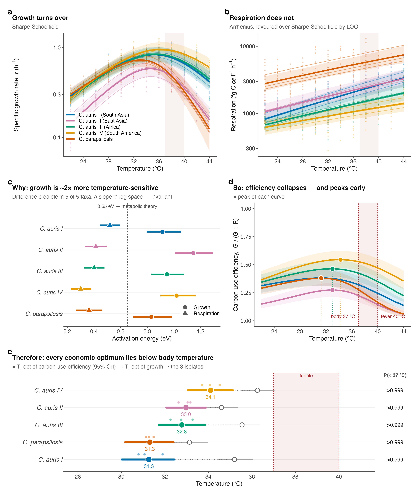
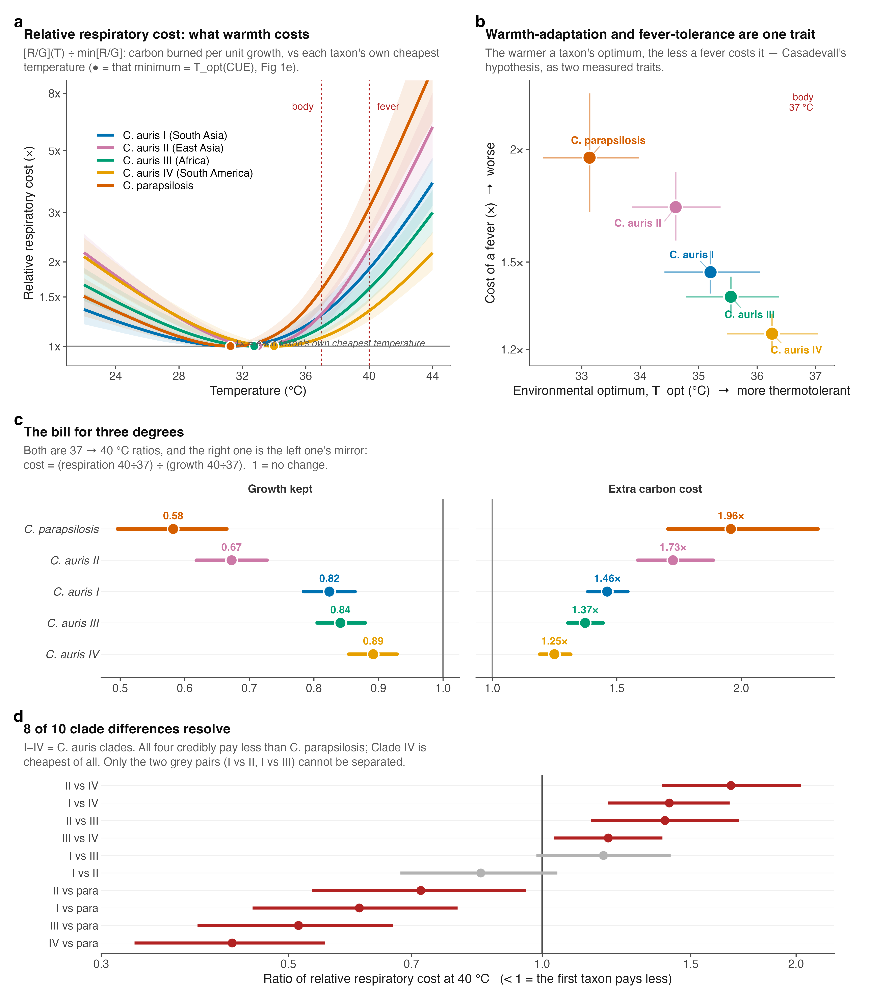
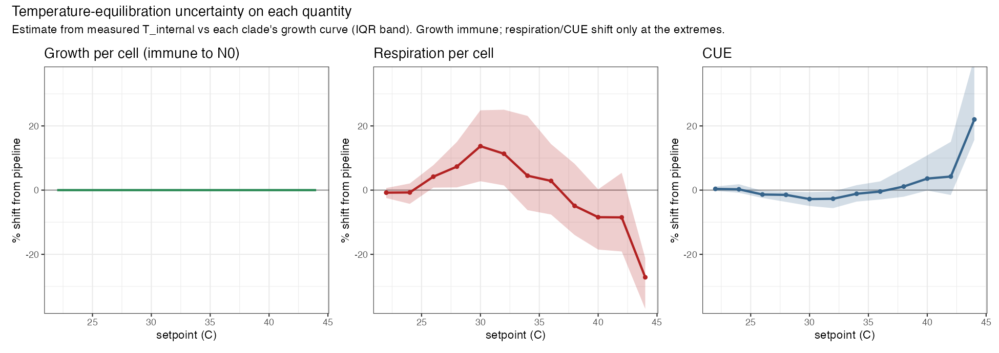
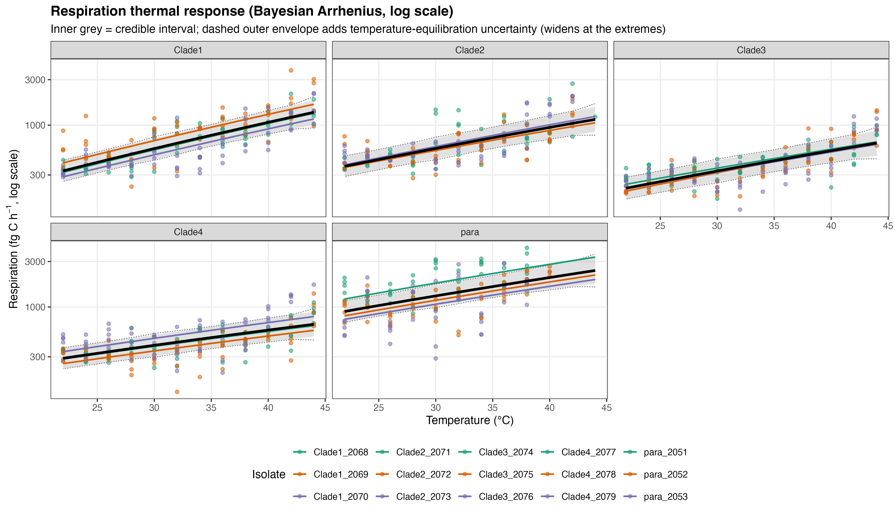
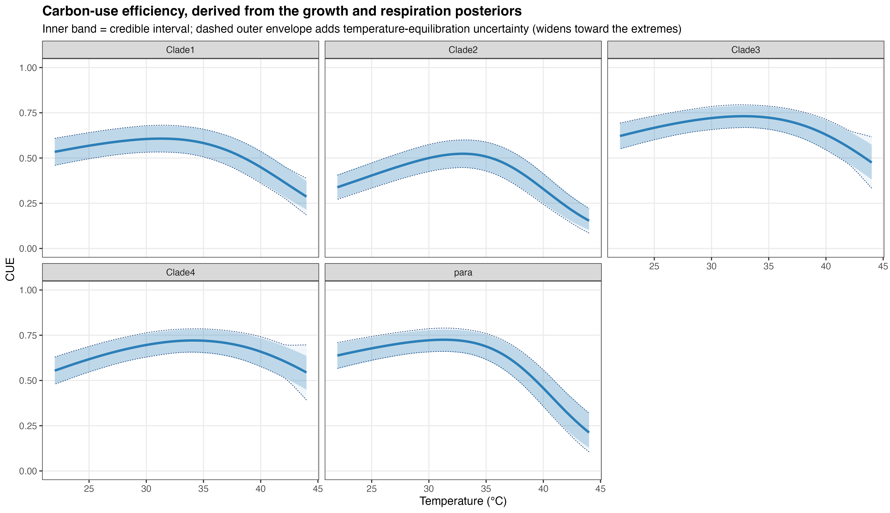
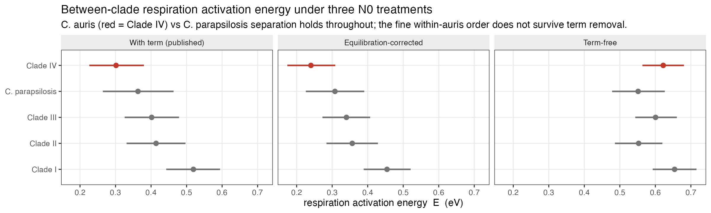

Pathogenic fungi that colonise mammals operate at host body temperature (37 °C) and, during fever, up to about 40 °C, temperatures near the upper limit of their growth range. Whether that thermal environment also imposes a *metabolic* cost, shifting how much of the carbon a cell takes up is turned into new biomass rather than burned in respiration, is not established, yet it bears directly on how these pathogens sustain infection. We tested this across five priority *Candida* taxa spanning a range of thermotolerance: the four major *C. auris* clades (I–IV), the warm-adapted core of the group, and the less thermotolerant *C. parapsilosis*. Measuring growth and respiration from 22 to 44 °C, we asked whether warming toward host and fever temperatures raises respiration relative to growth, and whether the more thermotolerant taxa are buffered against that cost.

Across all taxa, warming toward host temperatures increased respiration relative to growth, while the most thermotolerant *C. auris* clades were substantially buffered against this cost. Growth peaked below fever temperature while respiration continued to rise, so carbon-use efficiency declined across the host range.

Dissolved-oxygen respirometry was used to fit thermal performance curves for the four *C. auris* clades (three isolates each) and *C. parapsilosis* (three isolates) across 22–44 °C (12 temperatures). Growth was modelled with a Sharpe–Schoolfield function and per-cell respiration with a Boltzmann–Arrhenius function, both fitted hierarchically (isolates nested within clades) in a Bayesian framework; per-cell respiration and carbon-use efficiency (CUE = G/(G + R)) were derived on a matched per-cell basis. Full methods are given at the end. Unless stated, values are posterior medians with 95% credible intervals (CrI).

The results below sit in a deliberate hierarchy of assumptions. The central claims (the position of the carbon-economy optimum below 37 °C, the growth-respiration decoupling, and the fold-change in their balance across temperature) are reported scale-free: they are identifiable from the fitted growth rate r and volumetric consumption rate K alone, and require no starting cell number, per-cell carbon quota, oxygen-to-carbon conversion, or respiratory quotient. Absolute per-cell magnitudes (per-cell respiration, the level of CUE) do depend on those quantities and carry their uncertainty; we flag this where it bears on a result and give the full treatment in Robustness and limitations. A fine ranking among the C. *auris* clades is not reported, because it does not survive the starting-cell-number treatments (Robustness).

# **Growth and respiration decouple, placing the carbon-economy optimum below body temperature**

Growth rate rose with temperature to a clade-level optimum near 33--36 °C and then declined, following the expected unimodal thermal performance curve (Fig. 1a). Per-cell respiration showed no such turnover: it increased monotonically across the entire measured range, and leave-one-out cross-validation favoured the monotonic Arrhenius model over a unimodal Sharpe–Schoolfield alternative (Fig. 1b). Growth and respiration are therefore governed by different thermal sensitivities.

This difference is quantified by the activation energies (Fig. 1c). In every taxon, the activation energy of growth exceeded that of respiration: E~G~ ranged 0.83--1.14 eV and E~R~ 0.30--0.52 eV, with the growth-respiration difference credibly greater than zero in all five taxa (0.39--0.73 eV; 95% CrI excluding zero throughout). Growth is thus substantially more temperature-sensitive than respiration. This decoupling also holds entirely scale-free: comparing the activation energy of the fitted growth rate r directly against that of the volumetric consumption rate K, which involves no per-cell conversion at all, gives E~r~ 0.87--1.23 eV against E~K~ 0.55--0.62 eV (P = 1.000 in all five taxa), agreeing with the per-cell, term-free treatment to within 0.03 eV. The absolute per-cell respiration activation energies carry a temperature-structured uncertainty from the inoculum back-projection, but the decoupling itself does not depend on it.

Because respiration continues to rise while growth saturates and falls, carbon-use efficiency (CUE = G/(G+R)) is itself a unimodal function of temperature that peaks early and then collapses (Fig. 1d). Critically, the position of this economic optimum is identifiable without any of the assumptions that set absolute scale. Writing G = r·q and R = c·K, CUE = 1/(1 + (c/q)·K/r), so maximising CUE is equivalent to minimising K/r and the constant c/q drops out of the optimum entirely: T~opt~(CUE) follows from the fitted r and K alone, with no starting cell number, carbon quota, oxygen-to-carbon factor, or respiratory quotient. This model-free estimate places the optimum at 26.1--31.5 °C across the five taxa, a margin of 5.5--10.9 °C below body temperature, with P(T~opt~(CUE) \< 37 °C) = 1.0000 for all five.

The parametric (Sharpe--Schoolfield) counterpart on the per-cell scale gives 31.3--34.1 °C with P ≥ 0.999 (Fig. 1e), sitting on average 3.8 °C above the model-free estimate; that gap decomposes into the inoculum back-projection (1.6 °C) and the smoothing of the fitted functional form (2.2 °C), so the model-free value is the more conservative anchor and the fitted value the smooth-curve refinement. Under either estimate the economic optimum sat below the growth optimum and well below 37 °C. The mammalian host temperature therefore lies beyond the point at which warming still improves the carbon economy of any species tested, and this conclusion requires no assumption about cell numbers or carbon content.

{width="6.395833333333333in" height="7.514586614173228in"}

**Figure 1. Growth and respiration decouple with temperature, placing every carbon-economy optimum below body temperature.** (**a**) Specific growth rate *r* (h⁻¹) and (**b**) per-cell respiration carbon flux (fg C cell⁻¹ h⁻¹) versus temperature (points, isolate-level observations; thin lines, per-isolate fits; bold lines, clade-level posterior medians; bands, 95% CrI). Growth turns over; respiration does not (Arrhenius favoured over Sharpe–Schoolfield by leave-one-out cross-validation). (**c**) Activation energies of growth (circles) and respiration (triangles); dashed line, the 0.65 eV metabolic-theory value. Growth is credibly more temperature-sensitive than respiration in all five taxa. (**d**) Carbon-use efficiency, CUE = G/(G+R), collapses with warming and peaks early; filled points mark each curve's peak. (**e**) Thermal optimum of CUE (filled points, 95% CrI; open points, growth optimum; small points, isolates), with the posterior probability that it lies below 37 °C. Shaded band, 37 to 40 °C (body to fever).

# **A febrile host imposes a quantifiable, taxon-specific carbon cost**

This decoupling predicts that host warming should impose a respiratory penalty per unit growth; we therefore quantified that penalty at body and fever temperatures. Because the economic optimum lies below 37 °C, every taxon operates at a carbon penalty in the host. We express this as the relative respiratory cost, i.e. respiration per unit growth relative to each taxon's own cheapest temperature (Fig. 2a). At 40 °C (fever), this cost reached 1.34× for C. *auris* Clade IV but 3.13× for C. *parapsilosis*.

The three-degree step from body temperature (37 °C) to fever (40 °C) captures the clinical penalty most directly (Fig. 2c). Over this interval C. *parapsilosis* retained only 58% of its 37 °C growth rate (0.58, 95% CrI 0.50--0.67) while its respiratory cost per unit growth rose 1.96× (1.71--2.31). The C. *auris* clades were far less affected: Clade IV retained 89% of growth (0.89, 0.85--0.93) at a cost increase of only 1.25× (1.19--1.31), with Clades I–III intermediate (growth retained 0.67--0.84; cost 1.37×--1.73×). Fever thus suppresses growth without suppressing respiration, and it does so most severely in C. *parapsilosis*.

**Clade-level differences within *C. auris*.** Pairwise comparison of the fever cost resolved 8 of 10 taxon contrasts (95% CrI excluding a ratio of 1; Fig. 2d). The robust contrast is at the species level: all four C. *auris* clades credibly paid less at fever than C. *parapsilosis* (cost ratios 0.43--0.72), and this survives every treatment of the starting cell number. We do not report a finer ranking among the C. *auris* clades. The apparent within-*auris* ordering depends on the inoculum back-projection (its leader moves from first to fourth of five when the term is removed; Supplementary Fig. 4), and in the scale-free analysis the between-clade spread in respiration activation energy collapses from 0.22 eV to 0.07 eV, indicating that most of that apparent signal derives from the N0 construction rather than from clade biology (Robustness).

{width="6.395833333333333in" height="7.339966097987752in"}

**Figure 2.** A febrile host imposes a quantifiable, taxon-specific carbon cost. (a) Relative respiratory cost (respiration per unit growth, each taxon normalised to its own cheapest temperature) versus temperature; the minimum marks the CUE optimum, Topt(CUE). (b) Environmental growth optimum versus the cost of a fever across the five taxa; warmer-adapted taxa pay less. (c) The 37 to 40 °C step: growth retained (left) and the rise in respiratory cost per unit growth (right). (d) Pairwise contrasts of the 40 °C fever cost among clades and against *C. parapsilosis* (ratio \< 1 means the first taxon pays less). Points and bars are posterior medians with 95% credible intervals.

We next asked whether the variation in fever cost was related to each taxon's broader thermal adaptation. As an exploratory observation resting on only five taxa, and one partly geometrically coupled to the growth curve, the environmental growth optimum was negatively associated with the cost of a fever: the more thermotolerant a taxon, the less a fever cost it (Fig. 2b). Computed as a posterior over Spearman's ρ (propagating parameter uncertainty rather than treating the five taxon medians as fixed), the correlation was ρ = −0.90 (95% CrI −1.00 to −0.30; P(ρ \< 0) = 0.996), with *C. parapsilosis* at the cool-optimum, expensive-fever extreme and *C. auris* Clade IV at the warm-optimum, cheap-fever extreme. The respiration activation energy is an independent parameter that could have broken the relationship and did not; with only five points, however, we report the association as suggestive, to be tested directly with additional species. It is consistent with environmental thermal selection contributing to tolerance of the mammalian host.

# **Near-identical coding sequences do not account for the clade differences**

The four C. *auris* clades differ up to two-fold in peak growth rate, and measurably in the cost of a fever, yet their reference proteomes are near-identical: median whole-proteome amino-acid identity is 99.4--100% across clades I--IV by reciprocal best-hit alignment. Broad coding-sequence divergence is therefore an unlikely explanation for the physiological differences reported here, which points instead to regulatory, post-transcriptional, post-translational or bioenergetic differences in how metabolic capacity is deployed rather than in what is encoded.

The available transcriptional evidence does not resolve which. In the only public clade-resolved RNA-seq at a controlled condition (Clade I versus Clade II, 37 °C; GEO GSE165762), central-metabolic enzyme genes are not coordinately lower in the slower-growing clade (median log~2~ fold-change −0.005 against +0.031 for the genome background; Wilcoxon P = 0.93). Because that dataset is compositional, from a single isolate at one temperature, it can rule out a relative down-allocation of metabolic transcripts but not a difference in absolute output. Distinguishing regulatory from bioenergetic explanations will require absolute, spike-in-calibrated proteomics under the thermal conditions used here.

# **Robustness and limitations**

Because several derived respiratory quantities depend on the estimated starting cell number, we next tested which conclusions were sensitive to the inoculum back-projection. Per-cell respiration and carbon-use efficiency depend on the starting cell number N0, obtained by back-projecting the measured inoculum over the pre-fit interval, N0 = N_inoc·exp(r·Δt). The specific growth rate r and its activation energy are recovered directly from the oxygen dynamics and are independent of N0; only the per-cell respiratory flux, CUE and quantities derived from them inherit its uncertainty, so we assessed the two ways the back-projection can bias them. First, a fit-window selection issue was corrected: for a small number of series (chiefly at 26 °C) the selector had latched onto a short late-run segment and returned implausible growth rates. These windows were reviewed and corrected to span the full respiration phase, restoring the expected unimodal growth curves and leaving every clade optimum in the 34--36 °C range.

Second, and more consequentially, the vials are inoculated near bench temperature and take tens of minutes to reach setpoint, so the growth accrued during the pre-fit interval is not governed by the stable r used in the back-projection. Using the continuously logged internal vial temperature together with each clade's own measured growth--temperature curve, we recomputed the growth actually accrued during equilibration and propagated the difference into N0. Growth per cell is unaffected by construction. Per-cell respiration and CUE shift in a temperature-structured way: negligibly across 22--36 °C, then increasingly toward the extremes, with the sign set by the growth optimum (below it, a cooler onset implies slower early growth and slightly higher per-cell respiration; above it, the reverse). The median shift on respiration reaches about +14% near 30 °C and −27% at 44 °C, mirrored and buffered in CUE, while growth per cell is immune throughout (Supplementary Fig. 1). Shown on the thermal curves themselves, widening each posterior credible interval by this component leaves an outer envelope that coincides with the credible interval through the mid-range and separates only toward the extremes (Supplementary Figs. 2 and 3).

This equilibration correction is roughly an order of magnitude smaller than the trends it could threaten: the CUE optimum still lies below 37 °C in every taxon, growth remains credibly more temperature-sensitive than respiration, and respiration's monotonic rise is unchanged. We therefore keep the per-cell point estimates unchanged but treat their absolute values at the temperature extremes (≥40 °C) as approximate.

A stronger stress test is to remove the back-projection term entirely (N0 = N_inoc), the opposite bound to the equilibration correction. This is not the physical null (the inoculum did grow before the fit window, which is what the back-projection accounts for), so the true values lie between it and the published table rather than at either end; but it isolates every quantity that leans on the term. The primary conclusions are unchanged or strengthened under it: r and its activation energy are independent of N0 by construction, and the sub-37 °C CUE optimum in fact sharpens. Two secondary results are sensitive and we treat them accordingly. First, the fine fever-cost ordering among the C. *auris* clades: its leader moves from first to fourth of five when the term is removed, whereas the C. *auris* versus C. *parapsilosis* contrast survives both bounds; the scale-free analysis sharpens this further, collapsing the between-clade spread in respiration activation energy from 0.22 eV (with the term) to 0.07 eV, so we do not report a within-*auris* ranking at all. The between-clade respiration activation energy under all three treatments, with the term (published), equilibration-corrected, and term-free, is compared directly in Supplementary Fig. 4.

The strongest statement, however, is not robustness across N0 treatments but independence from them. As shown in the Results, the position of the CUE optimum, the growth-respiration decoupling (E~r~ versus E~K~), and the fold-change in the respiration-to-growth balance across the range (3.1×--6.5×) are all identifiable from the fitted r and K alone, verified against the pipeline's own identities across all 823 series. The starting cell number, carbon quota, oxygen-to-carbon conversion and respiratory quotient enter only the absolute level of CUE and per-cell respiration, not any of these conclusions.

Separately, the absolute carbon scale carries a systematic uncertainty from the assumed respiratory quotient and per-cell carbon content; varying these within literature ranges rescales CUE proportionally but does not change its thermal shape, its sub-37 °C optimum, or any among-taxon ranking. The primary conclusions in the preceding sections (the sub-37 °C carbon-economy optimum, the growth-respiration decoupling, and the C. *auris* versus C. *parapsilosis* fever-cost contrast) are independent of or robust to all of these sources; a finer within-*auris* ordering is not reported.

# **Conclusion**

Across the *Candida* taxa tested, host and fever temperatures lie above the optimum for carbon-use efficiency: growth turns over below body temperature while respiration keeps rising, so the mammalian host is, for every species measured, a carbon-inefficient environment. This central claim holds scale-free: the position of the optimum follows from the fitted growth and consumption rates alone, independent of every assumption about cell numbers or carbon content, with P(\< 37 °C) = 1.0000 in all five taxa. The penalty is taxon-specific and tracks thermal adaptation: it is steepest in the cold-adapted *C. parapsilosis* and shallowest in the warm-adapted *C. auris* clades, so the *C. auris* versus *C. parapsilosis* contrast is the firm biological result. A finer ranking among the *C. auris* clades is not resolvable in these data once the starting-cell-number construction is accounted for, and we do not report one.

What remains unresolved is the basis of the differences among the C. *auris* clades themselves. Their coding sequences are near-identical, so the explanation is unlikely to lie in what is encoded, and the available single-condition transcriptional data cannot distinguish a regulatory from a bioenergetic origin. Resolving it will require absolute, spike-in-calibrated proteomics under these thermal conditions, together with direct measurement of the carbon quota across temperature.

# **Methods (summary)**

O~2~ concentration was recorded continuously with PreSens SensorDish readers across the temperature series (22--44 °C, 12 temperatures; three isolates × five replicates per temperature). Specific growth rate and per-cell respiration rate were recovered simultaneously from each O~2~ time series using the mechanistic oxygen-dynamics model of Cakin *et al.* (2026), which couples exponential population growth with biomass-proportional oxygen consumption, O~2~(t) = O~2,0~ + (K/r)(1 − e^rt^), where r is the specific growth rate and K the volumetric O~2~ consumption rate at the window start. Per-cell respiration, carbon-use efficiency and derived quantities were computed as in that study.

Growth and respiratory carbon flux were expressed on a matched per-cell basis, so carbon-use efficiency could be computed as CUE = G/(G + R). The per-cell carbon quota is taken as a single temperature-independent value, and it is that assumption which makes the per-cell activation energy of growth directly comparable with that of respiration. The assumption is not innocuous across 22--44 °C: fungal cell volume and wall composition can shift under thermal stress, and any systematic temperature dependence in the carbon quota would propagate into the per-cell growth activation energy rather than cancelling from it. The scale-free comparison reported in the Results avoids the assumption altogether, since the activation energy of the fitted growth rate r against that of the volumetric consumption rate K involves no per-cell conversion at all; the two agree to within 0.03 eV, and we treat the scale-free comparison as primary for that reason.

# **Supplementary figures**

{width="6.6in" height="2.335384951881015in"}

**Supplementary Figure 1.** Sensitivity of each per-cell quantity to temperature equilibration. Median percentage shift from the pipeline value versus setpoint, estimated from the logged internal vial temperature against each clade's growth curve (band, interquartile range across vials). Growth per cell is immune because it does not use N0; per-cell respiration shifts by a few percent through the mid-range and up to about −27% at 44 °C; CUE follows, buffered.

{width="6.6in" height="3.8076924759405073in"}

**Supplementary Figure 2.** Per-cell respiration versus temperature (Bayesian Arrhenius, log scale), per clade, with the temperature-equilibration uncertainty overlaid. Solid band, 95% credible interval; dashed envelope, the same interval widened by the equilibration component. The two coincide through the mid-range and separate only toward the extremes; respiration's monotonic rise is unaffected.

{width="6.6in" height="3.8076924759405073in"}

**Supplementary Figure 3.** Carbon-use efficiency versus temperature, per clade, with the temperature-equilibration uncertainty overlaid. Solid band, 95% credible interval; dashed envelope, widened by the equilibration component. The two coincide through the mid-range and separate toward the extremes. Under this correction the fitted optimum of the warmest clade approaches body temperature (C. *auris* Clade IV, 36.6 °C, P(\< 37 °C) = 0.80); the sub-37 °C conclusion does not rest on this treatment, however, as the model-free, scale-free estimate places every optimum at 26.1--31.5 °C with P = 1.0000 regardless of the N0 correction adopted (main text).

{width="6.6in" height="3.0in"}

**Supplementary Figure 4.** The between-clade respiration activation energy under three treatments of the inoculum back-projection. Each panel shows the hierarchical Bayesian Arrhenius activation energy E~R~ per clade (posterior median; bars, 95% credible interval), refitting the same model under: (left) the published back-projection, N0 = N_inoc·exp(r·Δt); (centre) the equilibration-corrected N0, recomputed from the logged internal vial temperature over the onset window; and (right) the term removed entirely, N0 = N_inoc. The C. *auris*-versus-*C. parapsilosis* separation is preserved across all three, but the finer ordering within C. *auris* is not: Clade IV holds the lowest activation energy under the published and equilibration-corrected treatments and moves to fourth of five when the term is removed. The term-free case is not the physical null (the inoculum grows before the fit window), so it bounds the correction from the opposite side rather than representing the correct value; it is shown to make the dependence explicit. Generated by `scripts/18_n0_treatment_panel.R`.

#

# **Reference**

Cakin I, Millington R, Pawar S, Buckling A, Smirnoff N, Padfield D, Duffy J, Yvon-Durocher G. *A novel method to simultaneously estimate bacterial respiration and growth from oxygen dynamics.* ISME Communications 2026;6(1):ycag024. https://doi.org/10.1093/ismeco/ycag024
