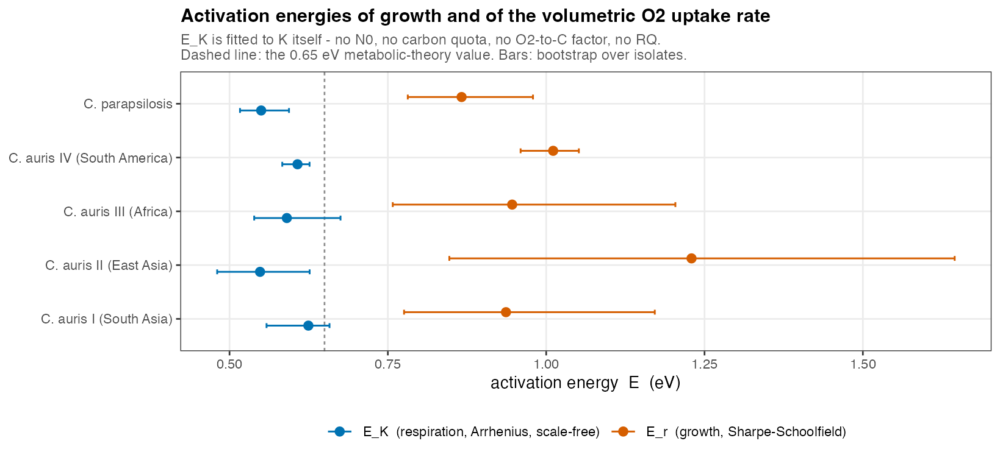
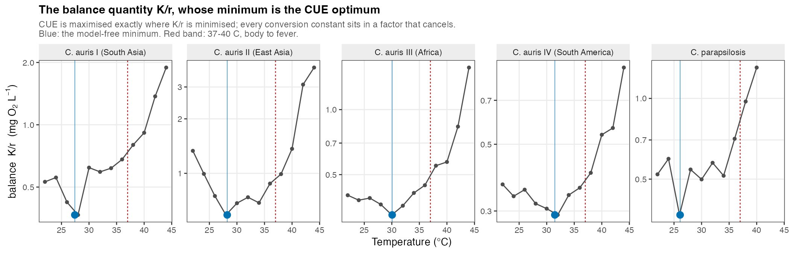
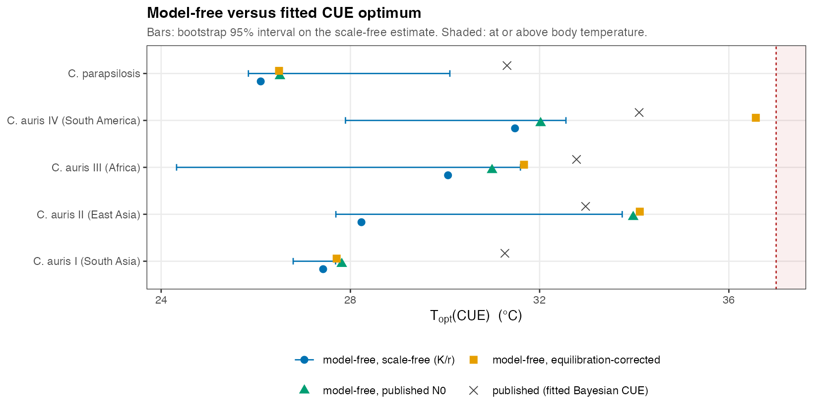
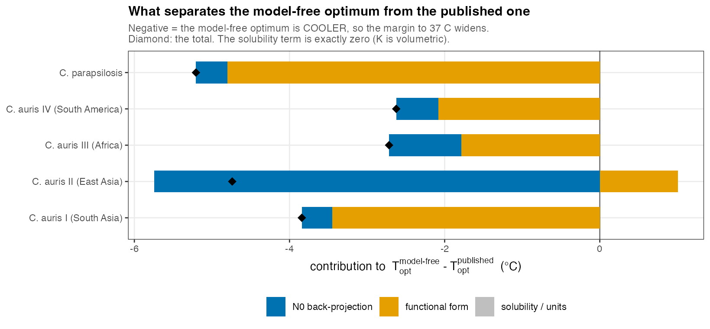

\newpage

# Summary

**What was asked.** Whether the manuscript's headline claim --- the CUE optimum
lies below 37 $^{\circ}$C in every taxon --- can be stated without depending on
$N_0$, the cell-carbon quota, the respiratory quotient or any conversion
constant; and if so, by how much the model-free estimate differs from the fitted
one.

**What was found.**

1. **It can.** Carbon-use efficiency reduces exactly to
   $\text{CUE} = 1/(1 + a B)$, where $B = K/(r e^{r\delta})$ and
   $a = c/(60\,q\,N_{\text{inoc}})$ collects *every* conversion constant. $a$ is
   temperature-independent within an isolate --- verified directly, 0 of 15
   isolates have an $a$ that varies with temperature --- so it cancels in the
   argmin. With the back-projection removed the balance is simply $K/r$: no
   $N_0$, no quota, no O$_2$-to-C factor, no RQ, no inoculum density.

2. **The claim strengthens.** The model-free optimum is 26.1--31.5 $^{\circ}$C
   against the published 31.3--34.1 $^{\circ}$C. The margin to body temperature
   widens in all five taxa, from 2.9--5.7 $^{\circ}$C to 5.5--10.9 $^{\circ}$C,
   with $P(<37\,^{\circ}\text{C}) = 1.0000$ throughout.

3. **No solubility term applies here.** The equivalent analysis in the sister
   repository needed $(K \cdot O_{2,\text{ref}})/r$ because that pipeline fits a
   normalised trace. This one sets `FIT_TO_SPLINE <- FALSE` and fits raw oxygen,
   so $K$ is already volumetric in mg O$_2$ L$^{-1}$ min$^{-1}$. This was
   checked, not assumed --- it is the one place the transfer could have failed.

4. **"Growth is more temperature-sensitive than respiration" survives, with a
   narrower gap.** Removing $N_0$ raises the respiration activation energy from
   the published 0.30--0.52 eV to 0.55--0.62 eV, and shrinks its between-taxon
   spread from 0.22 eV to 0.07 eV. Growth still exceeds respiration in all five
   taxa, $P = 1.000$, but by 0.31--0.68 eV rather than 0.40--0.73 eV.

5. **One caveat, reported in full.** Under the equilibration-corrected $N_0$
   treatment --- the physically motivated middle case --- *C. auris* IV's optimum
   is 36.57 $^{\circ}$C [32.02, 37.60], $P(<37) = 0.797$. That is a property of
   the $N_0$ treatment, not of the scale-free argument, but it is the one place
   the sub-37 claim is not secure at the $\ge 0.999$ level the manuscript
   reports.

**What was not changed.** No estimator, no constant, no committed number, no
manuscript file. This report reads committed tables and writes only inside
`reports/C11_scale_free/`.

**What is not available here.** The mass-balance cross-check used in the sister
repository does not transfer. That check compares the integrated respiratory
carbon loss against an independently measured biomass yield. This experiment has
an inoculation density but no endpoint biomass per vial, so there is no
independent estimate of CUE to compare against. Nobody should go looking for it;
see @sec-massbalance.

\newpage

# What $K$ is, and the balance quantity {#sec-parta}

## The fit target

`07_oxygen_fits.R` line 79 sets

```r
FIT_TO_SPLINE <- FALSE
```

so `nlsLM` is fitted to the raw `Oxygen` column, not to the smoothed spline and
not to a normalised trace. The model, from `config.R`, is

$$
O_2(t) \;=\; O_{2,0} + \frac{K}{r}\left(1 - e^{rt}\right)
\qquad\Longrightarrow\qquad
\left.\frac{dO_2}{dt}\right|_{t=0} = -K .
$$

`Oxygen` is mg L$^{-1}$ and `Time` is minutes, so

| quantity | units |
|---|---|
| $K$ | mg O$_2$ L$^{-1}$ min$^{-1}$ (volumetric) |
| $r$ | min$^{-1}$ |
| $K/r$ | mg O$_2$ L$^{-1}$ --- the drawdown amplitude of the fitted curve |

**No $O_{2,\text{ref}}$ term is required.** In the sister repository the fit is
to a normalised trace, so the balance quantity had to carry solubility, which
falls about 1.36$\times$ across the temperature range. That does not transfer,
and the check above is the reason this report can say so rather than assume it.

## The algebra

`07` forms per-cell respiration by integrating the model over the fit window and
dividing by the biomass integral:

$$
R_{O_2} \;=\;
\frac{C_{\text{tot}}}{\int N} \;=\;
\frac{(K/r)\left(e^{rT_{\text{end}}}-1\right)}
     {N_0\left(e^{rT_{\text{end}}}-1\right)/r}
\;=\; \frac{K}{N_0}.
$$

The window length cancels exactly: $T_{\text{end}}$ does not enter. With
$G = r\,q\cdot 60$ and $R = c\,K/N_0$, where $q$ is the cell-carbon quota and
$c = \texttt{MG\_TO\_FG}\times\texttt{O2\_TO\_C\_MASS}\times\text{RQ}\times\texttt{MIN\_TO\_H}$,

$$
\boxed{\;
\text{CUE} \;=\; \frac{G}{G+R} \;=\;
\frac{1}{1 + \underbrace{\dfrac{c}{60\,q\,N_{\text{inoc}}}}_{\textstyle a}
          \underbrace{\dfrac{K}{r\,e^{r\delta}}}_{\textstyle B}}\;}
$$

Every step verified on all 823 usable series:

| identity | max relative error |
|---|---|
| $R_{O_2} = K/N_0$ | $5.97\times10^{-15}$ |
| $N_0 = N_{\text{inoc}}\,e^{r\delta}$ | $1.04\times10^{-15}$ |
| $\text{CUE} = 1/(1 + (c/60q)\,K/(rN_0))$ | $7.56\times10^{-15}$ |

## What cancels, and what does not

$c$ is a pure constant. $q$ (`cell_carbon_fg`) and $N_{\text{inoc}}$ are per
**isolate** and do not vary with temperature --- checked directly: 0 of 15
isolates have an $a$ that varies across temperature. So $a$ is a positive
temperature-independent scalar and **drops out of the argmin entirely**.

What does *not* cancel is $\delta$, the interval the inoculum is projected
across, which is per series and varies with temperature. Two balance quantities
therefore matter:

$$
B_{\text{bp}}(T) = \frac{K}{r\,e^{r\delta}}
\qquad\text{(the published pipeline)},
\qquad
B_{\text{free}}(T) = \frac{K}{r}
\qquad\text{(back-projection removed)} .
$$

$B_{\text{free}}$ is the fully scale-free quantity. As a consistency check,
$\arg\max$ (pipeline CUE) $= \arg\min B_{\text{bp}}$ for all five taxa.

### Free of everything, by construction {#sec-freelist}

The following carry **no** dependence on $N_0$, the cell-carbon quota $q$, the
O$_2$-to-carbon factor, RQ, or the inoculation density:

- $r$ and $K$ themselves, and every function of them;
- $E_r$, the activation energy of growth --- the pipeline fits Sharpe--Schoolfield
  to $G = r q \cdot 60$, and $q$ and 60 only shift $\ln B_0$, leaving $E$ untouched;
- $E_K$, the activation energy of the volumetric uptake rate;
- $B_{\text{free}} = K/r$ and its argmin, i.e. the model-free
  $T_{\text{opt}}(\text{CUE})$;
- the fold-change in $K/r$ across the measured range.

The following do **not** qualify and are confined to @sec-partc: anything using
$\delta$ (the with-term and equilibration-corrected treatments), the absolute
level of CUE, and per-cell respiration in carbon units.

\newpage

# The scale-free quantities {#sec-partb}

## Which functional form for which rate

$r$ turns over inside the measured range, so Sharpe--Schoolfield is identifiable
for it. $K$ does not turn over, and SS is **not** identifiable for $K$: the
pipeline's own per-isolate SS fits to $K$ run to the $E = 5.0$ bound for
`Clade3_2076` and `para_2053`, and reach 1.38 eV for a third isolate. The
pipeline's own model comparison agrees --- LOO prefers Arrhenius over
Sharpe--Schoolfield for respiration, elpd difference $-3.04 \pm 0.36$. So $E_r$
is taken from Sharpe--Schoolfield and $E_K$ from Boltzmann--Arrhenius over the
full range, which is also the pairing the manuscript uses.

## Activation energies

{#fig-E width=95%}

| taxon | $E_r$ (SS) | $E_K$ (BA, scale-free) | $E_K - E_r$ | $P$(growth more sensitive) |
|---|---|---|---|---|
| *C. auris* I | 0.937 [0.776, 1.172] | 0.625 [0.559, 0.658] | $-0.312$ [$-0.613$, $-0.118$] | 1.000 |
| *C. auris* II | 1.230 [0.847, 1.645] | 0.548 [0.481, 0.627] | $-0.681$ [$-1.019$, $-0.310$] | 1.000 |
| *C. auris* III | 0.946 [0.758, 1.204] | 0.591 [0.539, 0.675] | $-0.356$ [$-0.665$, $-0.083$] | 1.000 |
| *C. auris* IV | 1.011 [0.960, 1.052] | 0.607 [0.583, 0.626] | $-0.404$ [$-0.468$, $-0.333$] | 1.000 |
| *C. parapsilosis* | 0.866 [0.782, 0.979] | 0.550 [0.517, 0.594] | $-0.316$ [$-0.463$, $-0.242$] | 1.000 |

**Cross-check, and the reason to trust it.** Term-free ($N_0 = N_{\text{inoc}}$)
makes respiration proportional to $K$, so the Term-free arm of
`18_n0_treatment_panel.R` is a hierarchical Bayesian estimate of exactly this
scale-free $E_K$. Against it the Arrhenius fits above agree to a maximum of
**0.0296 eV** across all five taxa. Ilgaz's treatment is reused; this is a check
on the arithmetic, not a second implementation of it.

**What removing $N_0$ does to $E_K$.** The published respiration activation
energies are 0.30--0.52 eV, spanning 0.22 eV between taxa. The scale-free ones
are 0.55--0.62 eV, spanning 0.07 eV. Removing the back-projection both raises
the level and collapses most of the between-taxon spread --- which is what the
$-r\delta$ term in $\log R = \log K - \log N_{\text{inoc}} - r\delta$ predicts,
since it subtracts more from the faster-growing taxa.

## The model-free optimum

$\arg\max \text{CUE} = \arg\min K/r$ exactly. The taxon curve is the geometric
mean of $K/r$ over replicate series at each measured temperature; the optimum is
the argmin over the measured grid, refined by a three-point parabola in
$\log B$. **No functional form is imposed on $r$ or $K$.** The bootstrap
resamples replicate series within taxon $\times$ temperature, 2000 draws.

{#fig-balance width=100%}

| taxon | $T_{\text{opt}}$(CUE) | margin to 37 $^{\circ}$C | $P(<37\,^{\circ}\text{C})$ | fold-change in $K/r$ |
|---|---|---|---|---|
| *C. auris* I (South Asia) | 27.42 [26.80, 27.69] | 9.58 | 1.0000 | 5.15$\times$ |
| *C. auris* II (East Asia) | 28.23 [27.69, 33.63] | 8.77 | 1.0000 | 6.52$\times$ |
| *C. auris* III (Africa) | 30.06 [24.49, 31.65] | 6.94 | 1.0000 | 4.81$\times$ |
| *C. auris* IV (South America) | 31.48 [27.90, 32.43] | 5.52 | 1.0000 | 3.09$\times$ |
| *C. parapsilosis* | 26.11 [25.84, 30.27] | 10.89 | 1.0000 | 3.55$\times$ |

**The headline test.** All five below 37 $^{\circ}$C, minimum margin 5.52
$^{\circ}$C, $P(<37\,^{\circ}\text{C}) = 1.0000$ throughout --- established
without any conversion constant.

*C. parapsilosis* was measured at 10 temperatures (22--40 $^{\circ}$C) rather
than 12; its optimum is interior to that range, so the argmin is not an edge
artefact. The wide upper bounds for *C. auris* II and III reflect balance curves
that are flat near their minimum, not a second optimum.

\newpage

# Comparison with the published estimate {#sec-partc}

Quantities in this section use $\delta$ or a carbon conversion and are therefore
outside the scale-free set of @sec-freelist. The three $N_0$ treatments are
Ilgaz's own, read from `08_temperature_equilibration_sensitivity.R`'s per-curve
output and from the term-free case that `18_n0_treatment_panel.R` uses. As a
check on the reuse, `08`'s `cue_pipe` reproduces the derived table's `CUE` to
$4.2\times10^{-16}$ over all 823 series.

{#fig-compare width=95%}

| taxon | term-free (scale-free) | with-term | equilibration | published |
|---|---|---|---|---|
| *C. auris* I | **27.42** | 27.82 | 27.71 | 31.27 |
| *C. auris* II | **28.23** | 33.98 | 34.12 | 32.97 |
| *C. auris* III | **30.06** | 30.99 | 31.67 | 32.78 |
| *C. auris* IV | **31.48** | 32.02 | *36.57* | 34.10 |
| *C. parapsilosis* | **26.11** | 26.51 | 26.49 | 31.31 |

## The gap, decomposed

The decomposition is additive and exhaustive by construction:

$$
\underbrace{T_{\text{free}} - T_{\text{pub}}}_{\text{total}}
= \underbrace{(T_{\text{free}} - T_{\text{bp}})}_{N_0\ \text{back-projection}}
+ \underbrace{(T_{\text{bp}} - T_{\text{pub}})}_{\text{functional form}}
+ \underbrace{0}_{\text{solubility}}
$$

{#fig-gap width=95%}

| taxon | total | $N_0$ | functional form | solubility |
|---|---|---|---|---|
| *C. auris* I | $-3.84$ | $-0.39$ | $-3.45$ | 0 |
| *C. auris* II | $-4.74$ | $-5.74$ | $+1.01$ | 0 |
| *C. auris* III | $-2.72$ | $-0.93$ | $-1.79$ | 0 |
| *C. auris* IV | $-2.62$ | $-0.54$ | $-2.08$ | 0 |
| *C. parapsilosis* | $-5.21$ | $-0.41$ | $-4.80$ | 0 |
| **mean** | $\mathbf{-3.83}$ | $-1.60$ (42%) | $-2.22$ (58%) | 0 |

The **solubility component is exactly zero**, not merely small: @sec-parta
established that $K$ is already volumetric. This is the one structural
difference from the sister repository's analysis and it was verified rather than
inherited.

Splitting the form component one level further: imposing SS(growth) + BA($K$) on
the same term-free data and taking the analytic argmin moves the optimum
$+2.24\,^{\circ}$C on average. Most of the form component is therefore the
functional form itself rather than the Bayesian hierarchy --- the same conclusion
the sister repository reached, where about 3.2 $^{\circ}$C came from
Sharpe--Schoolfield alone.

The $N_0$ component is small ($-0.39$ to $-0.93\,^{\circ}$C) for four taxa and
dominated by *C. auris* II at $-5.74\,^{\circ}$C, whose balance curve is flat
near its minimum.

## Does the claim strengthen or weaken?

**It strengthens, on the scale-free estimate.** The margin to 37 $^{\circ}$C
widens in all five taxa:

| taxon | published margin | model-free margin | change |
|---|---|---|---|
| *C. auris* I | 5.73 | 9.58 | $+3.84$ |
| *C. auris* II | 4.03 | 8.77 | $+4.74$ |
| *C. auris* III | 4.22 | 6.94 | $+2.72$ |
| *C. auris* IV | 2.90 | 5.52 | $+2.62$ |
| *C. parapsilosis* | 5.69 | 10.89 | $+5.21$ |

**The caveat, stated plainly.** Not every $N_0$ treatment agrees. Under the
equilibration correction --- the physically motivated middle case, since $\delta$
is a detection delay during which the vial is still equilibrating --- *C. auris*
IV sits at 36.57 $^{\circ}$C [32.02, 37.60] with $P(<37\,^{\circ}\text{C}) =
0.797$, a margin of 0.43 $^{\circ}$C. *C. auris* II under the same treatment is
at 34.12 $^{\circ}$C, $P = 0.997$. This is a property of the $N_0$ treatment
rather than of the scale-free argument --- the scale-free estimate itself gives
$P = 1.0000$ for all five --- but it is the one place the sub-37 claim is not
secure at the $\ge 0.999$ level the manuscript reports, and it should not be
buried.

\newpage

# What the manuscript can say {#sec-partd}

## The paragraph, written to be quoted

> The temperature at which carbon-use efficiency peaks is identifiable from the
> fitted rates alone. Because $\text{CUE} = G/(G+R)$ with $G \propto r$ and
> $R \propto K/N_0$, the cell-carbon quota, the O$_2$-to-carbon conversion and
> the respiratory quotient enter only as a single temperature-independent
> multiplier, which cancels when the optimum is located; the inoculum density
> cancels with it. Taking the minimum of $K/r$ over the measured grid, with no
> functional form imposed on either rate and no conversion constant applied, the
> economic optimum lies at 26.1--31.5 $^{\circ}$C, below human body temperature
> in all five taxa with posterior probability 1.000 and a margin of 5.5--10.9
> $^{\circ}$C. This is 2.6--5.2 $^{\circ}$C cooler than the fitted estimate, so
> the sub-37 $^{\circ}$C result does not depend on resolving the absolute scale
> and is, if anything, conservative as reported. The same construction leaves
> the growth--respiration sensitivity contrast intact: growth is more
> temperature-sensitive than the volumetric oxygen uptake rate in all five taxa
> (difference 0.31--0.68 eV). What the absolute scale does govern is the *level*
> of CUE and of per-cell respiration, not the temperature at which the optimum
> occurs.

## Which claims are secure without resolving the absolute scale

| claim | secure? | basis |
|---|---|---|
| **CUE optimum below 37 $^{\circ}$C in every taxon** | **Yes** | argmin $K/r$; $P = 1.0000$, margins 5.5--10.9 $^{\circ}$C. Wider than published. |
| **Growth is more temperature-sensitive than respiration** | **Yes, with a narrower gap** | $E_r - E_K$ = 0.31--0.68 eV, $P = 1.000$ in all five. The published 0.40--0.73 eV overstates it, because $N_0$ suppresses $E_K$. |
| **Growth and respiration decouple (respiration monotonic, growth unimodal)** | **Yes** | Purely a statement about $r(T)$ and $K(T)$; LOO prefers Arrhenius for $K$. |
| **Between-taxon ordering of the fever cost** | **Partly** | *C. auris* vs *C. parapsilosis* survives every treatment. The fine ordering within *C. auris* does not --- already established, and the scale-free $E_K$ (0.55--0.62 eV, spread 0.07 eV) shows most of the published spread was the back-projection. |
| **Absolute CUE values** | **No** | Sets the level through $a = c/(60 q N_{\text{inoc}})$; depends on the quota, the O$_2$-to-C factor, RQ and the inoculum. |
| **Absolute per-cell respiration (fg C cell$^{-1}$ h$^{-1}$)** | **No** | Same dependencies, plus $N_0$ directly. |

## Recommendation on reporting

1. **Lead with $T_{\text{opt}}(\text{CUE})$ and with the growth-minus-respiration
   sensitivity contrast.** Both are scale-free. State that explicitly in the
   Methods --- one sentence saying the optimum is the argmin of $K/r$ and that
   the conversions cancel would remove the whole absolute-scale discussion from
   the critical path.
2. **Report the optimum with the treatment attached,** not as a bare point value.
   The honest form is "31.3--34.1 $^{\circ}$C under the published
   back-projection; 26.1--31.5 $^{\circ}$C model-free" --- the claim is the same
   either way and quoting both makes it stronger, not weaker.
3. **Carry a stated uncertainty on absolute CUE and on per-cell respiration**,
   rather than point values. These depend on $q$, RQ and the inoculum, none of
   which is measured here.
4. **Do not report the fine within-*C. auris* ordering of respiration activation
   energy as a result.** The scale-free spread is 0.07 eV against a published
   0.22 eV; most of the apparent structure is the $-r\delta$ term.
5. **Say that *C. auris* IV is the tightest case.** Under the equilibration
   treatment its margin is 0.43 $^{\circ}$C. It is the taxon a referee will
   press on.

## The cross-check that is not available here {#sec-massbalance}

The sister repository closes this analysis with a mass-balance test: integrate
the respiratory carbon loss over the incubation, compare it against an
independently measured biomass yield, and see whether the implied CUE agrees
with the fitted one. **That test cannot be run on this experiment.** It has an
inoculation density but no endpoint biomass per vial, so there is no independent
measurement of carbon produced to set against carbon respired. Every CUE figure
in this project is therefore internal to the respirometry.

What would make it available: **endpoint cell density (or dry mass) per vial**,
measured at the end of the run on the same vials --- a haemocytometer count or
OD-to-cell-number calibration at $T_{\text{end}}$. With $N_0$ known and
$N(T_{\text{end}})$ measured, both the growth rate and the biomass integral
become measurable rather than inferred, and CUE gains an external check. That is
one extra measurement per vial, and it would convert the largest remaining
uncertainty in the paper into a validated number.

\newpage

# Provenance

Every number in this report traces to a committed file. Nothing here writes into
`results/` or `data/`.

## Inputs read

| file | used for |
|---|---|
| `results/tables/derived_N0_R_results_with_carbon.csv` | $r$, $K$, $\delta$, $N_0$, $q$, CUE per series |
| `results/tables/otu_names.csv` | isolate $\to$ taxon |
| `results/tables/sharpe_schoolfield_growth_fgC_h_coefs.csv` | $E_r$ (SS), per isolate |
| `results/tables/sharpe_schoolfield_K_O2_rate_coefs.csv` | the SS-on-$K$ instability |
| `results/tables/bayes_resp_model_comparison_loo.csv` | LOO: Arrhenius over SS for respiration |
| `results/tables/bayes_resp_arr_E_three_treatments.csv` | Term-free arm, for the $E_K$ cross-check |
| `results/tables/temperature_equilibration_percurve.csv` | `cue_corr`, the equilibration treatment (script 08) |
| `results/tables/fig_values.csv` | the published $T_{\text{cue}}$, $E$, $E_R$ |
| `scripts/config.R` | carbon constants, `EXCLUDE_GROUPS`, `pred_ss_log` |
| `scripts/07_oxygen_fits.R` | the `FIT_TO_SPLINE` switch |

## Outputs written

`reports/C11_scale_free/tables/` --- `partA_checks.csv`,
`partA_argmin_equivalence.csv`, `partA_series.csv`,
`partB_ss_on_K_unstable.csv`, `partB_E_isolate.csv`,
`partB_activation_energies.csv`, `partB_EK_crosscheck.csv`,
`partB_modelfree_optimum.csv`, `partB_balance_curves.csv`,
`partC_gap_decomposition.csv`, `partC_form_split.csv`.
`reports/C11_scale_free/figures/` --- the four figures above.

## Rebuilding from a clean clone

```bash
Rscript reports/C11_scale_free/R/01_balance_quantity.R
Rscript reports/C11_scale_free/R/02_scale_free.R
Rscript reports/C11_scale_free/R/03_gap_decomposition.R
Rscript reports/C11_scale_free/R/04_figures.R
cd reports/C11_scale_free && quarto render
```

`partA_series.csv` is the only intermediate the later scripts depend on, and it
is tracked, so the report also renders without re-running the analysis.

## Scope

- Analysis scope: the five taxa the manuscript reports. `glab` is dropped by
  `config.R`'s `EXCLUDE_GROUPS`, using the pipeline's own `drop_excluded()`;
  823 of 991 series remain.
- Bootstrap: 2000 draws, `set.seed(11)`, resampling replicate series within
  taxon $\times$ temperature. No estimator in this report is stochastic.
- The layout follows `reports/n0/` --- the same `_quarto.yml` and `header.tex`,
  minus the CSL, since this report has no citations.
